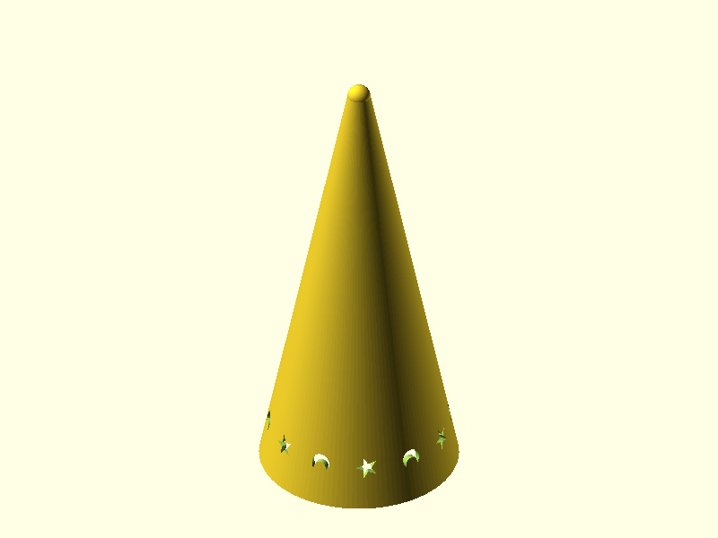
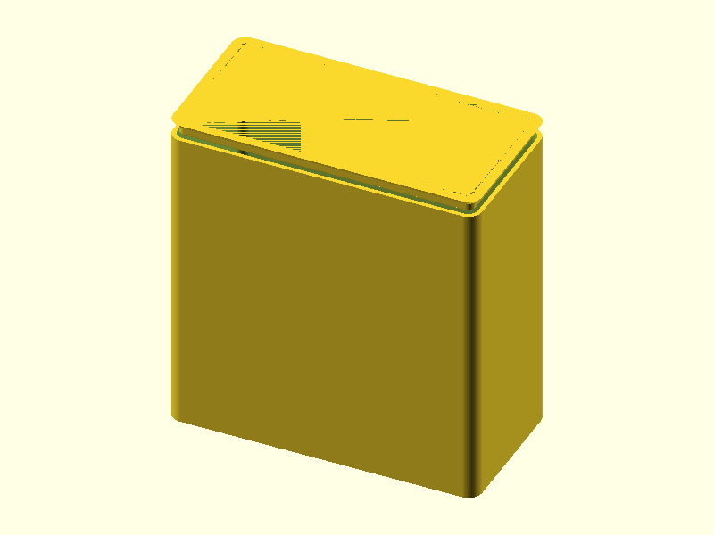
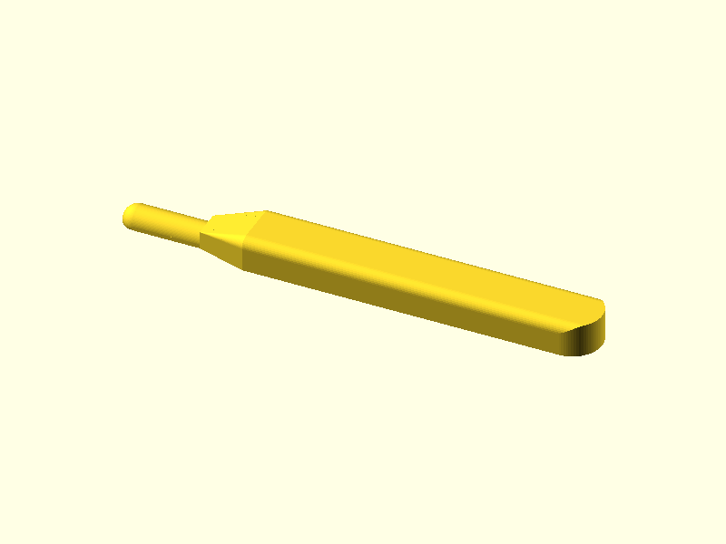
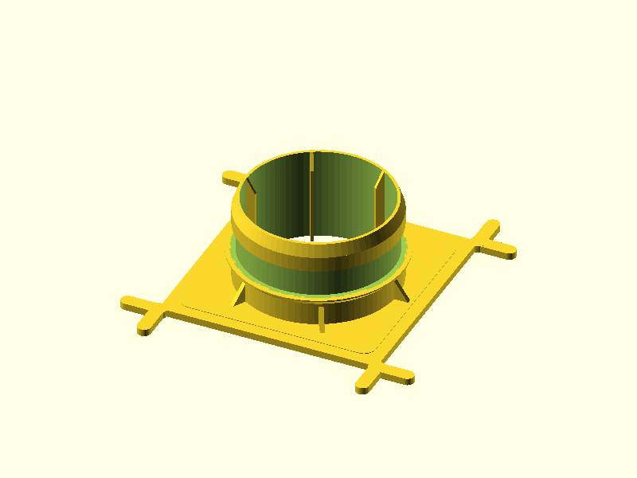
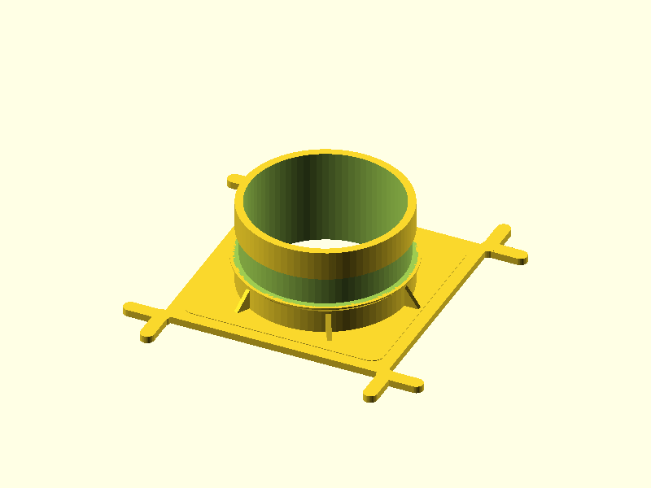
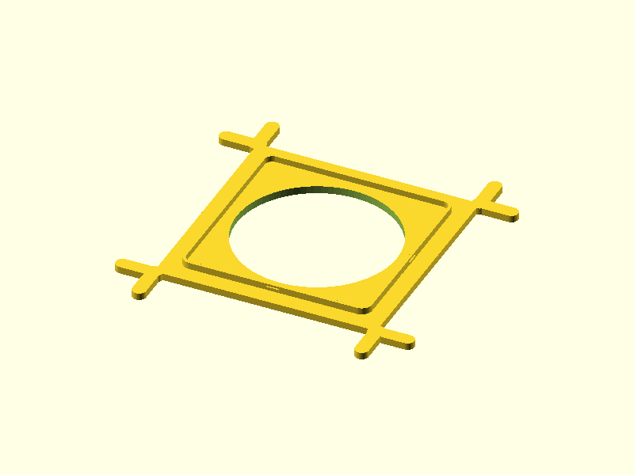
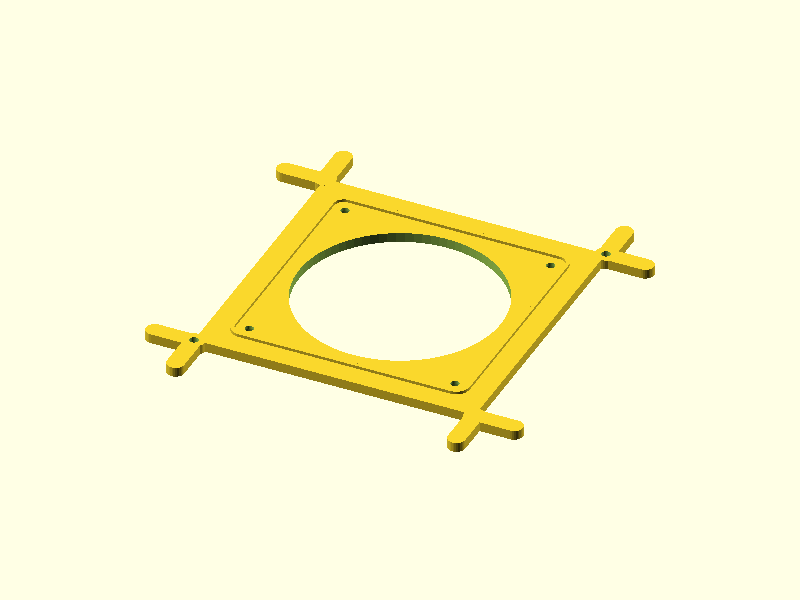

# AI 3D Modeling

Describe a part. Get a printable STL — spec'd, validated, reviewed for printability, and shipped with test prints for critical fitment. No CAD skills required.

This is an AI-native parametric modeling pipeline built on [Claude Code](https://docs.anthropic.com/en/docs/claude-code) with two modeling backends: [OpenSCAD](https://openscad.org/) (headless, git-native, default) and [Autodesk Fusion 360](https://www.autodesk.com/products/fusion-360/) via MCP (organic geometry, freeform surfaces). The human owns the design intent — dimensions, constraints, how things mate. The AI handles the CAD work, iterates against a validation pipeline, and doesn't ship until the geometry passes quantitative review.

**Printer:** Bambu Lab X1 Carbon — 256 × 256 × 256 mm, 0.4 mm nozzle, PLA.

## What It Does

- **Dual modeling backends** — OpenSCAD (headless, git-native, default) for functional and rectilinear geometry; Autodesk Fusion 360 via MCP for organic shapes, compound curves, and freeform surfaces. Both backends produce the same STL + report outputs; everything downstream is backend-agnostic. See [`docs/fusion-mcp-setup.md`](docs/fusion-mcp-setup.md).
- **Industrial design loop** — conversational `id-designer` agent runs a mockup-first aesthetic pass before modeling on visible parts (`requiresId: true`). After renders land, critique mode produces a concrete fix list for the modeler. Shared aesthetic library at `designs/_id-library/`.
- **Ground-truth printability** — trimesh slices the mesh at every layer height; PrusaSlicer confirms support and bridge behavior from actual G-code
- **Automated review** — every overhang, bridge, wall thickness, and mating clearance is checked against FDM/PLA limits before the part ships
- **Test print planning** — critical fitment interfaces get broken out into minimal-material hollow test pieces so you verify fit before committing to a full print
- **Multi-part assemblies** — interference and fit checks across parts using trimesh + PyVista

## Designs

| Design | Preview | Arch | Description | STL |
|--------|---------|:----:|-------------|-----|
| [P-touch Cradle](docs/ptouch-cradle.md) |  | v4 | Quiet two-part desk dock for Brother PT-P750W. Symmetric 25mm bathtub cradle holds printer; removable tray catches auto-cut labels. No decoration — clean fillets, S-curve corner sweeps on the tray, top-edge fillet r=wall_t aligned across both parts. 2 test prints (tray-slot fit + printer-pocket U-fit). | [Cradle](designs/ptouch-cradle/output/cradle.stl) · [Tray](designs/ptouch-cradle/output/tray.stl) |
| [Glitter Wizard Hat](docs/glitter-wizard-hat.md) |  | v4.1 | Replacement cap for vintage Glitter Wizard lava lamps. Hollow cone with star/moon cutouts, retention lip for bottle neck fit. Two sizes: large (114.3 mm) and small (95 mm). | [Large](designs/glitter-wizard-hat/output/glitter-wizard-hat-large.stl) · [Small](designs/glitter-wizard-hat/output/glitter-wizard-hat-small.stl) |
| [Caliper-Test Gridfinity Bin](docs/caliper-test.md) |  | v4 | Gridfinity 2×1 12u bin for a 6-inch digital caliper. Two-stage contoured pocket seats the display body; the beam extends above the rim for grab-and-go access. 4 test prints for fitment verification. | [STL](gridfinity-bins/designs/caliper-test/output/caliper-test.stl) |
| [Waffle Caulk Spudger](docs/waffle-caulk-spudger.md) |  | v4 | Handheld caulk spreading tool for 9.4 mm waffle-grid channels. Convex tip profiles a smooth bead for adapter bonding. No supports, prints flat. | [STL](designs/waffle-caulk-spudger/output/waffle-caulk-spudger.stl) |
| [Humidity-Output V2](docs/humidity-output-v2.md) |  | v4 | 4" flex duct mount for HDPE tub lids. Spigot with EPDM foam seal, zip-tie clamping, lead-in taper. 2 test prints for fitment verification. | [STL](designs/humidity-output-v2/output/humidity-output-v2.stl) |
| [Humidity-Output V1](docs/humidity-output.md) |  | v1 | Original duct mount — superseded by V2 (spigot was oversized, no lead-in taper, fins started mid-air). | [STL](designs/humidity-output/output/humidity-output.stl) |
| [Fan-Tub Adapter v2.0](docs/fan-tub-adapter-v2.md) |  | v1 | 119mm fan mount for Martha tent lids. Two-part snap-fit — base plate caulked to lid, retention clip with cantilever arms. Zero fasteners. | [Base](designs/fan-tub-adapter-base/output/fan-tub-adapter-base.stl) · [Clip](designs/fan-tub-adapter-clip/output/fan-tub-adapter-clip.stl) |
| [Fan-Tub Adapter v1.0](docs/fan-tub-adapter.md) *(frozen)* |  | v1 | Original bolt-on fan mount. Y-branch waffle engagement, hex nut counterbores, thumbscrew attachment. Superseded by v2.0. | [STL](designs/fan-tub-adapter/output/fan-tub-adapter.stl) |
| [Fan-Tub Adapter v3.0](docs/fan-tub-adapter-v3-proposal.md) *(proposal — stalled)* | — | v4 | Shroud-cap + guided-snap proposal addressing v2 flimsiness. Design dirs stubbed (`requirements.md` + `spec.json` only); implementation paused. Forward-looking only. | — |

## How It Works

Seven specialized agents split the work — each owns a stage, communicates through structured files, and never sees the full conversation history. The orchestrator (top-level Claude session) manages user dialogue and dispatches agents.


<details>
<summary><b>Agent details</b></summary>

| Agent | What it does | Key outputs |
|-------|-------------|-------------|
| **spec-writer** | Turns user intent into structured requirements. Flags tight tolerances, printability risks, test print candidates. Sets `modelingBackend` and `requiresId`. | `requirements.md`, `spec.json` |
| **id-designer** | Conversational industrial-design agent. Two modes: *design* (mockup-first aesthetic loop before modeling) and *critique* (post-render fix list after each iteration). Only runs when `requiresId: true`. | `id/brief.md`, `id/modeler-notes-v*.md` |
| **modeler** | Writes OpenSCAD, iterates against validation until PASS. Reads `id/brief.md` as the aesthetic contract. Produces a feature inventory in print-Z order for the reviewer. | `<name>.scad`, `modeling-report.json` |
| **modeler-fusion** | Builds geometry in Autodesk Fusion 360 via MCP. Same input/output contract as **modeler**; used when `modelingBackend: "fusion"` for organic shapes (lofts, sweeps, T-splines). Exports STL + F3D. | `output/<name>.stl`, `modeling-report.json` |
| **geometry-analyzer** | Slices the rendered STL at every layer height (trimesh). Optionally runs PrusaSlicer for G-code-level bridge/support analysis. Works on STL regardless of modeling backend. | `geometry-report.json`, `slicer-report.json` |
| **print-reviewer** | Checks every feature transition, overhang, bridge, wall thickness, and mating clearance against FDM limits. Classifies bridges as functional or avoidable. Read-only. | `review-printability.md` |
| **fit-reviewer** | Mesh-based interference and clearance checks for multi-part assemblies. | `review-fitment.json` |
| **test-print-planner** | Identifies critical geometries — tight fitment, near-limit overhangs, novel features — and specs minimal-material test pieces. Hollow volumes by default. | `test-prints.json`, stub design dirs |
| **shipper** | Renders views, writes the GitHub design page, updates README, commits, pushes. | `docs/<name>.md`, committed artifacts |

</details>

<details>
<summary><b>Pipeline scaling by complexity</b></summary>

| Complexity | Criteria | Pipeline |
|---|---|---|
| **Simple** | Single part, ≤5 features | `spec-writer` → `modeler` → `shipper` |
| **Medium** | Single part, >5 features | Full pipeline with geometry analysis, print review, test prints |
| **Complex** | Multi-part assembly | Parallel modelers + analyzers, fit-reviewer added, parallel test prints |

</details>

### Ground-truth geometry — not source code inference

The old approach — inferring printability from SCAD source — doesn't work. The mesh is the ground truth; the source code is a recipe that may not produce what you expect.

The geometry analyzer slices the actual STL at 0.2mm intervals, computing per-layer cross-sections, overhang faces, bridge spans, and wall thickness. The optional slicer pass runs PrusaSlicer (same engine as OrcaSlicer — Slic3r → PrusaSlicer → BambuStudio → OrcaSlicer lineage) and parses the G-code for support material and bridge moves. The print reviewer consumes this quantitative data, not SCAD arithmetic.

### Test prints — verify before you commit

Mating interfaces with tight clearances get test prints automatically. A 90° arc section of a spigot costs a fraction of the material and prints in minutes — enough to trial-fit against the real duct and know if the OD is right before burning hours on the full part.

## Quick Start

```bash
# One-time setup (installs OpenSCAD, Xvfb, cli-anything-openscad, Python venv, PrusaSlicer)
sudo bash setup.sh
npm install

# Validate an existing design
node bin/validate.js designs/humidity-output-v2

# Run geometry analysis
node bin/geometry-analyze.js designs/humidity-output-v2 --skip-slicer

# Check a multi-part assembly
node bin/check-assembly.js assemblies/<name>.json
```

> [!IMPORTANT]
> `setup.sh` requires sudo — it installs system packages and creates a Python venv. Run it once per environment.

## Project Structure

```
designs/<name>/
├── requirements.md          # What to build (from spec-writer)
├── spec.json                # Validation targets + tolerances
├── <name>.scad              # Parametric OpenSCAD source
├── output/
│   ├── <name>.stl           # Print-ready mesh
│   ├── geometry-report.json # Mesh analysis (trimesh)
│   ├── review-printability.md
│   └── test-prints.json     # Test print manifest
└── test-prints/             # Minimal-material test pieces
    └── <id>/                # Each gets its own modeler run

scad-lib/
├── fdm-pla.scad             # FDM/PLA tolerance constants
├── bambu-x1c.scad           # Build volume assertions
└── common.scad              # fdm_hole(), chamfer_cylinder(), etc.
```

## FDM/PLA Tolerances

Every design includes `fdm-pla.scad`. These are the constants — derived from real prints on the X1 Carbon.

| Fit Type | Offset | Use Case |
|----------|--------|----------|
| Press fit | −0.15 mm | Friction-held joints |
| Clearance fit | +0.25 mm | Easy insert/remove |
| Sliding fit | +0.35 mm | Moving parts |
| Hole compensation | +0.4 mm diameter | Bolt holes, dowel holes |
| Min wall | 1.2 mm (3 perimeters) | Structural walls |
| Max overhang | 45° | Unsupported overhangs |
| Max bridge | 10 mm | Horizontal spans |

## Architecture Versions

| Version | Name | What changed |
|---------|------|-------------|
| **v1** | Monolithic | Single CLAUDE.md, inline printability review, no ground-truth geometry |
| **v2** | Multi-agent | Specialized agents with file-based handoff. Print reviewer reads SCAD source — better, but still inferring |
| **v3** | Ground-truth geometry | geometry-analyzer produces mesh-based reports. Reviewer consumes quantitative data, not source code |
| **v4** | Test print planning | test-print-planner identifies critical geometries. Upstream agents flag candidates. Avoidable bridges get flagged, not silently passed |
| **v4.1** | CLI-Anything integration | OpenSCAD rendering via `cli-anything-openscad` Python CLI — parallel views, JSON output with auto-parsed dimensions, thread-safe Xvfb. Replaces direct subprocess management |

## License

MIT
