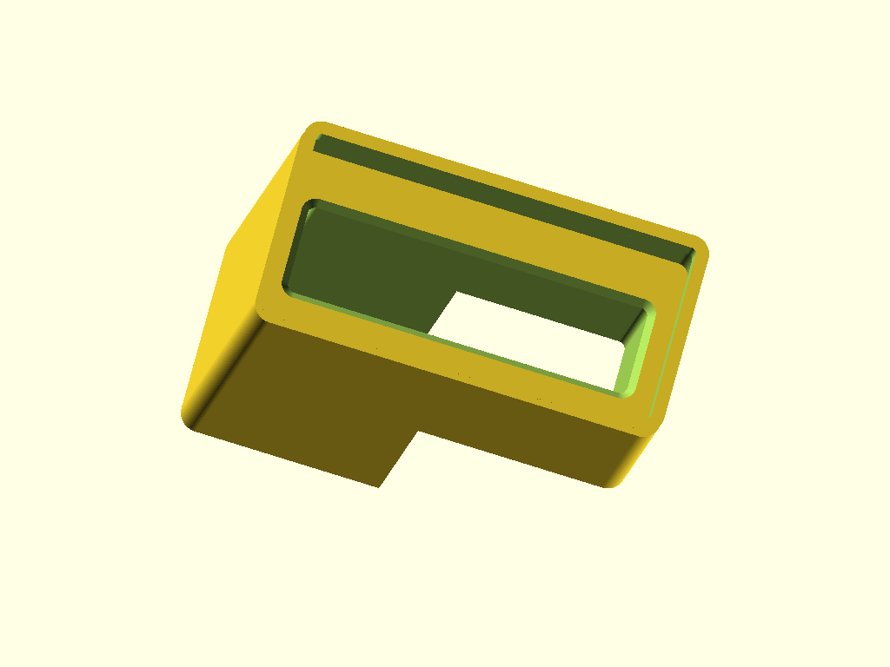
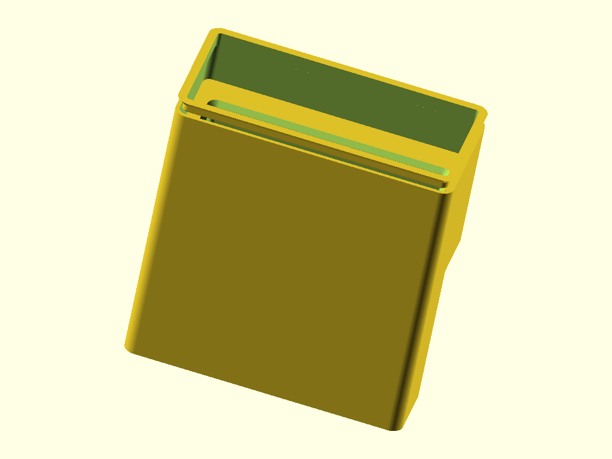
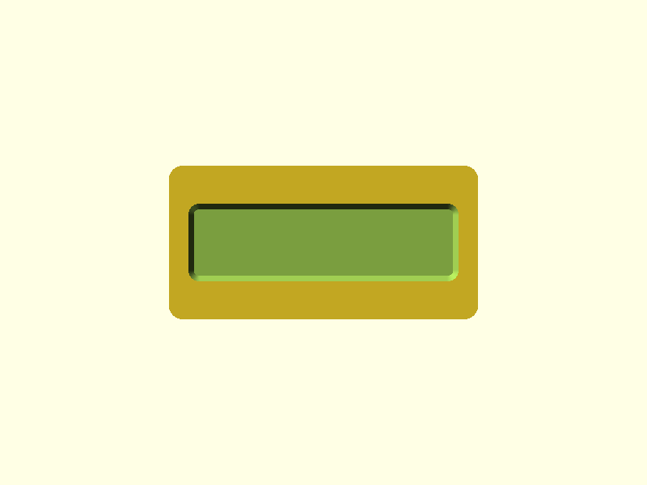

# Caliper-Test Gridfinity Bin

A Gridfinity-compatible 2x1 bin that holds a HARTE 6-inch digital caliper upright. The caliper drops display-body-first into a 70x18mm walled pocket in the lower bin; the beam extends up through the open upper interior and out through the stacking lip, making it immediately grabbable.

## Renders


*YZ section cut (X=0) — the two-zone interior is clearly visible: solid pocket walls (lower, gold) surround the 70x18mm pocket void (center opening), while the upper bin has only thin 1.2mm walls. The Gridfinity base profile is at the bottom.*


*XZ section cut (Y=0) — shows pocket wall thickness (10.55mm on Y sides), the pocket floor at Z=7.2mm, the shelf/transition at Z=71.2mm where walls end, and the open upper interior above.*


*Isometric view — stacking lip at top, thin-walled upper section, pocket opening visible inside.*


*Top-down view — stacking lip ring (outer), bin walls, and the 70x18mm pocket opening (inner rectangle).*

## Design Overview

The bin uses a standard Gridfinity thin-walled shell (`gf_bin()` library module) with solid pocket walls filling the lower interior. This creates two zones:

- **Lower zone (Z=7 to 71.2mm):** Solid pocket walls surround a 70x18mm pocket opening. The caliper display body (68x16mm) sits in this pocket with +1mm clearance per side.
- **Upper zone (Z=71.2 to 84mm):** Full 81.1x39.1mm open interior with only 1.2mm exterior walls. The caliper enters through this wide opening and drops into the narrower pocket below.

```
  Z (mm)
 88.4 +---------------------------+  <- stacking lip top
      |    lip ring (2.6mm)      |
 84.0 +----+               +----+  <- body top
      |    |               |    |
      |    |  open interior|    |   81.1 x 39.1mm
      |    |  (thin walls) |    |
 71.2 |    +---+       +---+    |  <- pocket wall top (shelf)
      |    |///|       |///|    |
      |    |///|pocket |///|    |   70 x 18mm pocket
      |    |///|70x18  |///|    |   1.5mm corner radii
      |    |///|       |///|    |
  7.2 |    |///| floor |///|    |  <- internal floor
  7.0 +----+---+-------+---+----+  <- base height
      |     base grid           |
  0.0 +-------------------------+  <- bed

  /// = solid pocket wall fill (5.55mm X sides, 10.55mm Y sides)
```

The 1.5mm 45-degree chamfer at the pocket mouth guides the caliper into the pocket. The caliper is held by gravity — no clips or friction fit.

## Geometry

| Dimension | Value | Notes |
|-----------|-------|-------|
| Bounding box | 83.5 x 41.5 x 88.4 mm | 2x1 Gridfinity grid, 12u height |
| Body height | 84.0 mm | 12 x 7mm height units |
| Stacking lip | 4.4 mm tall, 2.6 mm depth | Standard Gridfinity profile |
| Floor elevation | 7.2 mm | Standard Gridfinity internal floor |
| Wall thickness | 1.2 mm | 3 perimeters at 0.4mm nozzle |
| Inner cavity | 81.1 x 39.1 mm | Upper zone open dimensions |
| Pocket opening | 70 x 18 mm | Caliper 68x16mm + 1mm clearance/side |
| Pocket depth | 64 mm | Display body 63mm + 1mm clearance |
| Pocket wall (X sides) | 5.55 mm | (81.1 - 70) / 2 |
| Pocket wall (Y sides) | 10.55 mm | (39.1 - 18) / 2 |
| Volume | 170 cm3 | Mesh analysis (trimesh) |

## Features

### Gridfinity Base Grid (Z=0-7.0mm)

Two base pads at 42mm pitch with standard stepped chamfer profile (0.8mm + 1.8mm + 2.15mm). Bridge plate connects pads from Z=4.75 to Z=7.0mm. Uses `gf_base_grid()` library module.

### Pocket Walls (Z=7.0-71.2mm)

Solid fill inside the bin interior surrounding the 70x18mm pocket. Walls are 5.55mm thick on X sides and 10.55mm thick on Y sides — well above the 1.2mm structural minimum. The horizontal shelf at Z=71.2mm where the pocket walls end is the most visible internal feature.

### Pocket Void (Z=7.2-71.2mm)

70x18mm rectangular pocket with 1.5mm corner radii. Floor at Z=7.2mm (standard Gridfinity internal floor). The caliper display body (68x16mm) drops in with +1mm clearance per side. A 1.5mm 45-degree lead-in chamfer at the pocket mouth (Z=69.7-71.2mm) eases insertion.

### Open Upper Interior (Z=71.2-84.0mm)

Full 81.1x39.1mm bin interior with 1.2mm thin walls. The caliper enters through this wide space. The caliper beam (16x5mm) extends through here.

### Stacking Lip (Z=84.0-88.4mm)

Standard Gridfinity stacking lip ring: 0.7mm catch at 45 degrees, 1.8mm vertical, 1.9mm at 45 degrees. Inner opening 78.3x36.3mm — wider than the pocket, does not obstruct caliper insertion. Uses `gf_stacking_lip_ring()` library module.

## Mating Interfaces

| Interface | This Part | Mates With | Fit Type | Gap |
|-----------|-----------|------------|----------|-----|
| Base to baseplate | 2x1 stepped chamfer, 83.5mm outer | Gridfinity baseplate receptacle | Clearance | 0.25mm/side |
| Stacking lip to upper bin | Standard lip profile | Upper bin base profile | Clearance | 0.25mm/side |
| Pocket to caliper body | 70x18mm pocket | 68x16mm display body (+/-2mm) | Loose clearance | +1mm/side |

## Printability

All pass. Print base-down with no supports. All overhangs are standard Gridfinity 45-degree profiles. The geometry analyzer flagged 86 faces — all are the bed face (Z=0) false positives.

| Check | Result | Notes |
|-------|--------|-------|
| Transitions | 6/6 PASS | Base, pocket floor, chamfer, shelf, lip catch, lip ramp |
| Overhangs | PASS | 86 flags, all at Z=0 (bed face false positives) |
| Bridges | PASS | 0 bridges detected |
| Thin walls | PASS | 0 thin wall detections; minimum 1.2mm |
| Slicer | N/A | PrusaSlicer not installed |

### Geometry Analysis

442 layers at 0.2mm. Watertight mesh. 13 cross-section transitions detected — all align with declared features. Key transition at Z=71.3mm: 85% area reduction where pocket walls end and the open interior begins. Stacking lip expands at exactly 45 degrees per layer (0.2mm/side per 0.2mm height).

## Validation

```
bbox.x:     83.50 mm  (expected 83.5 +/-0.2)    PASS
bbox.y:     41.50 mm  (expected 41.5 +/-0.2)    PASS
bbox.z:     88.41 mm  (expected 88.4 +/-0.2)    PASS
watertight: true                                  PASS
volume:     170 cm3   (expected 150-250 cm3)     PASS
```

## Print Settings

| Setting | Value |
|---------|-------|
| Orientation | Base on bed, bin grows upward |
| Material | PLA |
| Layer height | 0.2mm |
| Infill | 15% gyroid |
| Supports | None |

## BOM

| Qty | Item | Notes |
|-----|------|-------|
| 1 | Caliper-Test Gridfinity Bin (3D printed) | PLA, 170 cm3 |

## Downloads

| File | Description |
|------|-------------|
| [`caliper-test.stl`](../gridfinity-bins/designs/caliper-test/output/caliper-test.stl) | Print-ready mesh |
| [`caliper-test.scad`](../gridfinity-bins/designs/caliper-test/caliper-test.scad) | Parametric OpenSCAD source |
| [`spec.json`](../gridfinity-bins/designs/caliper-test/spec.json) | Validation spec |
| [`geometry-report.json`](../gridfinity-bins/designs/caliper-test/output/geometry-report.json) | Mesh analysis |
| [`review-printability.md`](../gridfinity-bins/designs/caliper-test/output/review-printability.md) | Full printability review |
| [`requirements.md`](../gridfinity-bins/designs/caliper-test/requirements.md) | Design requirements |

## Pipeline

| Stage | Agent | Result |
|-------|-------|--------|
| Spec | spec-writer | 4 features, 3 mating interfaces, 1 test print candidate |
| Model | modeler | PASS (4 iterations across versions) |
| Geometry | geometry-analyzer | 442 layers, 0 bridges, 86 bed-face false positives |
| Review | print-reviewer | 6/6 transitions PASS, 0 conflicts |
| Ship | shipper | this commit |

Built with pipeline v4
