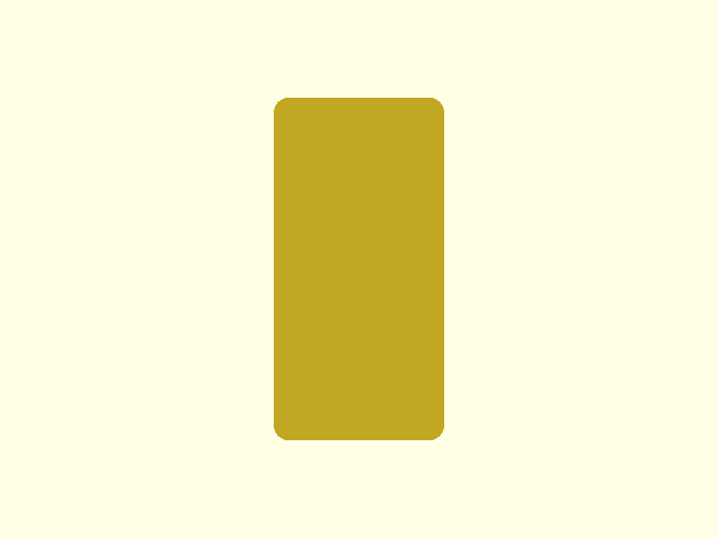
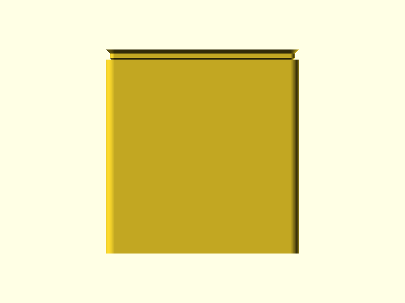

# Caliper-Test Gridfinity Bin

A Gridfinity-compatible 2×1 bin that holds a HARTE 6-inch digital caliper upright. The display body seats in a contoured two-stage pocket; the beam and jaws extend above the rim, making the caliper immediately grabbable without fishing around in a drawer.

## Renders


*Isometric view showing stacking lip at top, two-stage pocket geometry visible through the open top, and standard Gridfinity base profile at the bottom.*


*Front elevation — 83.5mm wide, 88.4mm tall. The open region at the top is the finger-relief zone; the beam slot narrows to 20mm wide at the center.*


*Right side — 41.5mm deep. The beam slot (9mm Y depth) is offset +5.5mm from center toward the back face to align with the caliper beam's actual position within the display body.*


*Top-down view showing the finger-relief opening (81.1mm × 39.1mm), the beam slot (20mm × 9mm) centered in the opening, and the stacking lip around the perimeter.*

## Design Overview

The bin is sized to a HARTE 6-inch digital caliper measured from grid photos (±2mm uncertainty). The caliper inserts display-body-down: the wide display body (68×16mm nominal) slides into the lower pocket, rests on the ledge where the pocket narrows, and the bare beam extends up through the slot and out of the bin. The jaws sit near the bin floor with clearance on all sides.

```
  ┌─────────────────────────────┐  ← stacking lip (Z=84–88.4mm)
  │                             │
  │     ╔═══╗         ╔═══╗    │  ← finger-relief opening (81.1×39.1mm)
  │     ║   ║    ┌┐   ║   ║    │
  │     ║   ║    ││   ║   ║    │  ← beam slot (20×9mm, Y-offset +5.5mm)
  │     ╚═══╝    └┘   ╚═══╝    │  ← ledge at Z=72.2mm (caliper rests here)
  │         ┌─────────┐         │
  │         │ display │         │  ← display body cavity (72×20×65mm)
  │         │  body   │         │
  │         │ cavity  │         │
  │         └─────────┘         │  ← bin floor at Z=7.2mm
  ├═════════════════════════════┤  ← bridge plate
  │  ╲     ╱         ╲     ╱   │  ← base profile (2×1 grid, 45° stepped chamfers)
  └─────────────────────────────┘  ← baseplate interlock (Z=0)
```

The 45° finger-relief chamfer blends the display cavity rim (72×20mm) into the wider opening (81.1×39.1mm) over 10mm of height. This creates room to grip the caliper body for extraction — without it, the display body would be recessed 11.8mm below the bin rim with no finger clearance.

## Geometry

| Dimension | Value | Notes |
|-----------|-------|-------|
| Bounding box | 83.5 × 41.5 × 88.41 mm | 2×1 Gridfinity grid, 12u height |
| Body height | 84.0 mm | 12 × 7mm height units |
| Stacking lip height | 4.4 mm | Standard Gridfinity profile |
| Internal floor elevation | 7.2 mm | Standard Gridfinity base height |
| Internal usable depth | 76.8 mm | 84.0 − 7.2 mm |
| Wall thickness | 1.2 mm | 3 perimeters at 0.4mm nozzle |
| Inner cavity | 81.1 × 39.1 mm | Outer − 2 × 1.2mm walls |
| Display body cavity | 72 × 20 × 65 mm | Caliper 68×16mm + 2mm clearance each side |
| Beam slot | 20 × 9 mm | Caliper beam 16×5mm + 2mm clearance each side |
| Beam slot height | 11.8 mm | Usable depth 76.8 − display cavity 65.0 mm |
| Ledge at transition | 26mm × 5.5mm each side | Caliper display body rests here |
| Volume | 48.93 cm³ | Mesh analysis (trimesh) |

## Features

### Gridfinity Base Profile (Z=0–4.75mm)

Two base pads at 42mm pitch (2×1 grid). Each pad has the standard Gridfinity stepped chamfer profile — 0.8mm chamfer, 1.8mm vertical wall, 2.15mm chamfer — totaling 4.75mm height and 2.95mm horizontal reach. The profile mates with Gridfinity baseplates; 0.25mm per-side XY clearance provides the interlock gap.

### Bridge Plate (Z=4.75–7.0mm)

Solid plate spanning the full 83.5×41.5mm footprint. Connects the two base pads and forms the structural base of the bin body above the base profile.

### Bin Floor (Z=7.0–7.2mm)

Solid floor at the standard Gridfinity internal floor elevation. Internal cavity begins at Z=7.2mm with 2.8mm fillet radius at bottom corners (GF_INTERNAL_FILLET).

### Display Body Cavity (Z=7.2–72.2mm)

Wide lower pocket (72×20mm) that houses the caliper display body. Centered in the bin XY. The 2mm clearance per side accommodates ±2mm measurement uncertainty from the grid photos. The bottom of the cavity has a 2.8mm fillet at each corner per Gridfinity standard.

### Pocket Transition Ledge + Finger Relief (Z=62.2–72.2mm)

At Z=72.2mm, the display cavity narrows to the beam slot. The resulting ledge (26mm × 5.5mm each side) supports the caliper by its display body upper rim — the primary load path. Simultaneously, a 45° chamfer widens the pocket opening from 72×20mm to 81.1×39.1mm over 10mm of height, providing finger clearance for extraction. The X and Y extents of the finger relief are capped at the inner cavity dimensions to maintain 1.2mm minimum wall thickness.

### Beam Slot (Z=72.2–84.0mm)

Narrow slot (20×9mm) that guides the caliper beam above the display body. The slot is centered in X and offset +5.5mm in Y from the display cavity center — this aligns with the beam's actual position within the display body, which runs along one face of the body rather than through its geometric center.

### Stacking Lip (Z=84.0–88.4mm)

Standard Gridfinity stacking lip: 0.7mm catch at 45°, 1.8mm vertical, 1.9mm at 45°. Receives another bin's base profile when stacking. 0.6mm fillet at the top outer edge.

## Mating Interfaces

| Interface | This Part | Mates With | Fit Type | Gap/Interference |
|-----------|-----------|------------|----------|-----------------|
| Gridfinity base → baseplate | 4.75mm stepped chamfer, 0.25mm per-side XY setback | Gridfinity baseplate receptacle | Clearance fit | 0.25mm per side |
| Stacking lip → upper bin base | GF_STACKING_LIP profile (0.7mm catch) | Lower bin stacking lip | Clearance fit | Same profile, 0.25mm per side |
| Display cavity → caliper body | 72×20mm pocket | 68×16mm display body (nominal ±2mm) | Generous clearance | +2mm each side |
| Beam slot → caliper beam | 20×9mm slot, Y offset +5.5mm from center | 16×5mm beam (nominal ±2mm) | Generous clearance | +2mm each side |

## Printability

All-pass. The 330 overhang flags in the geometry report are false positives: every flagged face reports z=0.0mm (the bottom face of the mesh, which sits on the print bed). At z=0, nothing is overhanging — this is the starting surface. Zero actual overhang conflicts; zero bridge issues; zero thin walls.

| Check | Result | Notes |
|-------|--------|-------|
| Transitions | 9/9 PASS | 15 detected in mesh; 9 feature transitions per modeling report, all clean |
| Overhangs | PASS | 330 flags, all at z=0 (base face false positives) |
| Bridges | PASS | 0 bridge fails, 0 warnings |
| Thin walls | PASS | 0 thin wall detections |
| Slicer | N/A | PrusaSlicer not installed in this environment |

### Geometry Analysis

442 layers at 0.2mm. Watertight mesh. 15 cross-section transitions detected (including the stepped base profile transitions). Key finding: all overhang detection results are the bottom face of the mesh at z=0 — this is a known trimesh artifact where the base face reports 90° because it has no material below it. The actual design overhangs (base chamfers, stacking lip, finger-relief chamfer) are all 45° — within the FDM print limit.

### Slicer Analysis

Slicer analysis not available — PrusaSlicer not installed in this environment.

## Test Prints

The test-print-planner consolidated four spec candidates into two test pieces that together cover all critical fitment and printability questions. Test print models will be committed separately once the modeler completes them.

| Test Print | Purpose | Z Range | Category | Status |
|------------|---------|---------|----------|--------|
| `cavity-fit` | Verify 72×20mm cavity fits the caliper display body (±2mm measurement uncertainty) | 7.2–27.2mm | fitment | Specced |
| `ledge-slot` | Verify beam slot (20×9mm), transition ledge height, and 45° finger-relief chamfer print quality | 62.2–84.0mm | fitment + printability | Specced |

`cavity-fit` is a 20mm cross-section of the display body cavity with a 2mm base plate — prints in minutes, tells you immediately whether the 72×20mm opening fits the actual caliper before printing the full 88mm tall bin. `ledge-slot` is a 21.8mm cross-section of the top zone — covers the ledge geometry, the beam slot centering offset, and the 45° chamfer all in one piece.

Dropped: `pocket-height-capture` (merged into `ledge-slot` — same z-range) and `finger-relief-chamfer` (the chamfer is in the `ledge-slot` z-range).

## Validation

```
bbox.x:     83.50 mm  (expected 83.5 ±0.2)    PASS
bbox.y:     41.50 mm  (expected 41.5 ±0.2)    PASS
bbox.z:     88.41 mm  (expected 88.4 ±0.2)    PASS
watertight: true                               PASS
volume:     48.93 cm³ (expected 30–120 cm³)   PASS
```

**Spec deviations (approved):**
- `finger_relief_x`: spec 92mm, actual 81.1mm — capped to inner cavity X to maintain 1.2mm minimum wall. No functional impact; finger clearance is still generous.
- `finger_relief_y`: spec 40mm, actual 39.1mm — capped to inner cavity Y for the same reason.

## Print Settings

| Setting | Value |
|---------|-------|
| Orientation | Base on bed, bin grows upward |
| Material | PLA |
| Layer height | 0.2 mm |
| Infill | 15% gyroid — bin walls carry the load; infill is structural backup |
| Supports | None — all overhangs are 45° Gridfinity profiles or the vertical pocket walls |

## BOM

| Qty | Item | Notes |
|-----|------|-------|
| 1 | Caliper-Test Gridfinity Bin (3D printed) | PLA, 48.93 cm³ (~55g at 1.24 g/cm³ + infill) |

## Downloads

| File | Description |
|------|-------------|
| [`caliper-test.stl`](../gridfinity-bins/designs/caliper-test/output/caliper-test.stl) | Print-ready mesh |
| [`caliper-test.scad`](../gridfinity-bins/designs/caliper-test/caliper-test.scad) | Parametric OpenSCAD source |
| [`spec.json`](../gridfinity-bins/designs/caliper-test/spec.json) | Validation spec |
| [`geometry-report.json`](../gridfinity-bins/designs/caliper-test/output/geometry-report.json) | Mesh analysis (trimesh) |
| [`modeling-report.json`](../gridfinity-bins/designs/caliper-test/output/modeling-report.json) | Feature inventory from modeler |
| [`requirements.md`](../gridfinity-bins/designs/caliper-test/requirements.md) | Full design requirements |
| [`test-prints.json`](../gridfinity-bins/designs/caliper-test/output/test-prints.json) | Test print manifest (2 pieces) |
| [`gridfinity-spec.scad`](../scad-lib/gridfinity-spec.scad) | Gridfinity constants and profiles |
| [`gridfinity.scad`](../scad-lib/gridfinity.scad) | Gridfinity module library |
| [`gridfinity-design-guide.md`](../scad-lib/gridfinity-design-guide.md) | Gridfinity design reference |

## Pipeline

| Stage | Agent | Result |
|-------|-------|--------|
| Spec | spec-writer | 5 pocket dims, 4 fitment interfaces, 4 test print candidates |
| Model | modeler | PASS (2 iterations) — finger relief Y/X capped to maintain min wall |
| Geometry | geometry-analyzer | 442 layers, 0 bridge fails, 330 false-positive overhangs at z=0 |
| Review | print-reviewer | 9/9 transitions PASS, 0 conflicts |
| Test prints | test-print-planner | 2 test pieces (cavity-fit, ledge-slot) — models pending |
| Ship | shipper | this commit |

Built with pipeline v4
