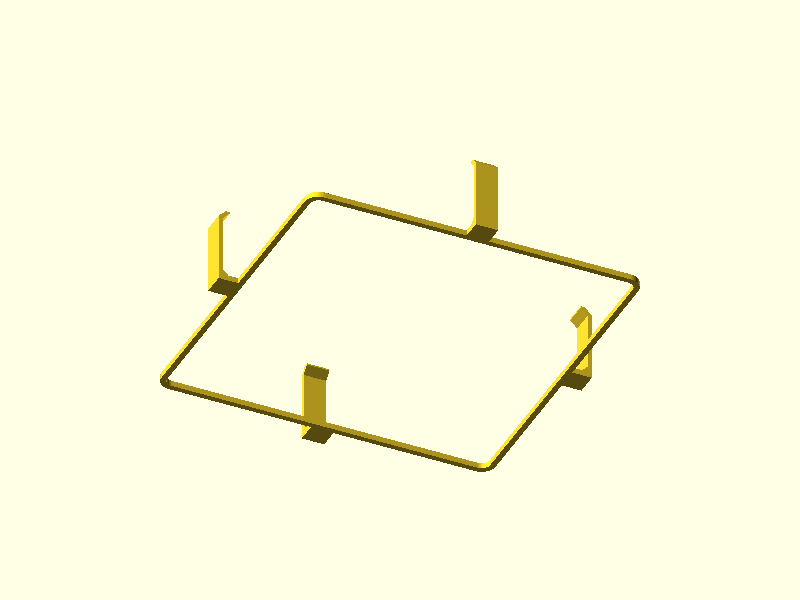

# Fan-Tub Adapter v2.0 — Tool-Free Clip System

A two-part replacement for the v1.0 bolt-on fan-tub adapter. The base plate is permanently caulked to the tub lid, and a snap-on retention clip holds the fan in place for tool-free removal and cleaning.

**v1.0 is frozen** — see [fan-tub-adapter.md](fan-tub-adapter.md) for the bolt-on design.

## System Overview

The v1.0 design used M4 bolts + thumbscrews to secure the fan. v2.0 eliminates all fasteners:

1. **Base plate** — caulked to the lid with silicone. Retains all waffle-grid engagement branches. A taller locating rim (4mm, up from 1.5mm) holds the fan positively, with clip ledges on the rim exterior.
2. **Retention clip** — a frame that sits on the fan top with four cantilever arms that snap down onto the base plate ledges. Squeeze two opposite arms to release.

No bolts, no nuts, no thumbscrews, no tools.

## Cross-Section (Installed)

```
                        ← center        outside →

    z=29.7  ┌─────────────────────┬──────┐  clip frame (2mm thick, on fan top)
            │   sits on fan top   │ tab  │
    z=29.7  ╪═════════════════════╪══════╪  fan frame top
            │                     │      │
            │   fan (24.7mm)      │  arm │  (1.5mm thick, 8mm wide)
            │                     │      │
    z=9.0   ║                     ║      │  rim top
            ║   rim (4mm tall)    ║      │
    z=7.5   ║                     ╠══╗   │  ledge (1.0mm out, 1.5mm tall)
            ║                     ║  ║┌──┤  hook catches UNDER ledge
    z=6.0   ║                     ╠══╝└──┤
            ║                     ║      │
    z=5.0   ╩═════════════════════╩══════╧  inner plate top
```

## Vertical Stackup

| Z (mm) | Feature |
|--------|---------|
| 0.0 | Base plate bottom (caulked to lid) |
| 5.0 | Inner plate top surface |
| 5.0–9.0 | Locating rim (4.0mm tall) |
| 6.0–7.5 | Clip ledge zone (1.0mm outward protrusion) |
| 5.0–29.7 | Fan frame (24.7mm thick) |
| 29.7–31.7 | Clip frame (2.0mm thick) |

## Part 1: Base Plate

### Renders

#### Isometric (Top)


Stepped plate with Y-branches extending into waffle channels. Taller 4mm locating rim visible as a raised square border. No bolt holes — clean inner zone. Clip ledges (3mm protrusions with 45° chamfered underside) on rim exterior.

#### Bottom Isometric


Clean flat bottom face — no hex counterbores or bolt holes. This face gets caulked directly to the tub lid.

#### Top-Down


Branch forks centered in surrounding channels at 73.1mm from center. Locating rim inner edge defines fan drop-in area.

#### Edge Profile


Shows the stepped plate profile: thick inner zone (5mm) with 4mm rim, thinner outer zone (4.6mm) flush with waffle square tops.

### Geometry

| Dimension | Value | Notes |
|-----------|-------|-------|
| Overall bounding box | 196.2 x 196.2 x 9.0 mm | Same XY footprint as v1 |
| Locating rim | 120mm inner, 124mm outer, 4.0mm tall | Taller than v1 (was 1.5mm) |
| Clip ledges | 3.0mm outward, 5.0mm tall, 8mm wide | 4x, one per side; 45° chamfered underside |
| Ledge Z position | z=4.0 to z=9.0 | chamfer z=4–7, flat engagement z=7–9 |
| Inner plate | 5.0mm thick | Fan mount zone |
| Outer plate | 4.6mm thick | Flush with waffle tops |
| Center opening | 115mm diameter | Matches fan inner circle |
| Branch engagement | 25mm per arm | 8 arms total |

### Validation

```
bbox.x:    196.2 mm  (expected 196 ±2)    PASS
bbox.y:    196.2 mm  (expected 196 ±2)    PASS
bbox.z:    9.0 mm    (expected 9.0 ±0.5)  PASS
watertight: true                           PASS
volume:    64.1 cm³  (expected 10–120)     PASS
```

## Part 2: Retention Clip

### Renders

#### Isometric (Top)


Frame with four cantilever arms. Installed orientation: frame on top, arms hanging down. Root fillets visible as small triangular buttresses where each arm meets its tab.

#### Bottom Isometric



View from below showing all four hooks at arm tips. The 45° lead-in chamfer on each hook's outer-lower edge is visible as the angled entry face. Hook catches under base plate ledge flat zone at z=7.0–9.0mm.

> Note: orthographic side views (front/right/side) are uninformative for this part — the clip is 4-way symmetric and the 1.5mm arms are invisible from any flat angle. Isometric views show the geometry clearly.

### Clip Mechanism — Cantilever Snap-Fit

- Arm length: 22.05mm (preload-adjusted from 22.2mm theoretical)
- Snap deflection: 2.5mm (= hook overhang; arm must flex this far outward to pass ledge)
- Engagement depth: 2.5mm (hook inner face sits 2.5mm behind ledge outer face when snapped)
- Arm cross-section: 8.0mm wide × 1.5mm thick
- Nominal root stress: 40.5 MPa  (`σ = 3Ehδ / 2L²`, E=3500, h=1.5, δ=2.5, L=22.05)
- PLA yield (Bambu PLA Basic): ~65 MPa
- **Nominal SF: 1.6** — adequate; with 2mm root fillet Kt→1.2, σ_peak ≈ 48.6 MPa < yield

#### Fatigue / Cycle Life

The **2mm root fillet** at the arm/tab junction drops Kt from ~2.5 to ~1.2, giving σ_peak ≈ 48.6 MPa — below PLA's estimated fatigue limit of ~50 MPa. Adequate for repeated seasonal removal/cleaning cycles.

The hook has **45° chamfers on both faces**:
- **Outer chamfer** (snap-in ramp): 2.5mm × 45° ramp distributes snap-in force over travel, reducing peak root load during assembly.
- **Inner chamfer** (printability): 2.5mm vertical over 2.5mm horizontal = exactly 45°. Eliminates the overhang at the arm/hook junction in print orientation (frame on bed, hooks at top). Every layer transitions at ≤45°.

#### Alternate Geometry Considered

A tapered arm (thicker root, thinner tip) distributes stress more uniformly but provides no meaningful gain here since arm length is geometrically locked by the ledge position — the only levers are section thickness and Kt reduction. The current arm with root fillet achieves the design goal.

### Geometry

| Dimension | Value | Notes |
|-----------|-------|-------|
| Overall bounding box | 133 x 133 x 27.1 mm | In installed orientation |
| Frame outer | 119mm rounded square | Matches fan frame |
| Frame inner | 115mm | Airflow opening |
| Frame thickness | 2.0mm | |
| Arm width | 8.0mm | One centered per side |
| Arm thickness | 1.5mm | |
| Arm length | 22.05mm | With 0.15mm preload |
| Hook overhang | 2.5mm inward | Snap deflection = engagement depth |
| Hook height | 3.0mm | |
| Hook outer chamfer | 2.5mm @ 45° | Snap-in ramp on outer-lower edge |
| Hook inner chamfer | 2.5mm @ 45° | Printability ramp; exactly 45° — no unsupported overhang in print orientation |
| Root fillet | 2.0mm | Triangular prism at arm/tab inner corner; Kt 2.5→1.2 |
| Tab bridge | 7.0mm | Frame edge to arm outer face |

### Validation

```
bbox.x:    133.0 mm  (expected 133 ±2)     PASS
bbox.y:    133.0 mm  (expected 133 ±2)     PASS
bbox.z:    27.05 mm  (expected 27.1 ±1.0)  PASS
watertight: true                            PASS
volume:    3.6 cm³   (expected 2–40)        PASS
```

## Assembly Instructions

1. **Install base plate**: Apply silicone caulk to base plate bottom. Press into waffle cutout, branches into channels. Let cure 24h.
2. **Install fan**: Drop fan into locating rim. Frame sits on inner plate, rim provides alignment.
3. **Clip on**: Press retention clip down over fan. Arms deflect outward ~1.8mm as hooks pass ledges, then snap into place.
4. **Remove for cleaning**: Squeeze two opposite clip arms outward. Lift clip off. Lift fan out. Base plate stays permanently on lid.

## BOM

| Qty | Item | Notes |
|-----|------|-------|
| 1 | Base plate (3D printed) | PLA, 64.1 cm³ |
| 1 | Retention clip (3D printed) | PLA, 3.6 cm³ |
| 1 | Silicone caulk | Aquarium-safe, for base plate to lid |

No fasteners required.

## Print Settings

| Setting | Base Plate | Retention Clip |
|---------|-----------|----------------|
| Orientation | Bottom face on bed | Frame on bed, arms up |
| Material | PLA | PLA |
| Layer height | 0.2mm | 0.2mm |
| Infill | 100% | 100% |
| Supports | None | None |
| Notes | Rim builds upward, ledges are 1mm steps | Hooks print at top; dual 45° chamfers (2.5mm each) ensure no unsupported overhangs |

## Changes from v1.0

| Feature | v1.0 | v2.0 |
|---------|------|------|
| Fan retention | M4 bolts + nuts | Snap-fit clip |
| Lid attachment | M4 thumbscrews + wing nuts | Silicone caulk (permanent) |
| Parts | 1 | 2 (base + clip) |
| Fasteners | 4 bolts, 4 nuts, 2 thumbscrews, 2 wing nuts | None |
| Tool-free removal | Thumbscrews only (fan still bolted) | Both fan and clip are tool-free |
| Locating rim height | 1.5mm | 4.0mm |
| Bolt holes | 4x M4 + hex counterbores | None |
| Total print volume | 69.4 cm³ | 68.0 cm³ (64.4 + 3.6) |

## Assembly Validation

The base plate, fan, and clip can be checked as an assembly:

```bash
node bin/check-assembly.js assemblies/fan-tub-adapter-v2.json
```

### Interference Checks

| Part A | Part B | Max Volume | Description |
|--------|--------|-----------|-------------|
| base | clip | 5.0 mm³ | Hook engagement zone — controlled overlap expected |
| base | fan | 0.0 mm³ | Fan must sit inside rim with clearance |
| clip | fan | 0.0 mm³ | Clip frame rests on fan top, no overlap |

### Fit Specs

| Check | Type | Expected Range | Description |
|-------|------|---------------|-------------|
| clip-hook-ledge-engagement | interference | 0.3–1.5 mm³ | Positive hook engagement with ledges |
| fan-in-rim-clearance | clearance | 0.3–0.7 mm | Gap between fan frame and locating rim |

### Assembly Positions

| Part | Position (X, Y, Z) | Notes |
|------|-------------------|-------|
| Base | 0, 0, 0 | Reference origin |
| Fan | 0, 0, 5.0 | Sits on inner plate (z=frame_t_inner) |
| Clip | 0, 0, 6.15 | Local z=0 (hook bottom) → global z=6.15 |

## Downloads

| Part | STL | Source |
|------|-----|--------|
| Base plate | [`fan-tub-adapter-base.stl`](../designs/fan-tub-adapter-base/fan-tub-adapter-base.stl) | [`fan-tub-adapter-base.scad`](../designs/fan-tub-adapter-base/fan-tub-adapter-base.scad) |
| Retention clip | [`fan-tub-adapter-clip.stl`](../designs/fan-tub-adapter-clip/fan-tub-adapter-clip.stl) | [`fan-tub-adapter-clip.scad`](../designs/fan-tub-adapter-clip/fan-tub-adapter-clip.scad) |

Shared: [`fan-tub-adapter-params.scad`](../scad-lib/fan-tub-adapter-params.scad) · [`spec.json (base)`](../designs/fan-tub-adapter-base/spec.json) · [`spec.json (clip)`](../designs/fan-tub-adapter-clip/spec.json) · [`assembly spec`](../assemblies/fan-tub-adapter-v2.json)
