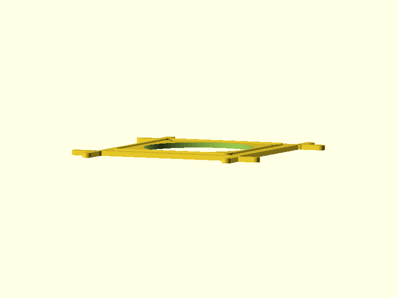
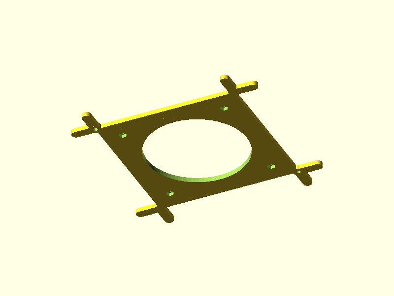
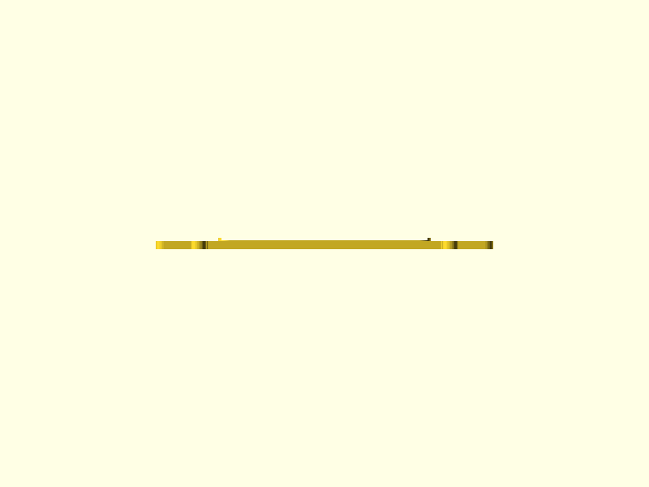

# Fan-Tub Adapter

A 3D-printed adapter frame that mounts a 119mm waterproof fan into a waffle-pattern HDPE tub lid, replacing the need to jigsaw a hole. Designed for a mushroom cultivation Martha tent, where the fan provides forced-air intake through the tub.

## The Problem

The tub lid has a rigid waffle pattern — a grid of raised squares (63.7mm) separated by flat channels (9.4mm wide). Cutting a clean circular hole for a fan is difficult with hand tools and weakens the lid. We need a way to mount the fan that:

- Doesn't require precision cutting (just remove a 2x2 block of waffle squares)
- Locates and locks into the waffle grid positively
- Can be removed tool-free for cleaning and maintenance
- Maximises airflow through the fan

## Design Approach

The user cuts out a **2x2 block of waffle squares** (136.8 x 136.8mm) along the channel lines. The adapter is a stepped frame that fills this hole, with Y-shaped corner branches that extend outward into the surrounding waffle channels for positive location.

The plate has **two thickness zones**:
- **Inner zone (5mm)** — bounded by the locating rim footprint (124mm square). Provides depth for hex M4 nut counterbores with tapered lead-in on the bottom face.
- **Outer zone (4.6mm)** — the flange and branches, thinned to match the waffle square height so they sit flush with the surrounding waffle tops. Saves material and print time.

A raised locating rim on top matches the fan's 119mm footprint for drop-in alignment.

### Key Design Decision: Branch Positioning

The branches must be centered in the **surrounding channels**, not at the cutout edge. The cutout edge is where the waffle squares end; the channels are 9.4mm further out. Branch roots are positioned at `cutout/2 + channel_w/2 = 73.1mm` from part center — at the intersection of the two perpendicular channels at each corner.

### Key Design Decision: Hex Counterbores with Tapered Lead-In

Previous revisions used circular counterbores to avoid bridging issues. Hex pockets are better — they hold the M4 nut rotationally, making one-handed assembly easy. But a full hex pocket with a flat ceiling creates an unsupported bridge across the entire 7.8mm span.

The solution: use the 1.6mm of material between the hex pocket ceiling and the bolt hole as a **tapered lead-in**. A `hull()` blends from the hex profile (7.8mm AF) at the pocket ceiling to a circle (bolt hole diameter) at the top surface. Each printed layer in the taper zone is slightly smaller than the one below, providing intrinsic support. The overhang angle at the flats is ~47° from vertical — close to the 45° limit but well within tolerance, and the hex corners are steeper but cover a tiny area. No bridging occurs at all.

```
z=5.0mm  ──────  bolt hole (4.4mm dia) continues through rim + top
z=5.0mm  ╱    ╲  taper top: circle, d = bolt_hole_dia (4.4mm)
         │    │
z=3.4mm  ╲    ╱  taper bottom: hex, d = 7.8mm AF  ← hull() between these
z=3.4mm  ┃    ┃
z=0.0mm  ┗━━━━┛  hex pocket: 7.8mm AF, $fn=6 (nut sits here)
```

### Key Features

**Stepped Plate** — The inner zone (124mm square, 5mm thick) is 0.4mm proud of the outer zone (4.6mm thick). This gives the fan mount area enough depth for nut counterbores while keeping the flange and branches flush with the waffle square tops. The step boundary follows the locating rim outer footprint.

**Y-Shaped Corner Branches** — Each of the 4 corners forks into two arms centered in the perpendicular waffle channels (branch root at 73.1mm from center, not 68.4mm). The waffle squares on either side constrain each arm laterally. 8 engagement points total provide anti-rotation and alignment. Branches are in-plane with the outer zone at 4.6mm thickness — flush with waffle square tops.

**Flange Lip** — The frame extends 4.7mm (half a channel width) beyond the cutout on all sides, so the frame edge aligns with the channel centers. This sits on the flat channel rim at the outer zone thickness (4.6mm) and prevents drop-through.

**Fan Locating Rim** — A 1.5mm raised square border on the top surface, sized to the fan's 119mm frame with 0.5mm clearance per side. Drop the fan into the rim, holes line up, thread bolts.

**Hex Nut Counterbores with Taper** — The 4 fan bolt positions have hex pockets ($fn=6) recessed into the bottom face (3.4mm deep, 7.8mm across flats). The hex profile holds the nut rotationally for easy assembly. Above each pocket, a 1.6mm tapered lead-in transitions from the hex to the circular bolt hole, eliminating bridging entirely. No supports needed.

**Tool-Free Removal** — Two M4 thumbscrews at diagonally opposite corner T-junctions — the thickest point on the part where the frame corner, crotch blend, and both branch roots all overlap. They clamp the adapter to the lid with wing nuts below.

## Renders

### Top (Isometric)


Stepped plate with branches extending outward from the frame corners into the surrounding channel positions. The inner zone (5mm) is slightly proud of the outer zone (4.6mm). Locating rim visible as a raised square border. Four fan bolt through-holes at the 107mm pattern.

### Edge Profile



Near-edge view showing the **stepped plate profile**: the thicker inner zone (5mm, with locating rim on top) sits 0.4mm proud of the thinner outer zone (4.6mm) and branch arms. Bottom face is flat — the step is only on the top surface.

### Bottom (Isometric)



Underside showing **hex nut counterbores** at each fan bolt position — hex pockets with tapered lead-in to the bolt hole. Bottom surface is completely flat across both thickness zones.

### Top-Down View



Looking straight down. Branch forks are visibly offset from the frame corners — centered in the surrounding channels at 73.1mm from center. Thumbscrew holes at two diagonally opposite T-junctions. The inner zone boundary is visible as a faint square outline around the locating rim.

### Bottom-Up View


Looking straight up at the bottom face. Hex counterbore pockets visible at the 4 fan bolt positions, with the tapered transition to the circular bolt hole.

## Cross-Section

How the parts stack when installed:

```
    Fan frame (drops inside locating rim)
  ┌──────────────────────────────────┐   ← locating rim (1.5mm)
  ├══════════════════════════════════┤   ← inner plate (5mm), hex counterbores on bottom
  ──╬──────────────────────────────╬──   ← outer plate (4.6mm, flush with waffle tops)
  ──╗                              ╔──   ← waffle squares (4.6mm)
    ║   branches centered in       ║        channels, constrained laterally
    ╚═══════════════╤══════════════╝
  ──────────────────┘                    ← lid surface
```

The outer zone (4.6mm) matches the waffle square height exactly, so the flange and branches sit flush with the surrounding waffle tops. The inner zone steps up 0.4mm to provide the full 5mm needed for counterbore depth.

## Geometry

| Dimension | Value | Notes |
|-----------|-------|-------|
| Waffle square | 63.7 mm | Measured at channel-level plane |
| Channel width | 9.4 mm | Gap between adjacent squares |
| Waffle square height | 4.6 mm | Height above channel surface |
| Grid pitch | 73.1 mm | square + channel |
| Cutout hole | 136.8 x 136.8 mm | 2 squares + 1 channel |
| Frame outer (with flange) | 146.2 x 146.2 mm | cutout + channel_w |
| Overall bounding box | 196.2 x 196.2 x 6.5 mm | Includes branch tips |
| Branch root position | 73.1 mm from center | Centered in surrounding channels |
| Center opening | 105 mm diameter | |
| Fan bolt pattern | 107 x 107 mm (M4) | |
| Hex nut pocket | 7.8mm AF hex ($fn=6), 3.4mm deep | Holds nut rotationally |
| Tapered lead-in | 1.6mm tall, hex→circle hull | ~47° overhang, no bridging |
| Locating rim | 120mm inner, 124mm outer, 1.5mm tall, 2mm wall | |
| Branch width | 9.0 mm | 0.4mm clearance in 9.4mm channels |
| Branch engagement | 25 mm per arm from root | |
| Inner plate thickness | 5.0 mm | Fan mount zone (bounded by locating rim footprint) |
| Outer plate thickness | 4.6 mm | Flange + branches, flush with waffle square tops |
| Step height | 0.4 mm | Inner zone proud of outer zone (top surface only) |

## Fastener BOM

| Qty | Item | Purpose |
|-----|------|---------|
| 4 | M4 x 12mm socket head bolts | Fan to adapter (through fan frame + plate) |
| 4 | M4 nuts | Seated in hex counterbores on bottom face (anti-rotation) |
| 2 | M4 x 16mm thumbscrews | Adapter to lid clamping (at corner T-junctions) |
| 2 | M4 wing nuts | Below-lid, tool-free removal |

## Print Settings

| Setting | Value |
|---------|-------|
| Material | PLA |
| Layer height | 0.2 mm |
| Infill | 100% (thin plate, mostly perimeters) |
| Supports | None needed |
| Orientation | Bottom face on bed (hex pockets print as recesses, taper self-supports, rim on top) |
| Estimated material | ~69.4 cm³ |

## Validation Results

```
bbox.x:    196.2 mm  (expected 196 ±2)    PASS
bbox.y:    196.2 mm  (expected 196 ±2)    PASS
bbox.z:    6.5 mm    (expected 6.5 ±0.5)  PASS
watertight: true                           PASS
volume:    69.4 cm³  (expected 10–100)     PASS
fits bed:  196.2 mm  (max 256)             PASS
```

## Revision History

- **v5** (current): Hex counterbores with tapered lead-in — hex pockets ($fn=6, 7.8mm AF) hold nuts rotationally, 1.6mm taper zone hull()s from hex to circle eliminating bridging entirely. ~47° overhang at flats, well within PLA limits.
- **v4**: Stepped plate — outer zone (flange + branches) thinned to 4.6mm to sit flush with waffle square tops; inner zone remains 5mm for counterbore depth. Saves ~3 cm³ material.
- **v3**: Fix branch positions — offset to channel centers (73.1mm from center, was 68.4mm). Switch hex counterbores to circular for clean bridging. Physical prototype confirmed fan/bolt alignment is correct; branch fitment issue resolved by this fix.
- **v2**: Flatten to single plane, add counterbores and locating rim, move thumbscrews to T-junctions
- **v1**: Initial design with separate branch plane and standoffs

## Source Files

- [`fan-tub-adapter.scad`](../designs/fan-tub-adapter/fan-tub-adapter.scad) — Parametric OpenSCAD source
- [`fan-tub-adapter.stl`](../designs/fan-tub-adapter/fan-tub-adapter.stl) — Ready-to-slice STL
- [`spec.json`](../designs/fan-tub-adapter/spec.json) — Validation spec
