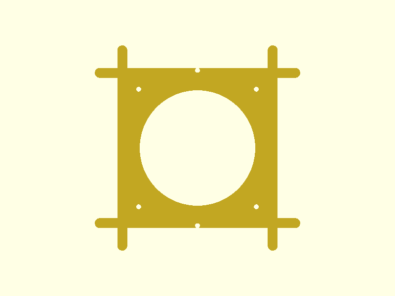
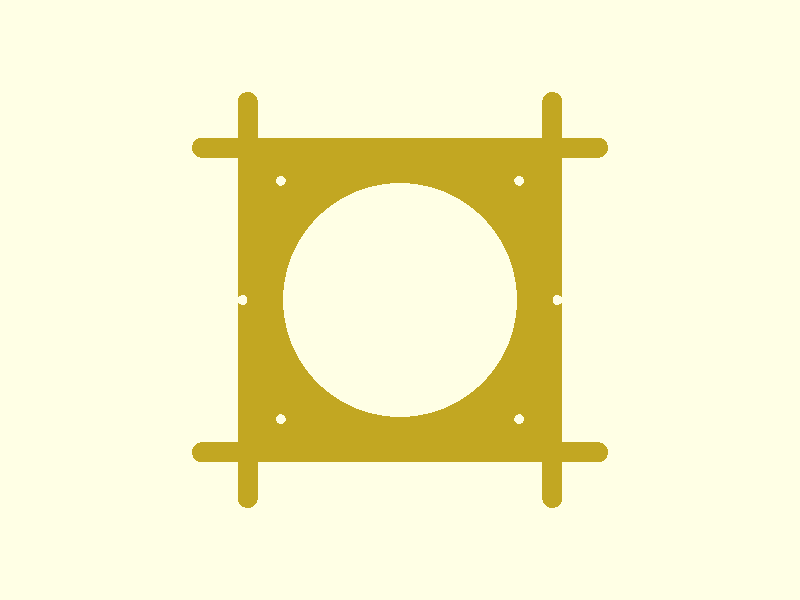

# Fan-Tub Adapter

A 3D-printed adapter frame that mounts a 119mm waterproof fan into a waffle-pattern HDPE tub lid, replacing the need to jigsaw a hole. Designed for a mushroom cultivation Martha tent, where the fan provides forced-air intake through the tub.

## The Problem

The tub lid has a rigid waffle pattern — a grid of raised squares separated by flat channels. Cutting a clean circular hole for a fan is difficult with hand tools and weakens the lid. We need a way to mount the fan that:

- Doesn't require precision cutting (just remove a 2x2 block of waffle squares)
- Locates and locks into the waffle grid positively
- Can be removed tool-free for cleaning and maintenance
- Maximises airflow through the fan

## Design Approach

Instead of cutting a circle, the user cuts out a **2x2 block of waffle squares** (136.8 x 136.8mm) using a jigsaw along the straight channel lines. The adapter is a flat frame that drops into this rectangular hole and locks into the surrounding waffle grid.

The entire part is a single flat plate — 3mm thick throughout. The fan bolts directly to the top surface with no standoffs or air gap.

### Key Features

**Y-Shaped Corner Branches** — The signature feature. Each of the 4 corners has a forking branch that extends into the two perpendicular waffle channels adjacent to that corner. The waffle squares on either side of each channel constrain the branch laterally. This gives 8 engagement points total, providing excellent anti-rotation and alignment with zero fasteners.

**Flange Lip** — The frame extends 4.5mm beyond the cutout on all sides, sitting on the flat rim around the hole. This prevents the adapter from dropping through.

**Direct Fan Mount** — Four M4 through-holes at the 107mm bolt pattern. The fan sits flush on the frame surface with no standoffs — bolts pass through the fan frame and adapter, secured with nuts below.

**Tool-Free Removal** — Two M4 thumbscrews on opposite sides of the flange clamp the adapter to the lid with wing nuts below. The branches handle alignment; the thumbscrews just hold it down. Undo two wing nuts and the whole assembly lifts out.

**Wire Channel** — A 20x6mm notch in one edge of the frame lets the fan cable exit cleanly.

## Renders

### Isometric View


The flat frame with center airflow opening, four M4 through-holes at the fan bolt pattern, Y-branches extending from each corner, and the wire channel notch on the right edge.

### Front View (XZ Plane)



Looking straight down. Shows the square frame, circular center opening, 8 branch arms forking from the 4 corners, and thumbscrew holes at top and bottom center of the flange.

### Side Views

| Right (YZ) | Top (XY) |
|:-:|:-:|
|  |  |

The part is only 3mm tall — a uniform flat plate. The side views show the thin profile with branches and frame all in the same plane.

## Cross-Section

How the parts stack when installed:

```
    Fan frame (sits flush on adapter)
  ════════════════════════════════       ← adapter plate (3mm), branches in-plane
  ──╗                          ╔──      ← waffle squares (4.6mm tall)
    ║   constrain branches     ║           surround and locate the branches
    ╚═══════════╤══════════════╝
  ──────────────┘                       ← lid surface (2mm thick)
```

The adapter plate sits on the flat channel-level rim. The waffle squares rise 4.6mm around the 3mm-thick branches, providing 1.6mm of lateral engagement above the branch surface. The fan sits directly on the adapter with no gap.

## Geometry

| Dimension | Value |
|-----------|-------|
| Cutout hole | 136.8 x 136.8 mm |
| Frame outer (with flange) | 145.8 x 145.8 mm |
| Overall bounding box | 186.8 x 186.8 x 3.0 mm |
| Center opening | 105 mm diameter |
| Fan bolt pattern | 107 x 107 mm (M4) |
| Branch width | 9.0 mm (0.4mm clearance in 9.4mm channels) |
| Branch engagement length | 25 mm per arm |
| Frame/branch thickness | 3.0 mm (uniform) |
| Corner radius | 4.0 mm |

## Fastener BOM

| Qty | Item | Purpose |
|-----|------|---------|
| 4 | M4 x 12mm socket head bolts | Fan to adapter (through fan frame + adapter plate) |
| 4 | M4 nylon lock nuts | Secure fan bolts from below |
| 2 | M4 x 16mm thumbscrews | Adapter to lid clamping (opposite sides) |
| 2 | M4 wing nuts | Below-lid, tool-free removal |

## Print Settings

| Setting | Value |
|---------|-------|
| Material | PLA |
| Layer height | 0.2 mm |
| Infill | 100% (only 3mm thick — 15 layers, mostly perimeters anyway) |
| Supports | None needed |
| Orientation | Flat on bed (only orientation that makes sense) |
| Estimated material | ~42 cm³ |

## Validation Results

```
bbox.x:    186.8 mm  (expected 186 ±2)    PASS
bbox.y:    186.8 mm  (expected 186 ±2)    PASS
bbox.z:    3.0 mm    (expected 3 ±0.5)    PASS
watertight: true                           PASS
volume:    41.6 cm³  (expected 5–50)       PASS
fits bed:  186.8 mm  (max 256)             PASS
```

## Source Files

- [`fan-tub-adapter.scad`](../designs/fan-tub-adapter/fan-tub-adapter.scad) — Parametric OpenSCAD source
- [`spec.json`](../designs/fan-tub-adapter/spec.json) — Validation spec
