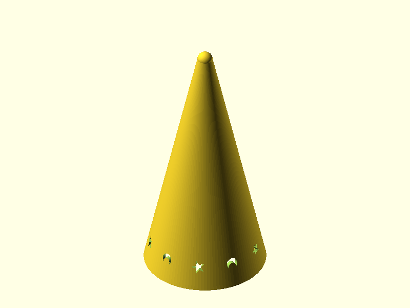

# Glitter Wizard Hat

Replacement top cap for vintage Lava Lite "Glitter Wizard" lava lamps — the conical wizard hat with star and moon cutouts that sits on top of the glass globe. The originals were stamped sheet metal and they don't survive four decades particularly well. This is a PLA replacement in two sizes, each with its own tuned SCAD file.

## Questions for Greg

Before printing, these need answers — all are based on best guesses from photo analysis and web research, not direct measurement:

1. **Bottle neck OD:** The retention lip ID is 43 mm (large) / 39 mm (small). These are estimated from eBay listings, not measured. Caliper the actual bottle neck before committing to a print.
2. **Cutout count:** 12 (large) / 10 (small) — derived from pixel cluster analysis. Could be wrong.
3. **Cutout row height:** Set at 10% from base. User confirmed "very near the bottom" but exact position is eyeballed.
4. **Crescent orientation:** All facing same direction. Might need to flip or alternate.
5. **Star/moon sizes:** 6 mm stars, 5 mm moons (large). Scaled down slightly for small. May need tuning after a test print.
6. **Tip radius:** 1.5 mm — nearly pointed. If this is too sharp or too blunt, adjust `tip_r` in the SCAD.

## Renders

### Large (fits 14.5"–17" lamps)


*Isometric — single row of alternating stars and moons near the base, nearly pointed tip*


*Front elevation — 114.3 mm tall, 52 mm base. Cutout ring at ~10% height from base*

### Small (fits 14.5" lamps)


*Small variant — 95 mm tall, 48 mm base, 10 cutouts (vs. 12 on large)*

## Design Overview

The cap is a hollow cone tapering from the base opening to a nearly pointed tip (1.5 mm radius — just enough to avoid a knife edge). A single row of alternating star and crescent moon cutouts rings the cone near the base, matching the vintage "star and moon" pattern documented across every collector source.

```
                .  tip (R = 1.5 mm)
               / \
              /   \
             /     \
            /       \
           /         \
          /           \
         /             \
        /  ★ ☽ ★ ☽ ★ ☽ \  cutout row (~10% from base)
       /                 \
      └─────┬───────┬─────┘  base (OD 52 mm)
            │ lip   │        retention lip (ID 43 mm)
            └───────┘
```

### V1 to V2 changes

| Item | V1 | V2 | Reason |
|------|----|----|--------|
| Cutout rows | 4 staggered rows | 1 single row near base | Photo reference + user correction |
| Cutout shapes | Stars, circles, crescents | Stars and crescents only | All sources say "star and moon" — no circles |
| Cutout pattern | 7-item repeating cycle | Alternating star, moon | Photo shows alternating |
| Row position | 15%, 35%, 55%, 75% | ~10% from base | User confirmed: near the bottom |
| Tip radius | 3.0–3.5 mm | 1.5 mm | Photo shows nearly pointed tip |
| File structure | Single parametric .scad | Two separate .scad files | Cutout count/sizes tuned per size |

### Two sizes

| Parameter | Small | Large |
|-----------|-------|-------|
| Height | 95.0 mm | 114.3 mm |
| Base OD | 48.0 mm | 52.0 mm |
| Wall | 1.5 mm | 1.5 mm |
| Tip radius | 1.5 mm | 1.5 mm |
| Star diameter | 5.5 mm | 6.0 mm |
| Moon height | 4.5 mm | 5.0 mm |
| Cutout count | 10 | 12 |
| Row position | 10% from base | 10% from base |

### Cutout pattern

Stars and crescent moons alternate around the circumference: star, moon, star, moon. All crescents face the same direction (horns pointing clockwise when viewed from above). The star and moon sizes are tuned per size — slightly smaller on the small cap to maintain visual proportion on the narrower circumference.

## Geometry

| Dimension | Large | Small |
|-----------|-------|-------|
| Bounding box | 52 x 52 x 114.3 mm | 48 x 48 x 95 mm |
| Wall thickness | 1.5 mm | 1.5 mm |
| Tip OD | 6.0 mm | 6.0 mm |
| Retention lip ID | 43.0 mm | 39.0 mm |

## Mating Interfaces

| Interface | This Part | Bottle | Fit Type | Notes |
|-----------|-----------|--------|----------|-------|
| Retention lip | 43 mm ID (large) / 39 mm (small) | ~41.3 mm OD (estimated) | clearance | **Measure your bottle neck before printing** |

## Print Settings

| Setting | Value |
|---------|-------|
| Orientation | Base-down — wide opening on build plate |
| Material | PLA |
| Layer height | 0.2 mm |
| Supports | None expected — cutouts near base print as layer gaps |
| Infill | 15% |

## Downloads

| File | Description |
|------|-------------|
| [`glitter-wizard-hat-large.stl`](../designs/glitter-wizard-hat/output/glitter-wizard-hat-large.stl) | Print-ready mesh — large |
| [`glitter-wizard-hat-small.stl`](../designs/glitter-wizard-hat/output/glitter-wizard-hat-small.stl) | Print-ready mesh — small |
| [`glitter-wizard-hat-large.scad`](../designs/glitter-wizard-hat/glitter-wizard-hat-large.scad) | OpenSCAD source — large |
| [`glitter-wizard-hat-small.scad`](../designs/glitter-wizard-hat/glitter-wizard-hat-small.scad) | OpenSCAD source — small |
| [`spec.json`](../designs/glitter-wizard-hat/spec.json) | Validation spec |
| [`requirements.md`](../designs/glitter-wizard-hat/requirements.md) | Full requirements |

## Pipeline

| Stage | Agent | Result |
|-------|-------|--------|
| Research | web search + photo analysis | 10+ sources, ruler-calibrated photos |
| Model v1 | orchestrator | 4-row cutouts — wrong pattern |
| Review | user | Single row near base, stars/moons only, tip too round |
| Model v2 | orchestrator | Split files, single row at 10%, tip 1.5mm |
| Geometry | geometry-analyzer | complete (`output/geometry-report.json`) |
| Print review | print-reviewer | complete (`output/review-printability.md`) |

Built with pipeline v4.1
