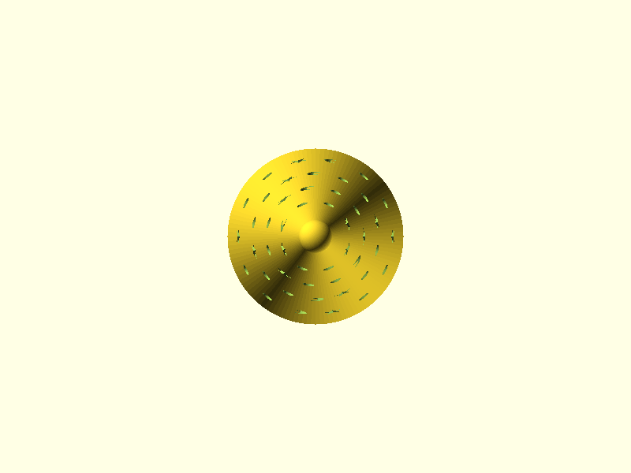
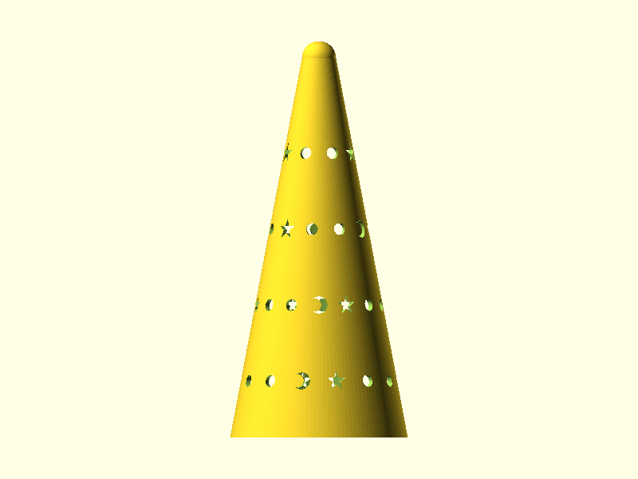
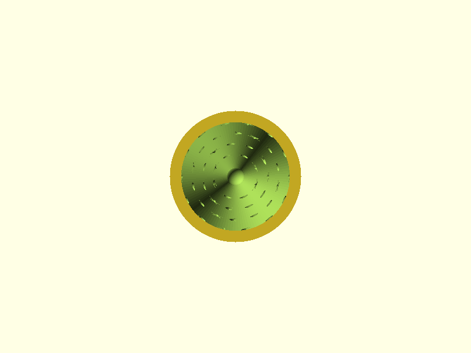

# Glitter Wizard Hat

Replacement top cap for vintage Lava Lite "Glitter Wizard" lava lamps — the conical wizard hat with star, circle, and crescent moon cutouts that sits on top of the glass globe. The originals were stamped sheet metal and they don't survive four decades particularly well. This is a parametric PLA replacement in two sizes.

## Renders


*Isometric view — conical body with hemisphere tip, four rows of star, circle, and crescent moon cutouts*


*Front elevation — 114.3 mm tall, 52 mm base, half-angle 12.8 degrees from vertical*


*Top-down view — circular profile, cutouts visible through the cone wall at four height bands*


*Bottom-up view — base opening with retention lip visible as the stepped inner ring (43 mm ID)*

## Design Overview

The cap is a hollow truncated cone that tapers from the base opening to a small diameter at the apex, capped with a hemisphere. Four rows of decorative cutouts — 5-pointed stars, circles, and crescent moons — are distributed around the cone surface in a staggered pattern. When lit, the cutouts project shapes onto surrounding surfaces.

```
                ●  hemisphere tip (R = 3.5 mm)
               / \
              /   \    ★  ○  ☽  cutout row 4  (z ≈ 83 mm)
             /     \
            /       \   ★  ○  ☽  cutout row 3  (z ≈ 61 mm)
           /         \
          /           \  ★  ○  ☽  cutout row 2  (z ≈ 39 mm)
         /             \
        /               \ ★  ○  ☽  cutout row 1  (z ≈ 17 mm)
       /                 \
      └─────┬───────┬─────┘  base (OD 52 mm)
            │ lip   │        retention lip (ID 43 mm)
            └───────┘
```

The base opening fits over the lava lamp bottle neck. A 3 mm inward retention lip at the base provides a friction grip — the bottle neck rim seats into the step between the 49 mm bore and the 43 mm lip opening. Wall thickness is 1.5 mm throughout (3 perimeters at 0.4 mm nozzle).

### Two sizes

Both sizes share the same cone geometry and cutout pattern — the only differences are height, base diameter, and tip radius. Toggle `SIZE` in the SCAD file.

| Parameter | Small (14.5" lamp) | Large (17" lamp) |
|-----------|-------------------|-----------------|
| Height | 95.0 mm | 114.3 mm |
| Base OD | 48.0 mm | 52.0 mm |
| Base ID | 45.0 mm | 49.0 mm |
| Lip ID | 39.0 mm | 43.0 mm |
| Wall | 1.5 mm | 1.5 mm |
| Tip radius | 3.0 mm | 3.5 mm |
| Half-angle | 14.2 deg | 12.8 deg |

Dimensions were derived from ruler-calibrated photo analysis (88 PPI from framing square tick marks) cross-referenced with existing 3D models — notably the [4.5" Replacement Wizard Lava Lamp Cap](https://www.thingiverse.com/thing:7307363) on Thingiverse, which confirmed the large size height.

### Cutout pattern

Each of the four rows distributes shapes evenly around the circumference, with adjacent rows staggered by half a step. Item count per row scales with circumference — more shapes on wider lower rows, fewer near the tip. The repeating pattern cycles: star, circle, circle, crescent, star, circle, circle.

| Shape | Size | Notes |
|-------|------|-------|
| 5-pointed star | 6.0 mm across points | Inner ratio 0.38 — narrowest web between points is 1.34 mm (passes 1.2 mm min wall) |
| Circle | 3.5 mm diameter | Clean round holes |
| Crescent moon | 5.0 mm tall, 3.5 mm wide | Horn tips will blunt slightly in print — acceptable for decorative feature |

## Geometry

| Dimension | Value | Notes |
|-----------|-------|-------|
| Bounding box (large) | 52 x 52 x 115.8 mm | 1.5 mm overage is the hemisphere tip |
| Wall thickness | 1.5 mm | constant throughout cone |
| Volume | 16.77 cm3 | ~21 g at 1.24 g/cm3 |
| Surface area | 221.4 cm2 | |
| Cone height (before tip) | 110.8 mm | height - tip_r |
| Tip outer diameter | 10.0 mm | 2 x (tip_r + wall) |
| Bore tip diameter | 7.0 mm | tip_od - 2 x wall |
| Retention lip | 3 mm deep, 5 mm tall | inward step at base interior |

## Mating Interfaces

| Interface | This Part | Bottle | Fit Type | Gap |
|-----------|-----------|--------|----------|-----|
| Retention lip in bottle neck | 43.0 mm ID | ~41.3 mm OD (estimated) | clearance | ~0.85 mm/side |
| Base bore over bottle neck | 49.0 mm ID | ~41.3 mm OD (estimated) | loose clearance | ~3.85 mm/side |

> **Measure your bottle neck before printing.** The 43 mm lip ID is based on web research (eBay listing: 1 5/8" standard cap ID), not direct measurement. If your bottle neck is different, adjust `lip_depth` in the SCAD source.

## Printability

Clean print — no supports, no overhangs, no problematic bridges. Printed base-down (wide end on bed), each layer is the same size or smaller than the one below. The cutouts are through-wall gaps that print as layer-by-layer slots.

| Check | Result | Notes |
|-------|--------|-------|
| Overhangs | PASS | 8,359 faces flagged — all are interior cone wall normals (false positive for hollow cones) |
| Bridges | PASS | 12 warnings, all < 0.54 mm — sub-mm spans at cutout edges |
| Thin walls | PASS | 0 violations — 1.5 mm wall holds throughout |
| Star web width | PASS | 1.34 mm narrowest — tightest tolerance in the design, clears 1.2 mm min |
| Crescent horn tips | PASS | Sub-nozzle geometry, will blunt — decorative, no structural concern |
| Hemisphere tip closure | PASS | Self-bridging dome over 3.5 mm of Z, max open span < 7 mm at equator (vertical wall, not bridging) |
| Watertight | PASS | Manifold mesh |

## Validation

```
bbox.x:     52.0 mm    (expected 52.0 +/- 1.0)     PASS
bbox.y:     52.0 mm    (expected 52.0 +/- 1.0)     PASS
bbox.z:     115.8 mm   (expected 114.3 +/- 2.0)    PASS
watertight: true                                    PASS
volume:     16.77 cm3  (expected 5-40 cm3)          PASS
layers:     579                                     (0.2 mm layer height)
```

## Print Settings

| Setting | Value |
|---------|-------|
| Orientation | Base-down — wide opening on build plate, tip pointing up |
| Material | PLA |
| Layer height | 0.2 mm |
| Infill | 15% — part is mostly hollow; infill only fills the wall and lip |
| Supports | None |

## Test Print Recommendations

The print reviewer flagged three verification items before a production print:

| Test | What it verifies | Material cost |
|------|-----------------|---------------|
| Arc section at Row 1 height | Star web geometry (1.34 mm) and cutout resolution | minimal |
| Tip stub (top 20 mm) | Hemisphere closure and small-diameter cone printing | minimal |
| Bottle neck caliper check | Lip ID (43 mm) vs. actual bottle neck OD | zero (just measure) |

## BOM

| Qty | Item | Notes |
|-----|------|-------|
| 1 | Glitter Wizard Hat Cap (3D printed) | PLA, 16.77 cm3 (~21 g). Print large or small per your lamp size |

## Downloads

| File | Description |
|------|-------------|
| [`glitter-wizard-hat.stl`](../designs/glitter-wizard-hat/output/glitter-wizard-hat.stl) | Print-ready mesh (large size) |
| [`glitter-wizard-hat.scad`](../designs/glitter-wizard-hat/glitter-wizard-hat.scad) | Parametric OpenSCAD source — toggle `SIZE` for small/large |
| [`spec.json`](../designs/glitter-wizard-hat/spec.json) | Validation spec |
| [`requirements.md`](../designs/glitter-wizard-hat/requirements.md) | Full requirements with measurement sources |
| [`geometry-report.json`](../designs/glitter-wizard-hat/output/geometry-report.json) | Mesh analysis (trimesh, 579 layers) |
| [`review-printability.md`](../designs/glitter-wizard-hat/output/review-printability.md) | Print review |

## Pipeline

| Stage | Agent | Result |
|-------|-------|--------|
| Research | web search + photo analysis | 10+ sources, ruler-calibrated PPI=88, 28 cutout regions detected |
| Spec | manual (orchestrator) | 2 sizes, 7 features, 2 mating interfaces |
| Model | manual (orchestrator) | PASS — 1 iteration for cone body, 1 fix for cutout rotation |
| Geometry | geometry-analyzer | 579 layers, 0 thin walls, 0 bridge fails, overhang FAIL is false positive |
| Review | print-reviewer | PASS — star web 1.34 mm is tightest tolerance |

Built with pipeline v4.1
