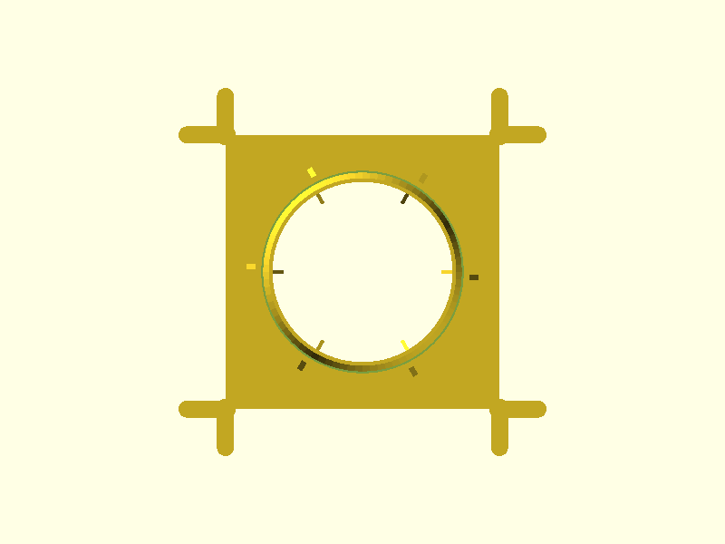
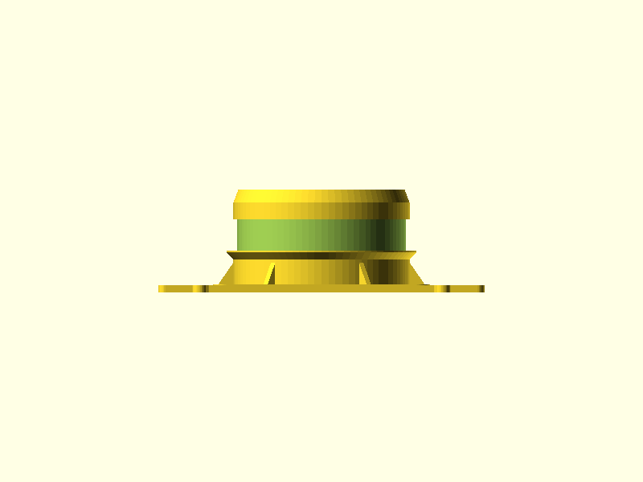
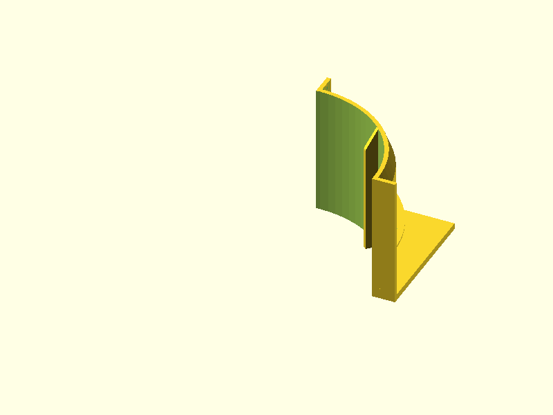

# Humidity-Output V2

V2 corrective rebuild of the humidity-output duct mount. Mounts a standard 4" flex dryer duct to a waffle-grid HDPE bin lid via a caulked base plate with Y-branch waffle engagement, cylindrical spigot, and EPDM foam seal — updated after v1 print failures to fix duct fitment, add a lead-in taper, and repair unsupported internal fin starts.

## Renders


*Isometric view showing the full assembly: spigot with foam groove and lower ridge, external shark fin gussets, and Y-branch arms projecting from all four corners of the base plate*


*Front elevation showing spigot seal zones from base plate through foam groove, lower stop ridge, and lead-in taper at the top*


*Top-down view showing base plate footprint (146.2mm), inner pad (130mm), 4-corner Y-branch arm arrangement, and 96mm bore*


*Right-side elevation showing spigot wall section, foam groove recess, and base plate profile*

## Design Overview

The part is a permanent fixture caulked to the top face of a waffle-grid HDPE bin lid. Four Y-branch arms reach down into the waffle channels on the lid underside, locking the plate against lateral movement while the caulk cures. A cylindrical spigot rises from the thickened central inner pad.

Installation sequence:

```
4" flex duct
    |
    v  (slides down over spigot from above)
lead-in taper (OD 100→106mm, guides alignment)
    |
above-seal grip (10mm plain zone for zip tie)
    |
foam groove (EPDM tape recessed here, 19mm wide)
    |
lower stop ridge (OD 114mm — wire ring stops here)
    |
spigot body (OD 106mm, ID 96mm)
    |
inner pad → base plate → bin lid
```

The 4" duct's wire reinforcement rings (effective ID 107.6mm) slide over the 106mm spigot with a comfortable 0.8mm/side radial gap. The duct end seats against the lower stop ridge at z=20mm. A wrap of 3/4" × 1/8" closed-cell EPDM foam tape is pressed into the foam groove, remaining slightly proud of the spigot OD. A 16" releasable zip tie cinches the duct over the foam, creating an airtight, moisture-resistant seal that can be broken and re-made without tools.

Six external shark fin gussets brace the spigot-to-inner-pad junction against tipping loads. Six internal radial fins resist bore ovalization under zip-tie clamping load; they run the full part height from z=0 and taper to flush at z=52–62.

### V1 problems fixed in V2

| Problem | V1 | V2 fix |
|---------|----|----|
| Duct wire rings couldn't slide over spigot | OD 108mm (too large) | OD reduced to 106mm |
| Duct starting position hard to locate | No taper at top | 8mm lead-in taper, 106→100mm OD |
| Internal fin first layers printed on air | Fins started at z=5mm (bore open below) | Fins start at z=0mm (on bed) |

## Geometry

| Dimension | Value | Notes |
|-----------|-------|-------|
| Bounding box | 196.2 × 196.2 × 62.0 mm | XY 0.2mm over nominal due to rounded arm endpoints |
| Base plate (outer) | 146.2 × 146.2 mm | Sits on bin lid, caulked |
| Inner pad | 130 × 130 mm | Thickened central zone, 5mm thick |
| Spigot OD | 106.0 mm | Duct wire ring ID 107.6mm → 0.8mm/side gap |
| Spigot ID (bore) | 96.0 mm | |
| Spigot wall | 5.0 mm | Full height; 2.5mm at foam groove bottom |
| Total height | 62.0 mm | |
| Lead-in taper tip OD | 100.0 mm | Taper tip wall 2.0mm |
| Foam groove depth | 2.5 mm | Wall at groove floor = 2.5mm |
| Foam groove width | 19.0 mm | Matches 3/4" EPDM tape |
| Lower stop ridge OD | 114.0 mm | 6.4mm diametric over duct ring ID |
| Y-branch arm width | 9.0 mm | Into 9.4mm channels, 0.2mm/side gap |
| Y-branch engagement | 25.0 mm | Per arm |
| Volume | 156.8 cm³ | |

## Features

### Base Zone (z=0–5)

**Outer plate** — 146.2mm square, 4mm corner radius, 4.6mm thick (matches waffle grid height). Rests flat on bin lid surface, caulked in place. Provides coverage of the lid opening and broad adhesion area.

**Y-branch arms** — Four corner forks, one per corner. Each fork sends a 9.0mm wide arm in the +X and +Y directions into adjacent waffle channels, engaging 25mm deep. Root centers at ±73.1mm from origin. Arms are hull geometry with rounded tips; per-side channel clearance is 0.2mm (caulked installation).

**Inner pad** — 130mm square, 8mm corner radius, 5.0mm thick. Raises the spigot base above the outer plate level and provides structural depth at the spigot junction.

**Internal fins** — 6 radial ribs inside the bore, 2.0mm thick, 6.0mm radial depth with 1mm overlap into the spigot wall. Run full height from z=0 (on bed, v2 fix) to z=52, then taper to flush with the bore wall over the top 10mm (z=52–62). Resist bore ovalization under zip-tie clamping. Aligned angularly with the external shark fins.

### Spigot Zone (z=5–62)

**Spigot body** — OD 106mm, ID 96mm, wall 5mm. Plain cylinder from z=5 to z=54. The duct slides over this surface.

**External shark fins** — 6 triangular gussets at the spigot-to-inner-pad junction (z=5–18). 3mm thick, 9mm radial extent from spigot OD, 13mm tall. Right-triangle profile; hypotenuse slopes at 55° from horizontal (35° from vertical, within 45° limit). Structural bracing and visual alignment markers.

**Lower stop ridge** — Annular ring at z=20–25. OD 114mm (4mm protrusion beyond spigot). 45° chamfer on underside (self-supporting, exactly at the overhang limit); 1mm flat top. Duct wire rings cannot pass the 114mm OD; the duct end seats here at z=20mm.

**Foam groove** — 2.5mm deep annular recess in the spigot OD surface from z=25–44. Accepts 3/4" × 1/8" closed-cell EPDM foam tape. Wall at groove floor = 2.5mm. Groove is 19mm wide (matching the 19.05mm = 3/4" tape). Foam sits 0.7mm proud of spigot OD before clamping.

**Above-seal grip** — Plain spigot at full 106mm OD from z=44–54. 10mm of clean surface above the foam groove for zip-tie engagement.

**Lead-in taper** — NEW in V2. Spigot OD tapers from 106mm down to 100mm over the top 8mm (z=54–62). Half-angle 20.6° from vertical. Tip wall 2.0mm. Guides duct onto the spigot without precise alignment.

## Mating Interfaces

| Interface | This Part | Mates With | Fit Type | Gap / Interference |
|-----------|-----------|------------|----------|--------------------|
| Spigot OD | 106.0 mm OD | 107.6 mm duct ring ID | Clearance | +1.6mm diametric (0.8mm/side) |
| Lead-in taper tip | 100.0 mm OD | 107.6 mm duct ring ID | Entry guide | +7.6mm at tip, narrows to 1.6mm |
| Lower stop ridge | 114.0 mm OD | 107.6 mm duct ring ID | Hard stop | −6.4mm (ring cannot pass) |
| Y-branch arms | 9.0 mm wide | 9.4 mm waffle channels | Loose clearance (caulked) | +0.4mm (0.2mm/side) |
| Base plate | 146.2 mm sq | Bin lid surface | Caulked adhesion | No mechanical fit |

## Printability

All 10 transitions pass. No support structures required. The part prints base-down in the same orientation it installs.

The one feature at the printability limit is the lower stop ridge underside chamfer: the 45° chamfer (4mm radial rise over 4mm height) is exactly at the 45° overhang limit. The geometry analyzer confirmed 4 bridge warnings, all at the foam groove top edge (2.5mm span, well within the 10mm limit) and ridge chamfer facets (0.2mm each). Slicer verification is recommended before the first print to confirm the slicer does not add auto-support at the ridge chamfer.

All 442 overhang faces flagged by the geometry analyzer are z=0 bed-contact false positives (downward-facing bed faces).

| Check | Result | Notes |
|-------|--------|-------|
| Transitions | 10/10 PASS | |
| Overhangs | PASS | 442 flagged — all z=0 false positives (bed contact) |
| Bridges | PASS | 4 warnings: foam groove top edge 2.5mm, ridge chamfer facets 0.2mm |
| Thin walls | PASS | Minimum: taper tip wall 2.0mm, groove floor wall 2.5mm |
| Slicer | N/A | PrusaSlicer not installed — recommend pre-print slicer check |

### Geometry Analysis

310 layers at 0.2mm layer height. 4 bridge warnings (all below 10mm limit). 0 bridge failures. 0 thin walls. Mesh is watertight. 4 geometric transitions detected.

### Slicer Analysis

Slicer analysis not available — PrusaSlicer not installed. Recommend slicer check before printing to verify the ridge chamfer does not trigger auto-support and the foam groove top edge is handled in bridge mode.

## Test Prints

Two test prints were planned by the test-print-planner to verify the two critical mating interfaces before printing the full part.

| Test Print | Purpose | Category | Status |
|------------|---------|----------|--------|
| [Spigot Arc — Duct Fitment & Seal Zone](#spigot-arc--duct-fitment--seal-zone) | Tests 106mm OD vs duct ring, foam groove depth, ridge chamfer at 45° limit | fitment | Modeled |
| [Y-Branch Arm — Waffle Channel Engagement](#y-branch-arm--waffle-channel-engagement) | Tests 9.0mm arm width in 9.4mm channel | fitment | Modeled |

### Spigot Arc — Duct Fitment & Seal Zone

A 90-degree arc sector of the spigot from z=0 to z=62, with one internal fin, a 3mm base plate for bed adhesion, and 2mm chord walls closing the cut faces. Prints in 61×61×62mm. Tests the three highest-risk dimensions in one compact piece: spigot OD fitment with the duct wire ring, foam groove geometry, and the ridge chamfer print quality.

**Verification method:** Caliper spigot OD (target 106.0 ±0.3mm). Caliper foam groove depth (target 2.5 ±0.2mm). Trial fit the actual duct wire ring over the arc — ring should slide on with light clearance and stop against the ridge. Seat foam tape in groove — tape should recess below spigot OD. Visual check: ridge chamfer underside should print cleanly without drooping.


*Spigot arc test piece — 90° sector showing ridge, foam groove, lead-in taper, and a single internal fin*


*Front elevation of spigot arc test piece, full 62mm height with feature zones visible*

### Y-Branch Arm — Waffle Channel Engagement

A single corner Y-branch fork (two arms + root blob) with a minimal base plate section, printed at 58×58×4.6mm. Tests the arm width (9.0mm) in the 9.4mm waffle channel with 0.2mm/side clearance.

**Verification method:** Caliper arm width at midpoint (target 9.0 ±0.3mm). Insert both arms into waffle channels on the actual bin lid — arms should slide in without force and not be sloppy loose.


*Y-branch test piece — single corner fork with X and Y arms, root blob, and minimal base plate*


*Top-down view of Y-branch test piece showing 9.0mm arm width and 25mm engagement length*

## Validation

```
bbox.x:     196.2 mm  (expected 196 ±2.0)    PASS  (+0.2mm — rounded arm endpoints, same as v1)
bbox.y:     196.2 mm  (expected 196 ±2.0)    PASS  (+0.2mm — symmetric)
bbox.z:      62.0 mm  (expected 62  ±1.0)    PASS
watertight:  true                             PASS
volume:     156.8 cm³ (expected 75–300 cm³)  PASS
```

## Print Settings

| Setting | Value |
|---------|-------|
| Orientation | Base plate bottom (z=0) flat on bed; spigot grows upward |
| Material | PLA |
| Layer height | 0.2mm |
| Infill | 20–30% — spigot wall is 5mm solid; infill only fills inner pad and base plate slab |
| Supports | None required (all features self-supporting) |

## BOM

| Qty | Item | Notes |
|-----|------|-------|
| 1 | Humidity-Output V2 (3D printed) | PLA, 156.8 cm³ |
| 1 | EPDM foam tape, 3/4" wide × 1/8" thick, closed-cell | Seats in foam groove; ~370mm strip for one wrap |
| 1 | Releasable zip tie, 16" | Cinches duct over foam seal |
| — | Silicone or latex caulk | Bonds base plate to bin lid |

## Downloads

| File | Description |
|------|-------------|
| [`humidity-output-v2.stl`](../designs/humidity-output-v2/output/humidity-output-v2.stl) | Print-ready mesh |
| [`humidity-output-v2.scad`](../designs/humidity-output-v2/humidity-output-v2.scad) | Parametric source |
| [`spec.json`](../designs/humidity-output-v2/spec.json) | Validation spec |
| [`geometry-report.json`](../designs/humidity-output-v2/output/geometry-report.json) | Mesh analysis |
| [`review-printability.md`](../designs/humidity-output-v2/output/review-printability.md) | Full printability review |
| [`test-prints.json`](../designs/humidity-output-v2/output/test-prints.json) | Test print manifest |
| [`spigot-duct-fit.stl`](../designs/humidity-output-v2/test-prints/spigot-duct-fit/output/spigot-duct-fit.stl) | Spigot arc test piece |
| [`y-branch-channel-fit.stl`](../designs/humidity-output-v2/test-prints/y-branch-channel-fit/output/y-branch-channel-fit.stl) | Y-branch test piece |

## Pipeline

| Stage | Agent | Result |
|-------|-------|--------|
| Spec | spec-writer | 10 features, 3 interfaces, 2 test print candidates flagged |
| Model | modeler | PASS (1 iteration, main part) |
| Geometry | geometry-analyzer | 310 layers, 442 overhang faces (all false positives), 4 bridge warnings |
| Review | print-reviewer | 10/10 transitions PASS, cleared for print |
| Test prints | test-print-planner | 2 test pieces (spigot-duct-fit, y-branch-channel-fit) |
| Model (test pieces) | modeler | PASS (2 iterations each) |
| Ship | shipper | this commit |

Built with pipeline v4
