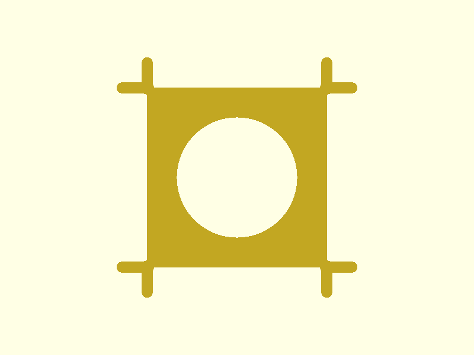
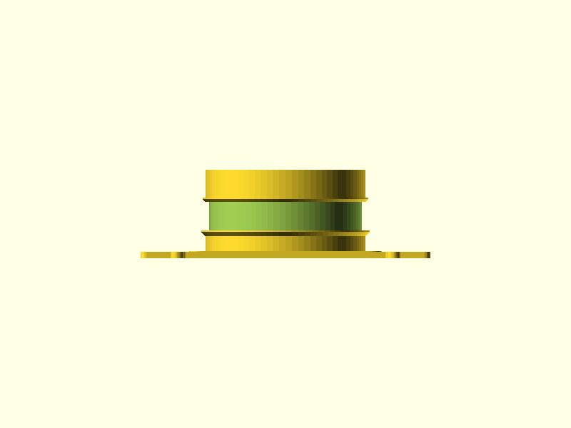

# Humidity-Output Duct Mount

Mounts a standard 4" flex dryer duct to the bin lid. Uses the same waffle-grid Y-branch architecture as the fan-tub-adapter-base — caulked permanently to the lid, no fasteners. The duct is secured with a 16" releasable zip tie over a closed-cell EPDM foam gasket for an airtight seal.

## System Overview

1. **Base plate** — same outer frame + Y-branches as fan-tub-adapter-base. Caulked to lid, branches engage waffle channels.
2. **Duct spigot** — cylindrical stub rises 55mm above base plate. 4" flex duct slides down over it.
3. **Seal system** — EPDM foam tape in a groove on the spigot, compressed by a releasable zip tie. Geometry forces the zip tie to land exactly over the foam.

## Spigot Seal Design

```
   duct (sliding down from above)
          ↓
   ┌──────────────────────┐  z=60  spigot top
   │   above-seal zone    │
   │      (19mm)          │
   ╠═════════╦════════════╣  z=41  upper guide ridge (OD 112mm, 2mm tall, 45° underside chamfer)
   ║  foam   ║            ║
   ║  zone   ║  zip tie   ║  z=38  — foam zone top
   ║  (19mm) ║  lands     ║        groove depth 2.5mm, foam proud ~0.7mm
   ║         ║  here      ║
   ╠═════════╩════════════╣  z=19  lower stop ridge top
   ╠══════════════════════╣  z=15  lower stop ridge bot (OD 114mm, 4mm tall, 45° chamfer)
   │   insertion zone     │  duct end slides down to here — can't pass the ridge
   │      (10mm)          │
   ╧══════════════════════╧  z=5   spigot starts (inner pad top)
```

**Install sequence:**
1. Press foam tape into spigot groove (peel-and-stick, butt-join)
2. Slide duct down over spigot until duct end stops against lower ridge
3. Drop releasable zip tie over duct; seat it between the two ridges
4. Tighten. The zip tie compresses duct rings into foam — done.

**To remove:** release zip tie tab, lift duct off.

### Why this seals well

The flex duct's hard wire rings (measured ID 110mm) cannot pass the lower ridge (OD 114mm) — the duct stops at a single defined position. The foam zone is 19mm wide, ensuring the zip tie lands over foam regardless of where in the zone it sits. Tightening compresses the rings slightly (from 110mm down to 108mm spigot OD + foam), and the EPDM foam bridges corrugation valleys to create a continuous seal surface.

## Gasket Specification

| Property | Value |
|----------|-------|
| Material | Closed-cell EPDM foam tape |
| Width | 3/4" (19mm) |
| Thickness | 1/8" (3.2mm) |
| Length (cut to) | ~340mm (π × 108mm) |
| Installation | Peel-and-stick into groove; butt-join ends |
| Compression | ~0.7mm (22%) when zip-tied |

**Where to buy:** Frost King R516H, M-D Building Products, or any hardware store weatherstripping section (EPDM foam tape, 3/4" × 1/8").

## Geometry

| Dimension | Value | Notes |
|-----------|-------|-------|
| Overall bounding box | 196.2 × 196.2 × 60.0 mm | Same XY as fan-tub-adapter-base |
| Outer plate | 146.2mm square, 4.6mm thick | Flush with waffle tops |
| Inner pad | 130mm square, 5.0mm thick | Spigot base zone |
| Spigot OD | 108mm | 1mm per-side clearance under duct rings |
| Spigot ID (airflow) | 98mm | 5mm wall |
| Spigot height above base | 55mm | 10mm insertion + 4mm ridge + 19mm foam + 3mm ridge + 19mm above |
| Foam groove | 2.5mm deep × 19mm wide | Groove bottom at 103mm OD |
| Lower ridge OD | 114mm (3mm protrusion) | Stop ring; duct ring ID 110mm cannot pass |
| Upper ridge OD | 112mm (2mm protrusion) | Zip tie keeper |
| Ridge chamfers | 45° on underside | No unsupported overhangs in print orientation |
| Branch engagement | 25mm per arm, 8 arms | Same as fan-tub-adapter-base |
| Volume | 152.2 cm³ | |

## Renders

### Isometric (Top)


Spigot rises from the stepped base plate. Two circumferential ridges bounding the foam groove zone are visible on the spigot exterior. Y-branches extend to the four waffle-channel engagement arms.

### Front



Shows the spigot height profile. Lower ridge step visible at z=15–19mm; foam groove zone (recessed) at z=19–38mm; upper ridge at z=38–41mm.

### Top



Top-down view shows the 98mm airflow bore and the circular ridge/groove features on the spigot.

## Validation

```
bbox.x:     196.2 mm  (expected 196 ±2)    PASS
bbox.y:     196.2 mm  (expected 196 ±2)    PASS
bbox.z:     60.0 mm   (expected 60 ±1)     PASS
watertight: true                            PASS
volume:     152.2 cm³ (expected 80–300)     PASS
```

## Print Settings

| Setting | Value |
|---------|-------|
| Orientation | Bottom face on bed, spigot up |
| Material | PLA |
| Layer height | 0.2mm |
| Infill | 40%+ (spigot wall handles zip-tie hoop load; outer plate can be lighter) |
| Supports | None (all ridge overhangs are 45°-chamfered) |
| Notes | Spigot ridges print cleanly with 45° underside chamfers |

## BOM

| Qty | Item | Notes |
|-----|------|-------|
| 1 | Duct mount (3D printed) | PLA, 152.2 cm³ |
| 1 | EPDM foam tape, 3/4" × 1/8" | ~340mm, hardware store weatherstripping |
| 1 | Releasable zip tie, 16" | Reusable for duct removal |
| 1 | Silicone caulk | Aquarium-safe, for base plate to lid |

## Downloads

| File | Link |
|------|------|
| STL | [`humidity-output.stl`](../designs/humidity-output/humidity-output.stl) |
| Source | [`humidity-output.scad`](../designs/humidity-output/humidity-output.scad) |
| Params | [`humidity-output-params.scad`](../scad-lib/humidity-output-params.scad) |
| Spec | [`spec.json`](../designs/humidity-output/spec.json) |
