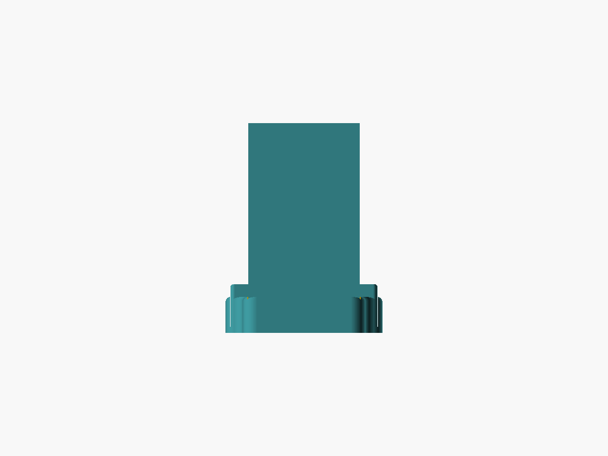
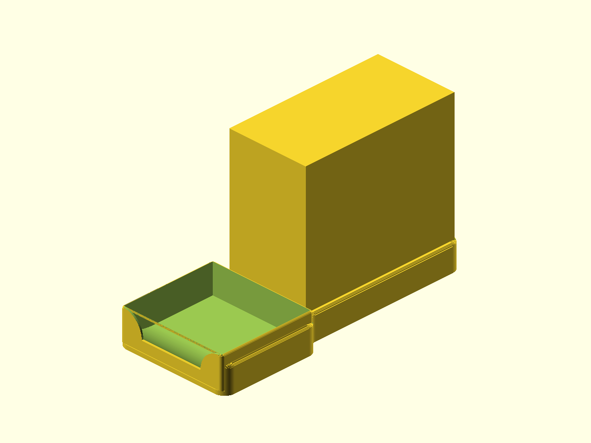
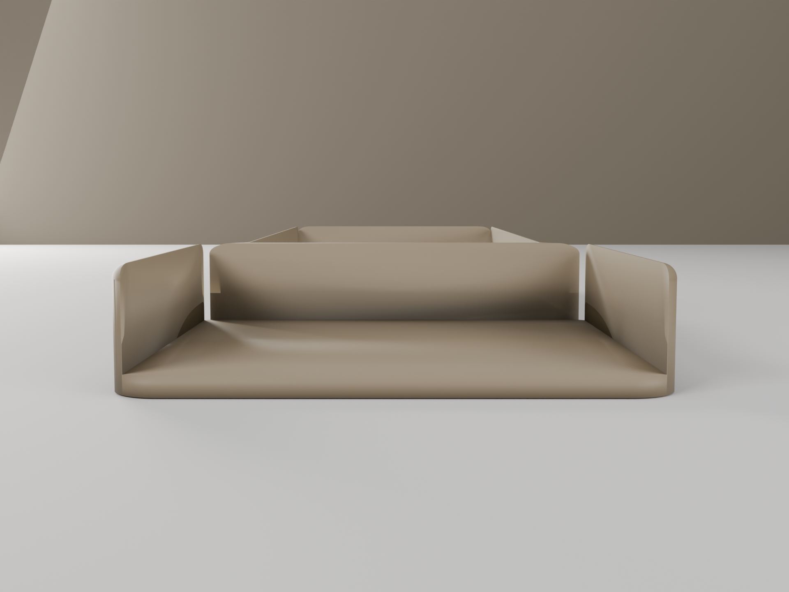
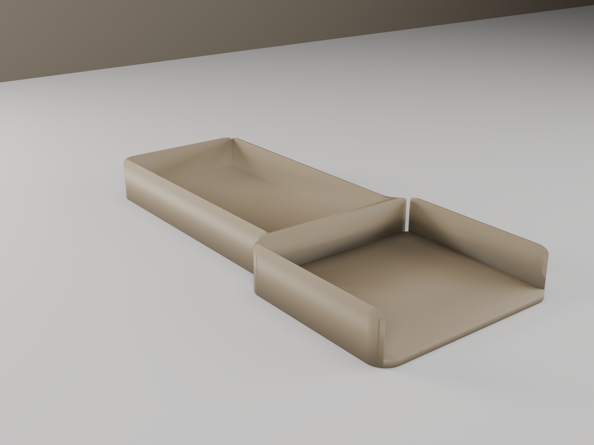
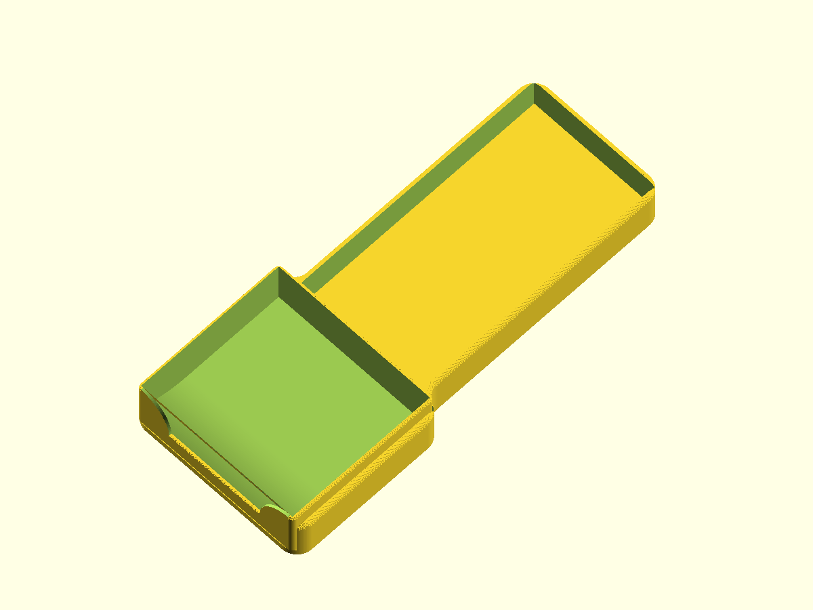
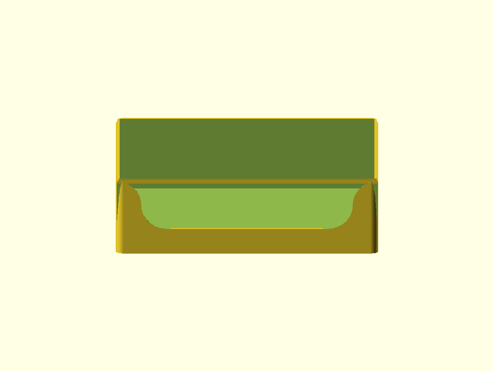
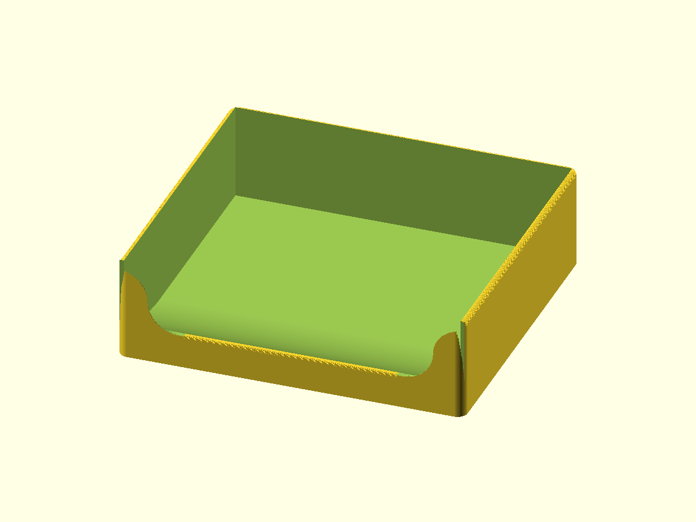

# P-touch Cradle

Quiet desk dock and label catch tray for the Brother PT-P750W label printer. Clean rectangular bathtub form with generous fillets — the printer is the visual subject; the cradle is the frame that holds it and catches the labels.

## Renders

### In use


*Use-state front elevation — printer in pocket, low cradle perimeter visible around base, catch tray in front. The 25mm walls disappear behind the 143mm printer.*


*Use-state three-quarter — full assembly: cradle stepped footprint, printer in pocket, tray slid in from front.*

### Cradle — bare part


*Front elevation — 25mm uniform bathtub walls, stepped footprint, open tray slot (103.9 × 94.9mm interior) at the forward shelf section.*


*Three-quarter bare-part — r=10 exterior corner fillets and printer-section→shelf concave fillet schedule visible. Tray slot side walls 3.05mm, matching the 3mm perimeter wall thickness for a continuous U-wrap.*


*Top-down three-quarter — symmetric bathtub, printer pocket (80 × 154mm), and tray slot (103.9 × 94.9mm) viewed from above.*

### Tray — bare part


*Tray front elevation — uniform 10mm front wall with S-curve sweeps on each corner. Two tangent-continuous quarter-arcs (r=9.2 each) join at an inflection point — horizontal tangent at both ends so the curve blends without a kink against either the cap outer-edge top or the front-wall flat top. The S-curve top tangent lands at z = ext_h − top_edge_fillet_r = 28.4, flush with the cap's outer-edge — corner reads as one continuous surface.*


*Tray three-quarter — 30mm back/side walls, S-curve corner sweeps with 3D corner blend (outer face follows the curve up to z=28.4 = cap outer-edge, inner face stays uniform at z=10 across full width — clean kanban lip from inside the bin). The S-curve and the rolled cap form one continuous surface at the corner. Top-edge fillet r=1.6 = wall_t (matches cradle's r=3 = its wall_t — same design proportion).*

## Design Overview

Two parts that assemble without fasteners or adhesive. The tray slides forward out of the cradle shelf section; the printer drops into the printer pocket from above.

```
                  ←— 110mm —→
   ┌──────────────────────────┐  z=25mm
   │      PRINTER POCKET      │  Low uniform perimeter walls
   │  80 × 154mm interior     │  3mm thick, all four sides
   │  1mm/side XY clearance   │
   │                          │
   ├──────────┬───────────────┤  z=4mm (base plate top)
   │  3.05mm  │  TRAY SLOT    │  z=26.3mm (slot side walls)
   │  side    │  103.9×94.9mm │
   │  walls   │  0.35mm/side  │  Tray slides forward (+Y)
   └──────────┴───────────────┘  z=0 (flush on bed)
   ←— 160mm depth ——→←— 95mm —→

TRAY (103.2 × 94.2 × 30mm, protrudes ~9mm above cradle wall):

   ┌──────────────────────────┐  z=30mm back/side wall top (r=1.6 = wall_t fillet, cap outer-edge at z=28.4)
   │      ← 100mm →           │
   │      open top            │
   │      interior            │  1.6mm walls
   │                          │  1.6mm floor
   │  parabolic ramp at front │
   ╲──────────────────────────╱  z=10mm front wall top (r=0.8 fillet)
    S-curve sweeps both sides (2× r=9.2 quarter-arcs, tangent-continuous at both ends; top lands at z=28.4 flush with cap)
```

**Install sequence:**
1. Place cradle on desk — base plate sits flush at z=0. Silicone feet optional (apply aftermarket).
2. Drop printer into the open top — rests in the full-perimeter bathtub pocket. Printer base sits on the 4mm base plate.
3. Route USB and DC power cables over the top of the 25mm back wall. No notch needed; the plug sits above the wall height.
4. Slide tray into the forward slot from the front (+Y direction).
5. Printer auto-cuts labels; they exit at z=64–79mm above desk, clear the 10mm front wall top (at z=21mm above desk) by 43–58mm, and drop forward into the tray.
6. Reach over the low front wall anywhere along its width to retrieve labels, or pull the tray forward to remove it entirely.

**Fillet schedule:** Two named radii, applied without exception.
- r=3 (utility): all cradle top edges, all visible vertical wall corners, tray vertical corner edges, break-edges.
- r=10 (hero): cradle exterior corners (4×), base plate corners (8×, top and bottom), printer-section→shelf concave fillet on ±X sides, tray-slot corner fillet.

No chamfers anywhere. No decoration of any kind.

## Geometry

| Dimension | Value | Notes |
|-----------|-------|-------|
| Cradle bounding box | 110 × 254.9 × 25mm | Flush base, no feet |
| Cradle printer section width | 86mm | Narrow section housing the printer pocket |
| Cradle shelf section width | 110mm | Full width including tray slot |
| Printer pocket interior | 80 × 154mm | 78 × 152mm printer + 1mm/side clearance |
| Tray slot interior | 103.9 × 94.9 × 22.3mm | 0.35mm/side sliding fit |
| Cable access | Over top of 25mm back wall | No notch — plug is above wall height |
| Cradle volume | ~136.6 cm³ | Mesh analysis |
| Tray bounding box | 103.2 × 94.2 × 30mm | 5mm above 25mm cradle wall by design |
| Tray front wall height | 10mm | Uniform across full width |
| Tray side-to-front fillet | S-curve, 2× r=9.2 quarter-arcs | Tangent-continuous at both ends (horizontal tangent at z=28.4 = cap outer-edge AND z=10) — joined at inflection point (9.2, 19.2). Outer face follows the curve; inner face stays at z=10 across full width via 16-slab Y-stack 3D corner blend. S-curve top is flush with the side-wall cap's outer-edge top — corner reads as one continuous surface. |
| Tray interior ramp | parabolic z(y) = 1.6 + 8.4·((y−62.6)/30)² | Tangent to floor at back, terminates at z=10 at front |
| Tray volume | ~38.9 cm³ | Mesh analysis |
| Combined volume | ~175.5 cm³ | |

## Features

### Cradle

**Base plate** — 110 × 254.9mm footprint, 4mm thick. r=10 hero corner radius softens the footprint on all four corners (top and bottom). Flush on the build plate — no feet.

**Low perimeter walls** — All four cradle walls at 25mm tall × 3mm thick. Full-perimeter uniform bathtub. The wall height is the defining dimension of the form: everything else defers to this. r=3 top-edge fillet slab stack (64 steps at ship quality) reads as a true continuous quarter-arc.

**Printer-section → shelf concave fillet** — r=10 concave quarter-arc on both ±X sides where the 86mm printer section transitions to the 110mm shelf section. The one sculptural move on the cradle. Purely vertical feature in print; no printability concern.

**Tray slot** — 103.9 × 94.9mm interior, 22.3mm engagement depth. Open front (+Y) and open top. Slot side walls 3.05mm — matches the 3mm perimeter wall thickness for a continuous U-wrap that reads as an uninterrupted part of the cradle body.

**Host-object proxy** — Render-only utility module (`host_object_proxy()`). Draws the 78 × 152 × 143mm printer reference box at its installed position for use-state renders. Excluded from STL by default; use-state PNGs pass `-D 'render_with_host=true'`.

### Tray

**Closed 4-wall bin** — 103.2 × 94.2 × 30mm exterior, 1.6mm walls and floor. r=3 vertical corner fillets on all exterior vertical edges.

**Uniform 10mm front wall** — Flat at z=10 across the full width. The grab feature: user reaches over anywhere along the width. Tray interior cavity accessible above the 10mm front lip.

**S-curve side fillet sweeps** — TWO tangent-continuous quarter-arcs per side (r=9.2 each, total horizontal extent 18.4mm matching the 18.4mm height drop from z=28.4 to z=10). Joined at an inflection point with vertical tangent. Horizontal tangent at z=28.4 (the cap outer-edge top — flush with the side-wall cap, so the S-curve and cap form one continuous surface at the corner) AND horizontal tangent at z=10 (matches front-wall flat top) — no kink at either end. Outer face follows the S-curve; inner face stays uniform at z=10 across the full width via a 16-slab Y-stack that linearly interpolates between OUTER and INNER profiles. The wall top in the corner zones slopes from z=10 (inner) to arc(x) (outer) over the 1.6mm wall depth — reads as a 3D corner blend, not a 2D extrusion.

**Top-edge fillets** — r=1.6 = wall_t continuous fillet on back and side wall tops (z=30). The cap rolls cleanly from the outer face to a point at the inner face — same construction principle as the cradle's r=3 = its wall_t. Same design proportion across the assembly, different absolute radii because the walls differ (cradle 3mm, tray 1.6mm). r=0.8 fillet on front wall top (z=10) — half wall_t for the thin front lip, keeps it soft without competing with the larger back/sides cap.

**Interior parabolic floor ramp** — z(y) = 1.6 + 8.4 · ((y − 62.6) / 30)². Tangent to the flat floor at the back (slope=0 at y=62.6), steepens toward the front, terminates at z=10 at the front wall interior face. Concave from cavity side — a finger sliding forward gets a smooth gradual incline. Self-supporting in face-up print orientation (always slopes up-and-forward, never overhangs).

## Mating Interfaces

| Interface | This Part | Mates With | Fit Type | Gap / Interference |
|-----------|-----------|------------|----------|--------------------|
| Printer pocket (X) | 80mm interior | 78mm printer width | Clearance | +1.0mm/side |
| Printer pocket (Y) | 154mm interior | 152mm printer depth | Clearance | +1.0mm/side |
| Tray slot (X) | 103.9mm interior | 103.2mm tray exterior | Sliding | +0.35mm/side |
| Tray slot (Y) | 94.9mm interior | 94.2mm tray exterior | Sliding | +0.35mm/side |
| Tray floor | z=4.0mm (slot floor) | Tray base | Contact | 0mm — intentional seat |

Slot side walls 3.05mm each side. Printer pocket clearances confirmed by interference check (0.0mm³ intersection). Tray sliding fit verified analytically: 103.9 − 103.2 = 0.7mm total = 0.35mm per side, exactly the spec sliding-fit offset.

## Printability

Both parts pass all printability checks. Zero real bridge spans in either part. No supports required.

| Check | Result | Notes |
|-------|--------|-------|
| Transitions (cradle) | 4/4 PASS | Base→wall (z=4mm): false-positive flag from analyzer measuring open pocket void |
| Transitions (tray) | 4/4 PASS | Floor, walls, front-wall terminus, top fillets |
| Overhangs (cradle) | PASS | Vertical walls throughout; flush base; no overhangs above z=0 |
| Overhangs (tray) | PASS — sloped wall top is face-up | The 3D corner blend's wall-top slope is 4.6° from horizontal (well below 45° max); prints face-up cleanly |
| Bridges (cradle) | PASS | 3 analyzer flags are false positives (open pocket voids) |
| Bridges (tray) | PASS | 1 false-positive flag from the trimesh bridge detector confused by the corner-column slope; visually inspected, no real unsupported bridges |
| Thin walls | ACCEPTED TRADEOFF | 24 sub-mm slivers near the corner-column outer-edge peaks (z ∈ [10, 26]) and at the cap apex (z>29mm). Geometrically forced at wall_t=1.6mm — the 3D corner blend's outer face rises to z=28.4 (post-v11) while the inner stays at z=10, producing sub-mm cross-sections near the peak. Slicer prints these as a soft fade (1–2 perimeter taper) rather than sharp peaks; cosmetic effect only, not structural. |
| Slicer | N/A | PrusaSlicer not installed |

### Geometry Analysis

Cradle: 125 layers at 0.2mm, watertight, all transitions PASS. Tray: 150 layers, watertight. All bridge FAIL flags in both parts are false positives from the cross-section analyzer measuring across intentionally open pockets or arc-sampling artifacts on curved surfaces.

**Accepted printability tradeoff:** the post-v9 3D corner blend produces sub-mm slivers near the outer-edge peaks of the S-curve sweep (corner columns at z ∈ [10, 26]) and at the cap apex (z>29mm). This is geometrically forced by simultaneously holding (1) outer face rising to z = ext_h − top_edge_fillet_r = 28.4 at the corner, (2) inner face uniform at z=front_wall_h=10, and (3) wall_t=1.6mm — any continuous transition with an 18.4mm Z-drop over 1.6mm Y produces sub-mm cross-sections near the peak. The slicer truncates the unprintable peak by ~1–2mm vertical, producing a softer corner in print rather than a sharp peak — the user accepted this as a cosmetic preference. No structural issue.

### Slicer Analysis

Slicer analysis not available — PrusaSlicer not installed. Key items to verify when slicing:
1. Confirm no support material is added to either part.
2. Confirm cradle bridge flags (z=4.1, z=22.1, z=22.9) do not trigger support generation — these are open interior voids.
3. Inspect tray corner-column outer peaks — slicer should taper the unprintable sub-mm slivers as a soft fade (~1–2mm vertical truncation) rather than raising errors. This is the expected accepted-tradeoff behavior.
4. Verify cradle is centered in Y (254.9mm vs 256mm build volume = 1.1mm margin — use auto-center in Bambu Studio).

## Print Settings

### Cradle

| Setting | Value |
|---------|-------|
| Orientation | Base plate bottom flush on bed; base plate at z=0, walls grow up |
| Material | PLA |
| Layer height | 0.2mm |
| Infill | 20% — base plate and walls are primarily solid perimeters |
| Supports | None required |
| Note | Y margin: 254.9mm vs 256mm build volume. Verify centering in Bambu Studio before printing. |

### Tray

| Setting | Value |
|---------|-------|
| Orientation | Face up (open top toward the sky), floor on bed |
| Material | PLA |
| Layer height | 0.2mm |
| Infill | 15–20% — 1.6mm walls are 4 perimeters at 0.4mm nozzle, effectively solid |
| Supports | None required — parabolic ramp self-supporting; S-curve sweeps build from lower z to higher z in X (no overhangs); 3D corner-blend wall top slopes 4.6° from horizontal (face-up, well below 45° max) |

## BOM

| Qty | Item | Notes |
|-----|------|-------|
| 1 | Cradle (3D printed) | PLA, ~136.6 cm³ |
| 1 | Tray (3D printed) | PLA, ~38.9 cm³ |

No fasteners, adhesive, or hardware required. Silicone bump feet (3–4mm diameter) can be applied to the cradle base plate underside aftermarket if desired.

## Design Log

**v3 (this version) — 7-round ID critique loop + 2 post-ship patches, 2026-04-18 to 2026-04-26**

The v3 design went through 7 rounds of industrial-design critique and revision, documented in full at `designs/ptouch-cradle/id/conversation-log.md` and individual modeler notes v1–v10.

Round 1–2 (owl direction): critique identified the shipped v2 owl tufts as cat-ear shaped; round 1 attempted a back-panel relocation. Round 2 surfaced a structural failure — the facial disc at z=90 is behind the printer in actual use (printer is 143mm tall; the face was invisible with the printer installed). The use-state render requirement was codified into the pipeline.

**Round 3 (pivot):** user abandoned the owl direction entirely after round 2 renders showed a panda/teddy-bear effect. New direction: quiet Muji-Rams minimalism. All four perimeter walls drop to 25mm (symmetric bathtub). No face, no tufts, no decoration. Two-tier fillet schedule (r=3 utility, r=10 hero).

Rounds 4–7 iterated within v3 minimalism:
- Round 4: tray holder wrap made continuous (slot walls 3.05mm), top-edge fillets added, tray closed-bin architecture established with scoop lip.
- Round 5: feet removed (flush base), cable notch removed (plug is above wall height), tray interior ramp established (concave parabolic), tray height raised to 30mm.
- Round 6: variable-height front wall (corners z=18, center z=10) replaced the round-5 boss+indent grab feature; concave ramp orientation corrected.
- Round 7: round-6 variable-height front wall simplified — corner sections ("top bars") and transition arcs eliminated. Single uniform z=10 front wall + ONE r=20 concave fillet per side. Initial user sign-off, shipped at `31a2e27`.

**v3 patch v8 — corner tab + sliver fixes (commit `4cece6e`)**

Post-ship critique surfaced (a) "tab" tips at the upper corners of the front-wall scoop where the arc met the inner face of the side wall instead of the outer edge, and (b) sub-mm slivers at z≈29.9 near the front corners caused by the back/sides cap stack inset exceeding the wall thickness. Fixed by extending the arc to start at the OUTER edge (tangent horizontal at z=30 — flush with side-wall top) and clipping `back_sides_mask` to y ≤ ext_d - wall_t so the cap stack doesn't operate in the front-wall slab corner column.

**v3 patch v11 — S-curve / cap continuity at the corner (this version)**

Post-ship slicer-view critique surfaced two artifacts at the front-wall corner: (1) a thin wedge-shaped gap between the S-curve sweep and the side-wall cap, and (2) a thin vertical front-face strip at the v10 mask boundary (y=92.55). Both stemmed from a single 1.6 mm height mismatch — the patch v9 S-curve outer-edge tangent point sat at z=30, while the v10 r=wall_t cap's outer-edge sat at z=28.4 — and the v10 mask clip meant the cap couldn't fill the corner column.

Fix (Option A): lowered the S-curve top tangent point to z = ext_h − top_edge_fillet_r = 28.4 so it lands flush with the cap outer-edge. The S-curve drop becomes 18.4 mm (was 20), the two tangent-continuous quarter-arcs become r=9.2 each (was 10), and the front-wall flat middle widens slightly (18.4..84.8 vs 20..83.2). The cutter polygon now also carves the corner column's outer-edge top from z=30 down to z=28.4 via vertical step edges at x=0 and x=ext_w. Watertight preserved (Option-C decoupling unchanged); thin-wall count drops 26 → 24 (the 2 z=28.1 corner-column slivers are gone since the corner column outer-edge no longer reaches that high).

**v3 patch v9+v10 — S-curve, 3D corner blend, r=wall_t cap (commit `3601789`)**

Critique on patch v8 surfaced three new issues with reference images: (1) the single quarter-arc had a vertical-tangent kink at z=10 against the flat front-wall top — design intent was a smooth continuous sweep tangent to BOTH endpoints; (2) a "blade" of material from the ramp top up to arc(x) was visible inside the bin at the corners; (3) the back/sides cap construction at r=2 + clamp produced a flat plateau, breaking the design proportion intended to align with the cradle's r=3 cap.

Patch v9 fixed (1) with an S-curve (two tangent-continuous quarter-arcs r=10 each, joined at an inflection point) and (2) with a 3D corner blend implemented as a 16-slab Y-stack interpolating between an INNER profile (flat top at z=10) and an OUTER profile (the S-curve). Inside the bin now reads as a clean uniform z=10 lip; outside reads as a smooth S-curve sweep with no kinks.

Patch v10 aligned the top-edge fillet with the cradle by proportion: tray r=2 → r=1.6 (= wall_t), matching the cradle's r=3 (= its wall_t). Cap rolls cleanly from outer face to inner-face apex on both parts — same design language across the assembly. Pulled `back_sides_mask` y-extent back by 0.05mm to decouple coincident CSG planes for clean watertight manifold.

Accepted tradeoff at patch v10: 26 sub-mm slivers near the corner-column peaks (geometrically forced by holding wall_t=1.6mm + outer-rises-to-30 + inner-stays-at-10). User accepted: "soft fades instead of sharp peaks." Slicer truncates the unprintable peaks ~1–2mm in print, producing softer corners than the renders show.

**v2 (prior) — shipped commit `90dd34a`**

Owl-themed: tray shortened (41.6 → 21.6mm), enlarged owl face on tray front, flat cylinder feet, feather-arch embosses on printer-section side walls. The owl direction was fully abandoned at round 3 of the v3 loop.

## Validation

```
cradle.x:    110.0 mm  (expected 110 ±1.0)     PASS
cradle.y:    254.9 mm  (expected 254.9 ±1.0)   PASS
cradle.z:     25.0 mm  (expected 25 ±4.0)      PASS
watertight:  true                               PASS

tray.x:      103.2 mm  (expected 103.2 ±0.2)   PASS
tray.y:       94.2 mm  (expected 94.2 ±0.2)    PASS
tray.z:       30.0 mm  (expected 30 ±4.0)      PASS
watertight:  true                               PASS

volume (cradle):   ~136.6 cm³  (expected 30–400 cm³)  PASS
volume (tray):      38.9 cm³   (expected 30–400 cm³)  PASS
volume (combined): 175.5 cm³   (expected 30–400 cm³)  PASS
```

## Test Prints

Two small fitment test pieces verify the load-bearing dimensions before committing to the full ~150 cm³ print:

| Test Print | Purpose | Volume | Print time |
|------------|---------|-------:|-----------:|
| [tray-slot-fit-pair](../designs/ptouch-cradle/test-prints/tray-slot-fit-pair/) | Mini cradle slot + matching tray shell. Verifies the 0.35mm/side sliding fit clearance at full-scale wall thickness. | ~10 cm³ | ~12 min |
| [printer-corner-fit](../designs/ptouch-cradle/test-prints/printer-corner-fit/) | Two full sides (back + right long) + two stubs forming three inside corners (back-left, back-right, front-right) at half cradle height. Pins both pocket X (80mm) and Y (154mm) interior dimensions and verifies 1mm/side clearance against the actual PT-P750W's corners (the proxy box used for fit-review doesn't capture printer corner radii/chamfers). | ~11 cm³ | ~12 min |

**Recommendation: print both first, on the same bed run** (~30 minutes, ~25 cm³ total). If both pass: proceed to the full ~150 cm³ print. If either fails: adjust XY compensation in Bambu Studio (Process → Advanced → XY Compensation) by ±0.05mm and re-test before burning hours on the full job.

## Downloads

| File | Description |
|------|-------------|
| [`cradle.stl`](../designs/ptouch-cradle/output/cradle.stl) | Cradle — print-ready mesh (ship quality) |
| [`tray.stl`](../designs/ptouch-cradle/output/tray.stl) | Tray — print-ready mesh (ship quality) |
| [`tray-slot-fit-pair.stl`](../designs/ptouch-cradle/test-prints/tray-slot-fit-pair/tray-slot-fit-pair.stl) | Test print — tray-to-slot sliding fit (~10 cm³) |
| [`printer-corner-fit.stl`](../designs/ptouch-cradle/test-prints/printer-corner-fit/printer-corner-fit.stl) | Test print — printer pocket two-sides-three-corners fit (~11 cm³) |
| [`cradle.scad`](../designs/ptouch-cradle/cradle.scad) | Cradle parametric source |
| [`tray.scad`](../designs/ptouch-cradle/tray.scad) | Tray parametric source |
| [`spec.json`](../designs/ptouch-cradle/spec.json) | Validation spec |
| [`modeling-report.json`](../designs/ptouch-cradle/output/modeling-report.json) | Feature inventory (round 7 + patch v9 update) |
| [`id/modeler-notes-v9.md`](../designs/ptouch-cradle/id/modeler-notes-v9.md) | Patch v9 — S-curve sweep + 3D corner blend + cap step bump |
| [`id/modeler-notes-v10.md`](../designs/ptouch-cradle/id/modeler-notes-v10.md) | Patch v10 — r=wall_t cap alignment with cradle + watertight resolution |
| [`id/modeler-notes-v11.md`](../designs/ptouch-cradle/id/modeler-notes-v11.md) | Patch v11 — S-curve / cap continuity at the corner |
| [`review-printability.md`](../designs/ptouch-cradle/output/review-printability.md) | Full printability review |
| [`review-fitment.json`](../designs/ptouch-cradle/output/review-fitment.json) | Fitment review — all clearances PASS |
| [`id/brief.md`](../designs/ptouch-cradle/id/brief.md) | ID brief — v3 minimalism direction |
| [`id/conversation-log.md`](../designs/ptouch-cradle/id/conversation-log.md) | Full 7-round ID critique log |

## Pipeline

| Stage | Agent | Result |
|-------|-------|--------|
| Spec | spec-writer | 2 parts, 5 mating interfaces, 8 test print candidates |
| ID | id-designer | 7-round critique loop — rounds 1–2 owl, round 3 pivot to v3 minimalism, rounds 4–7 refinement |
| Model | modeler | PASS (7 rounds + 4 patches: v3 → v4 tray wrap + fillets → v5 closed bin + ramp → v6 variable front wall → v7 simplified uniform front wall → v8 corner tabs + slivers → v9 S-curve + 3D corner blend → v10 r=wall_t cap aligned with cradle → v11 S-curve / cap continuity at the corner) |
| Geometry | geometry-analyzer | Cradle: watertight, all transitions PASS. Tray: watertight, 1 marginal fillet corner |
| Print review | print-reviewer | 7/7 PASS cradle, 4/4 PASS tray. 1 marginal (tray fillet corner 1.026mm). No blockers. |
| Fit review | fit-reviewer | PASS — 0.0mm³ interference, all clearances confirmed analytically |
| Test prints | test-print-planner | 2 pieces — tray-slot-fit-pair + printer-corner-fit (both fitment verification) |
| Ship | shipper | this commit |

Built with pipeline v4
