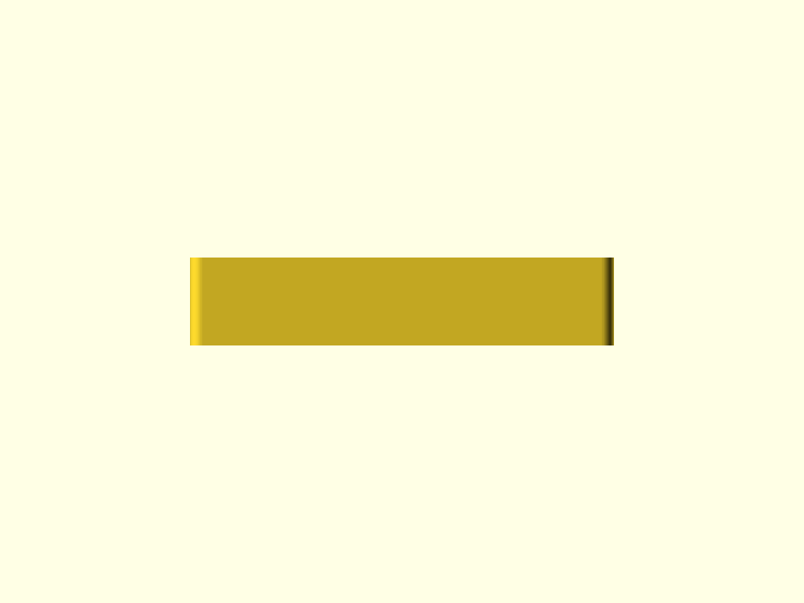
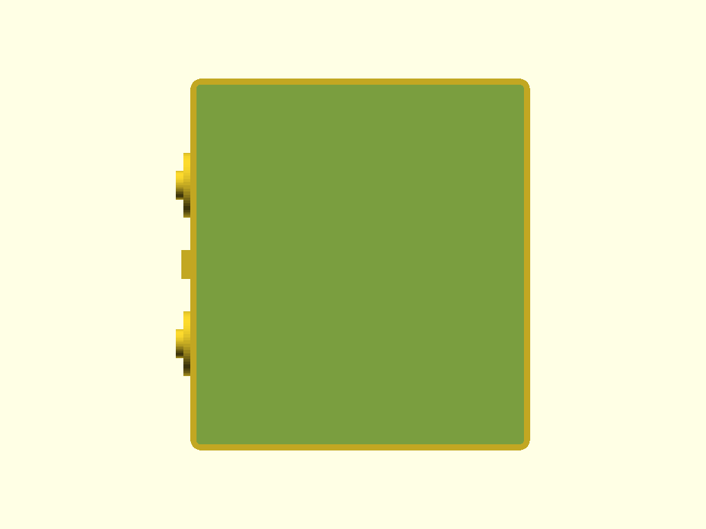

# P-touch Cradle

Owl-themed two-part desktop holder for the Brother PT-P750W label printer. The cradle holds the printer in a full-perimeter low bathtub wall with a tall back panel, and a removable catch tray slides forward out of the cradle base to collect printed labels.

> **Revision 2** — Tray shortened to 21.6 mm tall (from 41.6 mm); scoop lip and grip scallop removed; owl face enlarged. Cradle feet changed from dome bumps to flat cylinders. Three feather-arch embosses added to each printer-section side wall. Tray slot height shortened to 22.3 mm to match.

## Renders

### Cradle


*Isometric — stepped 86 mm printer section widens to 108 mm shelf section via 45° chamfer. Owl ear tufts at z = 180 mm. Feather-arch embosses on each printer-section side wall.*


*Rear isometric — back panel exterior with ear tufts, cable U-notch (25 mm wide × 20 mm, open at z = 0), and open-front tray slot.*


*Top-down — stepped base footprint. Printer pocket (80 × 154 mm) visible in the back section; tray slot (103.9 × 94.9 mm) visible in the forward shelf.*


*Side elevation — stepped base footprint. Printer section depth 160 mm, tray shelf section depth 94.9 mm. Flat cylinder feet visible at base.*


*Front elevation — 25 mm bathtub walls on all four sides. Tray slot opening (103.9 mm W × 22.3 mm H) at lower center. Feather embosses visible on both side walls.*

### Tray


*Tray isometric — 21.6 mm tall exterior. Enlarged owl face: eye embosses (r = 9 mm, +2 mm proud), pupil embosses (r = 4 mm, total +4 mm), 8 × 8 mm beak triangle.*


*Tray front elevation — enlarged owl face centered on the 21.6 mm front wall. No scoop lip. Eyes at z ≈ 11 mm (wall mid-height), beak apex at z = 1 mm.*


*Tray top-down — open-top bin, 103.2 × 94.2 mm exterior footprint, 1.6 mm walls, 3 mm vertical corner fillets.*


*Tray side elevation — 21.6 mm total height (was 41.6 mm). Proportional reduction keeps wall and floor thickness unchanged.*

## Design Overview

The system is two parts that assemble by hand without adhesive or fasteners.

```
                  [ear tuft]  [ear tuft]
                     /  \      /  \
                    /    /    /    \
┌───────────────────────────────────┐  z = 145 mm (back panel body top)
│  ← tall back panel (3 mm thick) →│
│                                   │
│      [ printer sits here ]        │
│       80 mm W × 154 mm D          │
│       1.0 mm/side clearance       │  z = 25 mm (low perimeter wall tops)
├─────┬─────────────────────┬───────┤
│[≋≋≋]│  (open top pocket)  │[≋≋≋]  │  feather embosses on side walls
└─────┴─────────────────────┴───────┘  z = 0 (base plate top) / z = -3 (feet)
      │  ← 160 mm printer section →│
      ├────────────────────────────┤
      │     tray slot (open front  │
      │     and open top):         │
      │     103.9 W × 94.9 D mm   │  z = 4 → 26.3 mm
      └────────────────────────────┘
                ↑
         tray pulls forward to empty
```

**Install sequence:**
1. Place cradle on desk (four flat cylinder feet elevate it 3 mm).
2. Slide printer into the open top — rests in the full-perimeter low bathtub walls. Printer base sits on the 4 mm base plate at z = 4 mm above desk.
3. Route USB and power cables through the 25 mm × 20 mm U-notch in the back wall. The notch is open at the base — no bridging, no threading.
4. Slide the tray into the forward slot from the front. The owl face faces forward.
5. As the printer cuts and ejects labels, they fall forward and down into the tray (label exit is at ~64–79 mm above desk; tray floor is at 5.6 mm above desk; front wall top is at ~9.6 mm — labels clear comfortably).
6. Pull the tray forward to retrieve or empty labels.

The ear tufts on the back panel peek above the printer's 143 mm height, visible from the front. The three feather-arch embosses on each printer-section side wall add texture to what would otherwise be flat blank surfaces at desk level.

## Geometry

| Dimension | Value | Notes |
|-----------|-------|-------|
| Cradle bounding box | 108 × 254.9 × 183 mm | Includes 3 mm feet below z = 0 |
| Cradle height with tufts | 180 mm | Back panel body 145 mm + 35 mm tufts |
| Printer section outer depth | 160 mm | Back wall 3 + interior 154 + front wall 3 |
| Tray shelf section depth | 94.9 mm | Slot interior depth (open front) |
| Interior pocket (W × D) | 80 × 154 mm | Printer 78 × 152 mm + 1 mm/side clearance |
| Ear tuft base width | 25 mm | Along back panel top edge, each tuft |
| Ear tuft peak height above back panel | 35 mm | Tufts at z = 180 mm total |
| Cable notch | 25 × 20 mm | Back wall, centered, open at z = 0 |
| Feather embosses | 20 × 12 × 1 mm | 3 per side wall, half-ellipse arch, centered vertically on 25 mm low wall |
| Cradle volume | 177.8 cm³ | Mesh analysis (pre-revision; feather embosses add negligible volume) |
| Tray bounding box | 103.2 × 94.2 × 21.6 mm | Exterior envelope — **shortened from 41.6 mm** |
| Tray interior | 100 × 91 × 20 mm | Label catch area |
| Tray wall / floor thickness | 1.6 mm | 4 perimeters at 0.4 mm |
| Tray volume | ~18 cm³ | Estimated (proportional to height reduction from 36.2 cm³) |

## Features

### Cradle — Printer Section

**Base plate** — Stepped: 86 mm wide at the printer section, widening via a 45° chamfer at y = 149–160 mm to 108 mm at the shelf section. 4 mm thick. 6 mm base plate corner fillets.

**Low perimeter walls** — All four sides of the printer section at 25 mm tall × 3 mm thick. Full perimeter bathtub enclosure. Printer sits inside with 1 mm/side clearance. 1.5 mm top-edge fillets on wall tops.

**Tall back panel body** — 86 mm wide × 3 mm thick × 145 mm tall (z = 0 to 145 mm). Integrates with the back low perimeter wall at z = 0–25 mm. 1.5 mm top-edge fillets at z = 145 mm (between tuft bases).

**Ear tufts (left and right)** — Triangular 2D profile extruded 3 mm (inherits back panel wall thickness), rising 35 mm above the back panel top corners (z = 145 to 180 mm). Each tuft is 25 mm wide at the base, outer edge vertical, inner edge angled up to the peak. 2 mm apex fillet at each tip.

**Cable U-notch** — 25 mm wide × 20 mm tall notch cut through the back wall base, centered at X = 54 mm. Open at z = 0 (no bridge). Routes USB and DC power cables without lifting the printer.

**Corner feet (4×)** — 8 mm diameter × 3 mm tall flat cylinders, inset 5 mm from each outer corner of the base plate footprint. Flat top and flat bottom — full 8 mm disk contact on bed. No overhang, no support required. (Revision 2: replaces the dome-bump shape that supported the base plate on single-point contacts.)

**Feather-arch embosses (3 per side, 6 total)** — Half-ellipse arch profiles (20 mm wide × 12 mm tall, 1 mm proud of wall exterior) on each printer-section side wall. Evenly spaced along the 146 mm wall run (y = 3 to y = 149 mm), centered vertically on the 25 mm low-wall zone. The arch faces down, reading as a stylized feather or wing scale. On vertical walls, the 1 mm extrusion is a horizontal overhang-free emboss requiring no support.

**4 mm exterior vertical edge fillets** — Applied to all printer-section side wall and shelf-section exterior vertical corners.

### Cradle — Tray Shelf Section

**Tray shelf walls** — 2.05 mm side walls flanking the tray slot, z = 4 to 26.3 mm. Slot opening: 103.9 mm W × 94.9 mm D × 22.3 mm H, open front and open top (no bridges). The shelf upper walls are trimmed to z = 26.3 mm (slightly above the 25 mm low-wall zone) to close out the slot cleanly. (Revision 2: slot height shortened from 42.3 to 22.3 mm to match the new tray.)

### Tray

**Tray shell** — Open-top rectangular bin, 103.2 × 94.2 × 21.6 mm exterior (revised from 41.6 mm), 1.6 mm walls and floor. 3 mm vertical corner fillets. Scoop lip and top-edge grip scallop removed in Revision 2.

**Owl face embosses (revised)** — Eye discs (r = 9 mm, +2 mm proud) at z ≈ 11 mm (wall mid-height), X = ±22 mm. Pupil discs (r = 4 mm, +2 mm additional, total +4 mm proud) centered in each eye. Downward-pointing beak triangle (8 × 8 mm, +2.5 mm proud) centered at X = 0, top at z = 9 mm, apex at z = 1 mm. All sizes increased from Revision 1 to fill the shorter front wall.

## Mating Interfaces

| Interface | This Part | Mates With | Fit Type | Gap / Interference |
|-----------|-----------|------------|----------|--------------------|
| Printer pocket (X) | 80 mm interior | 78 mm printer width | Clearance | +1.0 mm/side |
| Printer pocket (Y) | 154 mm interior | 152 mm printer depth | Clearance | +1.0 mm/side |
| Tray slot (X) | 103.9 mm interior | 103.2 mm tray exterior | Sliding | +0.35 mm/side |
| Tray slot (Y) | 94.9 mm interior | 94.2 mm tray exterior | Sliding | +0.35 mm/side |
| Tray slot (Z) | 22.3 mm interior | 21.6 mm tray exterior | Sliding | +0.35 mm/side |

Slot side wall each side: 2.05 mm — above 1.2 mm FDM minimum wall. XY clearances unchanged from Revision 1; only the Z dimension was shortened proportionally.

## Printability

Both parts pass all printability checks. Zero real bridge spans in either part. No support required for either part.

| Check | Result | Notes |
|-------|--------|-------|
| Transitions (cradle) | 7/7 PASS | Shelf wall top-edge fillet suppressed in v3 to eliminate collapse |
| Transitions (tray) | 7/7 PASS | |
| Overhangs | PASS | Cradle: flat cylinder feet are bed contact, not overhangs. Tray: none |
| Bridges | PASS | Zero real spans. All analyzer flags are open-pocket false positives |
| Thin walls | PASS | Cradle shelf side walls 2.05 mm; tray walls 1.6 mm |
| Slicer | N/A | PrusaSlicer not installed |

### Geometry Analysis

Cradle: 915 layers at 0.2 mm, 17,360 faces, watertight. Tray: watertight, all transitions PASS. All bridge-fail flags in both parts are false positives from the geometry analyzer measuring across intentionally open pockets.

The flat cylinder feet (Revision 2) eliminate the prior overhang flag caused by the dome-bump geometry that created a curved undercut between foot apex and base plate.

### Slicer Analysis

Slicer analysis not available — PrusaSlicer not installed. The feather-arch embosses are on vertical walls and extrude outward horizontally, requiring no support. Tray walls at 1.6 mm are 4 perimeters; recommend a wall-count preview in slicer to confirm perimeter detection.

## Test Print Candidates

Test prints were identified but not modeled in this pipeline run.

| Priority | What to Print | What to Verify |
|----------|---------------|----------------|
| High | Full tray (21.6 mm tall) | Slot fit against a full-depth cradle section; enlarged owl face print quality |
| High | Cradle section z = 0–30 mm (full width) | Tray sliding fit in new shorter slot; feather emboss detail on side walls |
| Low | Cradle top 60 mm (back panel z = 120–180 mm) | Ear tuft apex print quality; inter-tuft stringing |

## Validation

```
cradle.x:    108.0 mm  (expected 108 ±1.0)    PASS
cradle.y:    254.9 mm  (expected 254.9 ±1.0)  PASS
cradle.z:    180.0 mm  (expected 180 ±1.0)    PASS
watertight:  true                              PASS

tray.x:      103.2 mm  (expected 103.2 ±0.2)  PASS
tray.y:       94.2 mm  (expected 94.2 ±0.2)   PASS
tray.z:        21.6 mm  (expected 21.6 ±0.2)  PASS  ← revised from 41.6
watertight:  true                              PASS

volume (cradle):  177.8 cm³  (expected 80–700 cm³)  PASS
volume (tray):    ~18 cm³    (expected 80–700 cm³)  PASS
```

Note: Cradle mesh Z min = −3.0 mm (feet extend below z = 0). Tray mesh Y max protrudes slightly beyond 94.2 mm at pupil emboss peaks (+4 mm proud) — intentional aesthetic relief not counted in the wall envelope.

## Print Settings

### Cradle

| Setting | Value |
|---------|-------|
| Orientation | Base plate bottom flat on bed; feet contact bed at z = −3 |
| Material | PLA |
| Layer height | 0.2 mm |
| Infill | 20–25% — base plate and shelf slab; tall back panel walls are effectively solid |
| Supports | None required — cable notch open at z = 0, tray slot open-top and open-front, ear tufts are vertical extrusions, feather embosses on vertical walls |

### Tray

| Setting | Value |
|---------|-------|
| Orientation | Tray floor bottom flat on bed |
| Material | PLA |
| Layer height | 0.2 mm |
| Infill | 15–20% — thin walls are effectively solid at 1.6 mm (4 perimeters) |
| Supports | None required — owl embosses are raised bosses on a vertical wall |

## BOM

| Qty | Item | Notes |
|-----|------|-------|
| 1 | Cradle (3D printed) | PLA, ~178 cm³ |
| 1 | Tray (3D printed) | PLA, ~18 cm³ |

No fasteners, adhesive, or hardware required.

## Downloads

| File | Description |
|------|-------------|
| [`cradle.stl`](../designs/ptouch-cradle/output/cradle.stl) | Cradle — print-ready mesh |
| [`tray.stl`](../designs/ptouch-cradle/output/tray.stl) | Tray — print-ready mesh |
| [`cradle.scad`](../designs/ptouch-cradle/cradle.scad) | Cradle parametric source |
| [`tray.scad`](../designs/ptouch-cradle/tray.scad) | Tray parametric source |
| [`spec.json`](../designs/ptouch-cradle/spec.json) | Validation spec |
| [`modeling-report.json`](../designs/ptouch-cradle/output/modeling-report.json) | Feature inventory |
| [`cradle-geometry-report.json`](../designs/ptouch-cradle/output/cradle-geometry-report.json) | Cradle mesh analysis |
| [`tray-geometry-report.json`](../designs/ptouch-cradle/output/tray-geometry-report.json) | Tray mesh analysis |
| [`review-printability.md`](../designs/ptouch-cradle/output/review-printability.md) | Full printability review |
| [`review-fitment.json`](../designs/ptouch-cradle/output/review-fitment.json) | Fitment review |
| [`requirements.md`](../designs/ptouch-cradle/requirements.md) | Full design requirements |

## Pipeline

| Stage | Agent | Result |
|-------|-------|--------|
| Spec | spec-writer | 16 features, 2 mating interfaces, 4 test print candidates flagged |
| Model | modeler | PASS (3 iterations v1–v3; Revision 2: tray shortened, feet redesigned, feather embosses added, slot height adjusted) |
| Geometry | geometry-analyzer | Cradle: 915 layers, 7 transitions. Tray: watertight, all transitions PASS |
| Print review | print-reviewer | 7/7 PASS each part. Zero real bridges. Flat cylinder feet resolve prior overhang flag. |
| Fit review | fit-reviewer | Zero interference. XY clearances unchanged; Z fit updated to 22.3/21.6 mm. |
| Ship | shipper | this commit |

Built with pipeline v4
