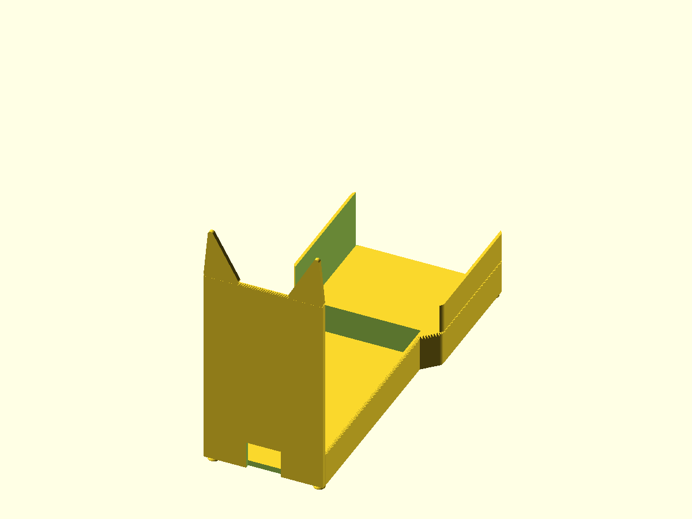
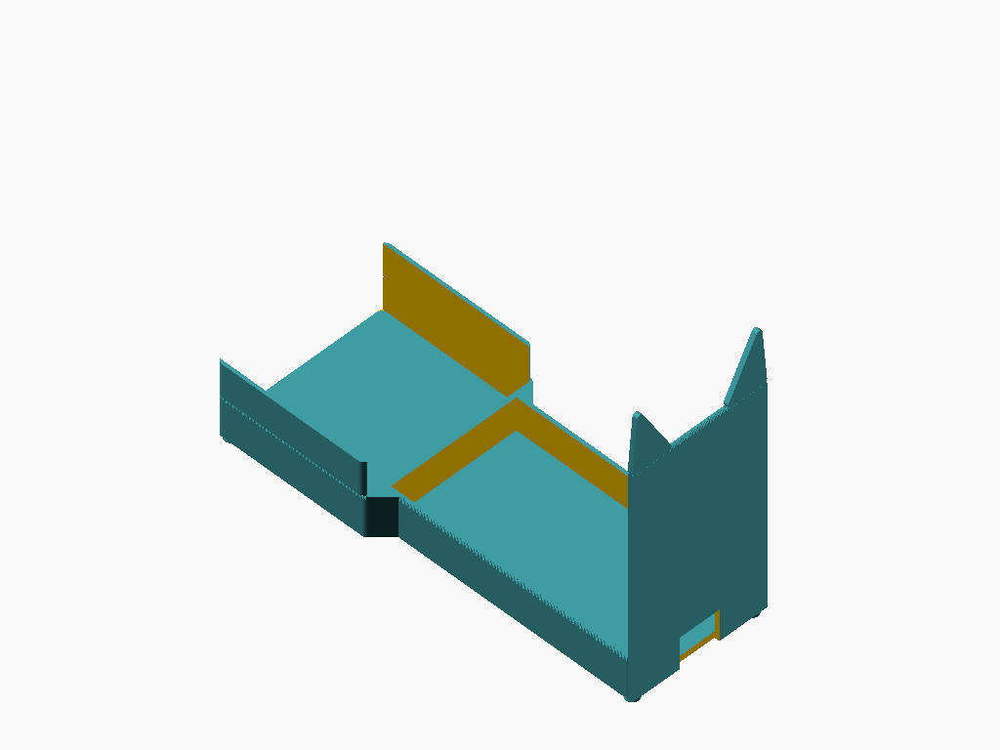
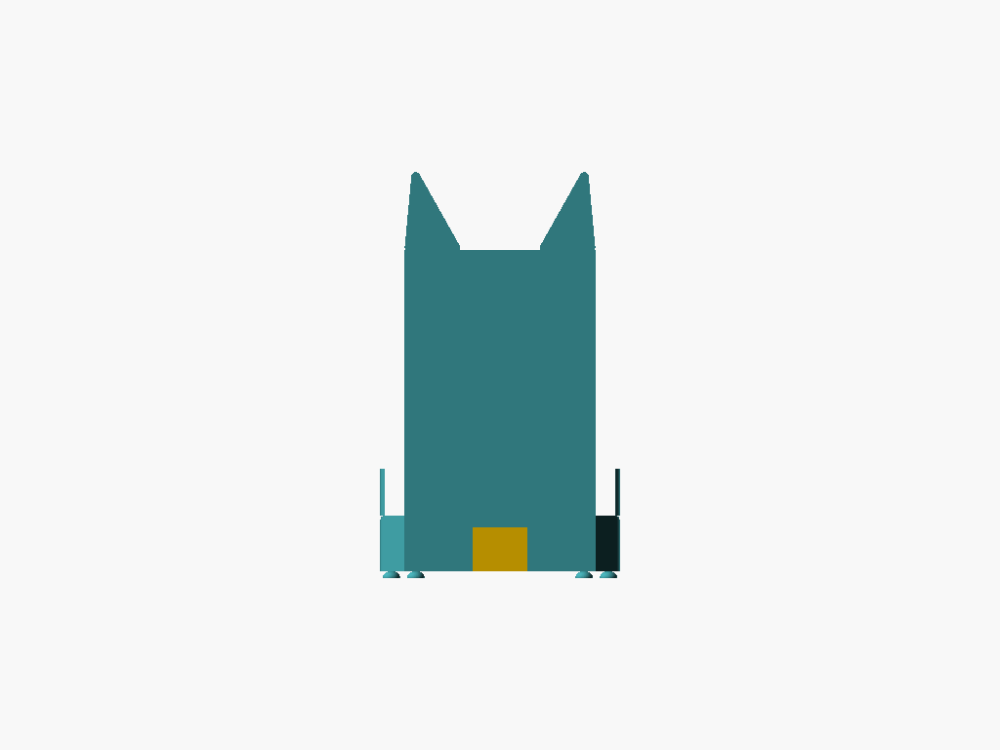
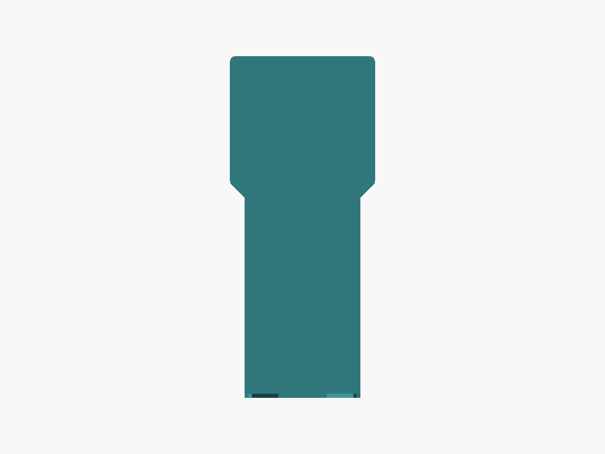
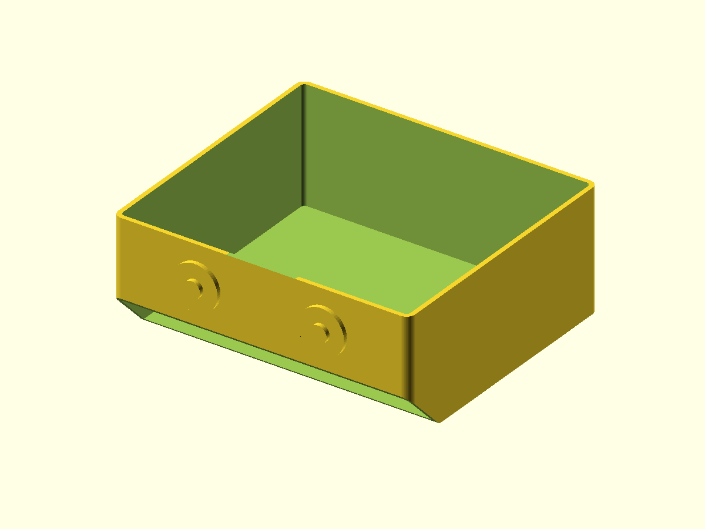
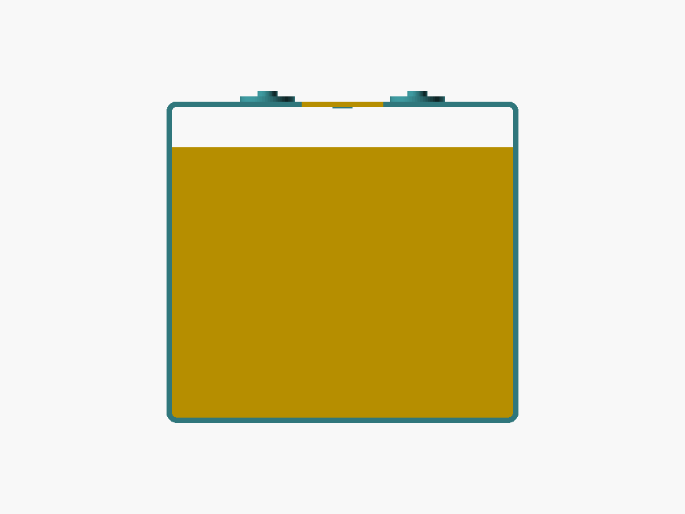

# P-touch Cradle

Owl-themed two-part desktop holder for the Brother PT-P750W label printer. The cradle holds the printer in a full-perimeter low bathtub wall with a tall back panel, and a removable catch tray slides forward out of the cradle base to empty printed labels.

## Renders

### Cradle


*Isometric — stepped 86 mm printer section widens to 108 mm shelf section via 45° chamfer. Owl ear tufts peek above the tall back panel at z = 180 mm.*


*Rear isometric — back panel exterior with ear tufts, cable U-notch (25 mm wide × 20 mm, open at z = 0), and open-front tray slot.*


*Back elevation — 180 mm total height with ear tufts. Cable notch centered at back wall base. Low perimeter walls visible at sides.*


*Side elevation — stepped base footprint. Printer section depth 160 mm (including 3 mm front and back walls), tray shelf section depth 94.9 mm.*


*Front elevation — 25 mm bathtub walls on all four sides. Tray slot visible at lower center. Stepped body (86 mm printer section inset 11 mm each side from 108 mm shelf).*

### Tray


*Tray isometric — owl face front wall showing eye embosses (r = 8 mm, +1.5 mm proud), pupil embosses (r = 3 mm, total +3 mm), beak triangle, and finger-grip scallop at top.*


*Tray front elevation — owl face centered on front wall. Scoop lip angled at 45° from horizontal covers bottom 15 mm of front wall.*

## Design Overview

The system is two parts that assemble by hand without adhesive or fasteners.

```
                  [ear tuft]  [ear tuft]
                     /  \      /  \
                    /    \    /    \
┌───────────────────────────────────┐  z = 145 mm (back panel body top)
│  ← tall back panel (3 mm thick) →│
│                                   │
│      [ printer sits here ]        │
│       80 mm W × 154 mm D          │
│       1.0 mm/side clearance       │  z = 25 mm (low perimeter wall tops)
├─────┬─────────────────────┬───────┤
│     │  (open top pocket)  │       │  full-perimeter low walls (25 mm)
└─────┴─────────────────────┴───────┘  z = 0 (base plate top) / z = -3 (feet)
      │  ← 160 mm printer section →│
      ├────────────────────────────┤
      │     tray slot (open front  │
      │     and open top):         │
      │     103.9 W × 94.9 D mm   │  z = 4 → 46.3 mm
      └────────────────────────────┘
                ↑
         tray pulls forward to empty
```

**Install sequence:**
1. Place cradle on desk (four corner feet elevate it 3 mm).
2. Slide printer into the open top — rests in the full-perimeter low bathtub walls. Printer base sits on the 4 mm base plate at z = 4 mm above desk.
3. Route USB and power cables through the 25 mm × 20 mm U-notch in the back wall. The notch is open at the base — no bridging, no threading.
4. Slide the tray into the forward slot from the front. The owl face faces forward.
5. As the printer cuts and ejects labels, they fall forward and down into the tray (label exit is at ~64–79 mm above desk; tray floor is at 5.6 mm above desk; front wall top is at 29 mm — labels clear by 35–50 mm).
6. Pull the tray forward to retrieve or empty labels.

The ear tufts on the back panel peek above the printer's 143 mm height, visible to anyone looking at the printer from the front.

## Geometry

| Dimension | Value | Notes |
|-----------|-------|-------|
| Cradle bounding box | 108 × 254.9 × 183 mm | Includes 3 mm feet below z = 0 |
| Cradle height with tufts | 180 mm | Back panel body 145 mm + 35 mm tufts |
| Printer section outer depth | 160 mm | Back wall 3 + interior 154 + front wall 3 |
| Tray shelf section depth | 94.9 mm | Slot interior depth (open front) |
| Interior pocket (W × D) | 80 × 154 mm | Printer 78 × 152 mm + 1 mm/side clearance |
| Ear tuft base width | 25 mm | Along back panel top edge, each tuft |
| Ear tuft peak height above back panel | 35 mm | Tufts at z = 180 mm total |
| Cable notch | 25 × 20 mm | Back wall, centered, open at z = 0 |
| Cradle volume | 177.8 cm³ | Mesh analysis |
| Tray bounding box | 103.2 × 94.2 × 41.6 mm | Exterior envelope (wall) |
| Tray interior | 100 × 91 × 40 mm | Label catch area |
| Tray wall / floor thickness | 1.6 mm | 4 perimeters at 0.4 mm |
| Tray volume | 36.2 cm³ | Mesh analysis |

## Features

### Cradle — Printer Section

**Base plate** — Stepped: 86 mm wide at the printer section, widening via a 45° chamfer at y = 149–160 mm to 108 mm at the shelf section. 4 mm thick. Six mm base plate corner fillets.

**Low perimeter walls** — All four sides of the printer section at 25 mm tall × 3 mm thick. Full perimeter bathtub enclosure. Printer sits inside with 1 mm/side clearance. 1.5 mm top-edge fillets on wall tops.

**Tall back panel body** — 86 mm wide × 3 mm thick × 145 mm tall (z = 0 to 145 mm). Integrates with the back low perimeter wall at z = 0–25 mm. 1.5 mm top-edge fillets at z = 145 mm (between tuft bases).

**Ear tufts (left and right)** — Triangular 2D profile extruded 3 mm (inherits back panel wall thickness), rising 35 mm above the back panel top corners (z = 145 to 180 mm). Each tuft is 25 mm wide at the base, outer edge vertical (flush with back panel exterior face), inner edge angled up to the peak. 2 mm apex fillet at each tip.

**Cable U-notch** — 25 mm wide × 20 mm tall notch cut through the back wall base, centered at X = 54 mm. Open at z = 0 (no bridge). Routes USB and DC power cables without lifting the printer.

**Corner feet (4×)** — 8 mm diameter dome bumps, 3 mm tall, inset 5 mm from each outer corner of the base plate footprint. Extend below z = 0 to elevate the cradle off the desk.

**4 mm exterior vertical edge fillets** — Applied to all printer-section side wall and shelf-section exterior vertical corners where material thickness permits.

### Cradle — Tray Shelf Section

**Tray shelf walls** — 2.05 mm side walls flanking the tray slot, z = 25 to 46.3 mm. Slot opening: 103.9 mm W × 94.9 mm D × 42.3 mm H, open front and open top (no bridges). Slot top edges are left sharp (no fillet) to preserve the full 2.05 mm cross-section.

### Tray

**Tray shell** — Open-top rectangular bin, 103.2 × 94.2 × 41.6 mm exterior, 1.6 mm walls and floor. 3 mm vertical corner fillets.

**Scoop lip** — Bottom 15 mm of the front wall angled at 45° from horizontal. Makes labels easy to pinch without reaching over the wall. 2 mm leading-edge fillet at floor/scoop junction.

**Owl face embosses** — Eye discs (r = 8 mm, +1.5 mm proud of wall) at z = 28 mm, X = ±22 mm. Pupil discs (r = 3 mm, +1.5 mm additional, total +3 mm proud) centered in each eye. Downward-pointing beak triangle (6 × 6 mm, +2 mm proud) centered at X = 0, top at z = 22 mm, apex at z = 16 mm.

**Finger grip scallop** — 24 mm wide × 8 mm deep semicircle cut into the top edge of the front wall, centered. Open to top (no bridge). Provides one-finger pull to slide tray out.

## Mating Interfaces

| Interface | This Part | Mates With | Fit Type | Gap / Interference |
|-----------|-----------|------------|----------|--------------------|
| Printer pocket (X) | 80 mm interior | 78 mm printer width | Clearance | +1.0 mm/side |
| Printer pocket (Y) | 154 mm interior | 152 mm printer depth | Clearance | +1.0 mm/side (printer rests back) |
| Tray slot (X) | 103.9 mm interior | 103.2 mm tray exterior | Sliding | +0.35 mm/side |
| Tray slot (Y) | 94.9 mm interior | 94.2 mm tray exterior | Sliding | +0.35 mm/side |
| Tray slot (Z) | 42.3 mm interior | 41.6 mm tray exterior | Sliding | +0.35 mm/side |

Slot side wall each side: 2.05 mm — above 1.2 mm FDM minimum wall. Fit review confirmed zero interference volume (trimesh boolean) on both printer/cradle and tray/cradle checks.

## Printability

Both parts pass all printability checks. Zero real bridge spans in either part — all analyzer bridge flags are false positives from open pockets and open-top slot measurements. No support required for either part.

| Check | Result | Notes |
|-------|--------|-------|
| Transitions (cradle) | 7/7 PASS | Includes fillet and shelf wall re-review |
| Transitions (tray) | 7/7 PASS | |
| Overhangs | PASS | Cradle: dome feet false positives (z = 0 bed contact). Tray: none |
| Bridges | PASS | Zero real spans. All analyzer flags are open-pocket false positives |
| Thin walls | PASS | Cradle shelf side walls 2.05 mm; tray walls 1.6 mm. Top-layer fillet intersection in cradle is cosmetic (top 2 layers only) |
| Slicer | N/A | PrusaSlicer not installed |

### Geometry Analysis

Cradle: 915 layers at 0.2 mm, 17,360 faces, watertight. Tray: 1,702 faces, watertight. All bridge-fail flags are false positives from the geometry analyzer measuring across intentionally open pockets — the slicer does not create bridge moves over open volumes.

The cradle shelf upper wall top-edge fillet was suppressed (v3 fix) to eliminate a 0.445–0.525 mm cross-section collapse that caused a T5 FAIL in v2. With the fillet removed, all remaining thin-wall flags in that zone (24 hits, z = 25–45.1) are confirmed ray-casting artifacts at the 4 mm vertical corner fillet tangent region.

### Slicer Analysis

Slicer analysis not available — PrusaSlicer not installed. The 45° tray scoop face is exactly at the FDM overhang threshold; recommend visual check of the scoop surface finish after the first tray print.

## Test Print Candidates

Test prints were identified but not modeled in this pipeline run. The three recommended verifications before printing the full cradle:

| Priority | What to Print | What to Verify |
|----------|---------------|----------------|
| High | Full tray | Scoop face 45° surface quality; slot fit against a full-depth cradle section |
| High | Cradle section z = 0–50 mm (full width) | Tray sliding fit in slot with actual tray |
| Low | Cradle top 60 mm (back panel z = 120–180 mm) | Ear tuft apex print quality; inter-tuft stringing |

## Validation

```
cradle.x:    108.0 mm  (expected 108 ±1.0)    PASS
cradle.y:    254.9 mm  (expected 254.9 ±1.0)  PASS
cradle.z:    180.0 mm  (expected 180 ±1.0)    PASS
watertight:  true                              PASS

tray.x:      103.2 mm  (expected 103.2 ±0.2)  PASS
tray.y:       94.2 mm  (expected 94.2 ±0.2)   PASS
tray.z:       41.6 mm  (expected 41.6 ±0.2)   PASS
watertight:  true                              PASS

volume (cradle):  177.8 cm³  (expected 80–700 cm³)  PASS
volume (tray):     36.2 cm³  (expected 80–700 cm³)  PASS
```

Note: Cradle mesh Z min = −3.0 mm (feet extend below z = 0). Tray mesh Y max = 97.2 mm (pupil embosses protrude 3 mm proud of the front wall exterior — intentional aesthetic relief not counted in the wall envelope).

## Print Settings

### Cradle

| Setting | Value |
|---------|-------|
| Orientation | Base plate bottom flat on bed; feet contact bed at z = −3 |
| Material | PLA |
| Layer height | 0.2 mm |
| Infill | 20–25% — base plate and shelf slab; tall back panel walls are solid |
| Supports | None required — cable notch is open at z = 0, tray slot is open-top and open-front, ear tufts are vertical extrusions |

### Tray

| Setting | Value |
|---------|-------|
| Orientation | Tray floor bottom flat on bed |
| Material | PLA |
| Layer height | 0.2 mm |
| Infill | 15–20% — thin walls are effectively solid at 1.6 mm (4 perimeters) |
| Supports | None required — scoop face at 45° is at the threshold but self-supporting; owl embosses are raised bosses on a vertical wall |

## BOM

| Qty | Item | Notes |
|-----|------|-------|
| 1 | Cradle (3D printed) | PLA, 177.8 cm³ |
| 1 | Tray (3D printed) | PLA, 36.2 cm³ |

No fasteners, adhesive, or hardware required.

## Downloads

| File | Description |
|------|-------------|
| [`cradle.stl`](../designs/ptouch-cradle/output/cradle.stl) | Cradle — print-ready mesh |
| [`tray.stl`](../designs/ptouch-cradle/output/tray.stl) | Tray — print-ready mesh |
| [`cradle.scad`](../designs/ptouch-cradle/cradle.scad) | Cradle parametric source |
| [`tray.scad`](../designs/ptouch-cradle/tray.scad) | Tray parametric source |
| [`spec.json`](../designs/ptouch-cradle/spec.json) | Validation spec |
| [`modeling-report.json`](../designs/ptouch-cradle/output/modeling-report.json) | Feature inventory |
| [`cradle-geometry-report.json`](../designs/ptouch-cradle/output/cradle-geometry-report.json) | Cradle mesh analysis |
| [`tray-geometry-report.json`](../designs/ptouch-cradle/output/tray-geometry-report.json) | Tray mesh analysis |
| [`review-printability.md`](../designs/ptouch-cradle/output/review-printability.md) | Full printability review |
| [`review-fitment.json`](../designs/ptouch-cradle/output/review-fitment.json) | Fitment review (interference + clearance checks) |
| [`requirements.md`](../designs/ptouch-cradle/requirements.md) | Full design requirements |

## Pipeline

| Stage | Agent | Result |
|-------|-------|--------|
| Spec | spec-writer | 16 features, 2 mating interfaces, 4 test print candidates flagged |
| Model | modeler | PASS (3 iterations — v1 initial, v2 fillet fix, v3 shelf wall top-edge suppression) |
| Geometry | geometry-analyzer | Cradle: 915 layers, 7 transitions. Tray: watertight, all transitions PASS |
| Print review | print-reviewer | 7/7 PASS each part. Zero real bridges. Shelf fillet collapse resolved in v3. |
| Fit review | fit-reviewer | Zero interference (tray/cradle and printer/cradle). All clearances within spec. |
| Ship | shipper | this commit |

Built with pipeline v4
