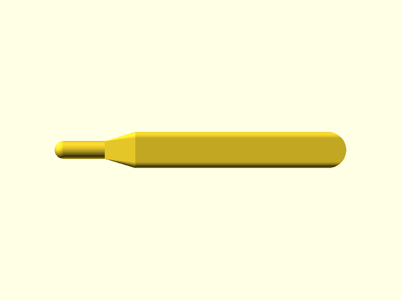
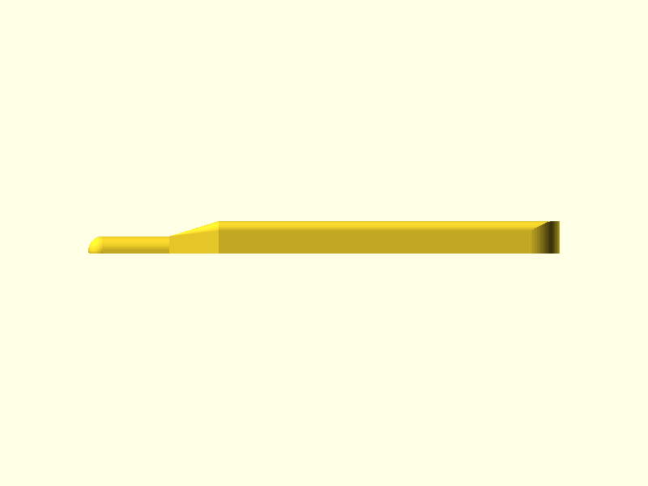
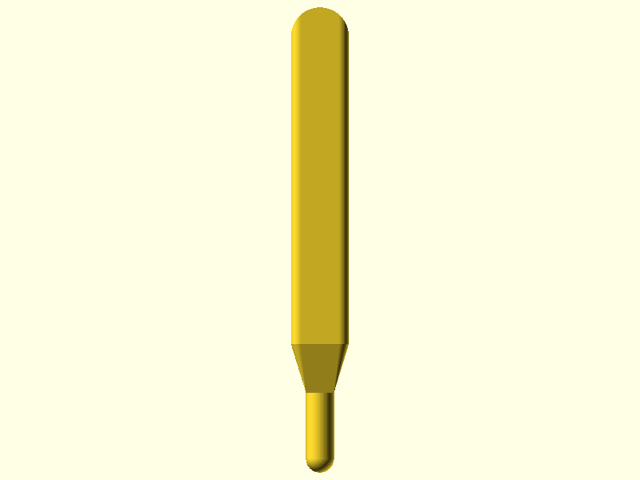

# Waffle Caulk Spudger

A single-part handheld tool for spreading silicone caulk into waffle-grid HDPE bin lid channels before seating a printed adapter (fan-tub adapter, humidity output, etc.). The convex tip travels along each 9.4 mm wide channel and displaces caulk sideways, leaving a smooth concave bead that bonds the adapter flange to the channel walls.

## Renders


*Isometric view showing the full tool: rounded handle body, 15 mm taper zone, and 8.8 mm-wide convex spreader tip with hemispherical nose*


*Front elevation showing the full 145 mm length — tip nose at left, convex arc profile rising above the flat bed face, taper zone, and rounded handle tail at right*


*Top-down view showing the 18 mm handle narrowing through the 15 mm taper zone to the 8.8 mm spreader tip and hemispherical nose*


*Right-side elevation showing the 10 mm handle height and the step-down through the taper to the 5.4 mm tip apex*

## Design Overview

The tool is used once per caulk session: press caulk into the waffle channels, then run the spudger tip along each channel to shape a consistent bead before seating the adapter.

```
     handle (120 mm)
    ┌──────────────────────────┐
    │ 18 mm wide × 10 mm tall  │──── taper (15 mm) ──── tip (25 mm) ──── ●  nose
    │ filleted edges, 3 mm R   │                         8.8 mm wide
    └──────────────────────────┘                         arc apex 5.4 mm tall
                                                         0.3 mm clearance/side
```

The tip cross-section is a convex circular arc (R = 4.4 mm, sag = 4.2 mm). When pressed into the 9.4 mm × 4.6 mm waffle channel with the tool bottom flush against the waffle square surface, the arc apex sits 4.2 mm above the channel floor — leaving 0.4 mm of channel depth for caulk to flow into. Lateral clearance is 0.3 mm per side, enough for free travel without scraping the HDPE walls.

The hemispherical nose (R = 4.4 mm) provides a smooth leading edge for channel entry and direction changes at waffle intersections.

## Geometry

| Dimension | Value | Notes |
|-----------|-------|-------|
| Bounding box | 145 × 18 × 10 mm | handle drives all three dimensions |
| Tip width | 8.8 mm | channel width (9.4 mm) − 2 × 0.3 mm clearance |
| Tip arc radius | 4.4 mm | convex arc spanning full tip width |
| Tip arc sag | 4.2 mm | channel depth (4.6 mm) − 0.4 mm bond clearance |
| Tip total height (apex) | 5.4 mm | base floor 1.2 mm + sag 4.2 mm |
| Tip length | 25.0 mm | working stroke |
| Taper length | 15.0 mm | handle-to-tip transition |
| Handle length | 120.0 mm | ergonomic thumb-and-finger grip |
| Handle width | 18.0 mm | comfortable palm width |
| Handle height | 10.0 mm | grip stiffness without bulk |
| Edge fillet radius | 3.0 mm | all long handle edges |
| Volume | 20.67 cm³ | |

## Features

### Tip — Convex Spreader

Flat base (1.2 mm floor, 6 layers) with a convex circular arc on top. The arc geometry (R = 4.4 mm, sag = 4.2 mm) displaces caulk outward and downward when drawn along the channel, producing a consistently shaped concave bead. Printed as normal staircase layers at 0.2 mm — not a bridge.

### Tip Nose

Hemispherical end cap (R = 4.4 mm) for smooth channel entry and corner navigation. Rounded in all axes.

### Taper Zone

15 mm linear transition from handle cross-section (18 × 10 mm) to tip cross-section (8.8 × 5.4 mm). Width tapers linearly (17° half-angle from the tool axis — well within the 45° overhang limit). Height tapers on the top face only; the bottom face remains flat throughout. No overhangs, no bridges.

### Handle

120 mm solid bar, 18 × 10 mm cross-section. 3 mm radius fillets on all long top edges and side edges. Tail end is a full semicircle (R = 9 mm) for a comfortable grip end. No thin walls — handle is solid throughout.

## Mating Interfaces

| Interface | This Part | Channel | Fit Type | Gap/Side |
|-----------|-----------|---------|----------|----------|
| Tip in waffle channel (width) | 8.8 mm | 9.4 mm | clearance | 0.3 mm |
| Tip arc apex in waffle channel (depth) | 4.2 mm sag | 4.6 mm deep | clearance | 0.4 mm |

The 0.3 mm/side clearance is consumed in the worst case by a +0.2 mm tip-width print error, leaving 0.1 mm/side — still enough for free travel.

## Printability

Straightforward print. Flat on the bed, no supports, no overhangs beyond vertical side faces, no real bridges. The geometry-analyzer flagged 164 overhang faces at 90° (vertical walls, artifact of the analyzer's face-normal test at z=0) and one marginal bridge at z=5.7 mm — both are analyzer false positives from bounding-box detection on the curved nose geometry. The print-reviewer confirmed all flags as non-issues.

| Check | Result | Notes |
|-------|--------|-------|
| Transitions | 0 abrupt transitions | smooth taper throughout |
| Overhangs | PASS | all 90° flags are vertical side walls at z=0, not real overhangs |
| Bridges | PASS | z=5.7 mm flag (10.085 mm span) is a false positive — bounding-box artifact at the convex nose; no real unsupported span |
| Thin walls | PASS | none detected; minimum is 1.2 mm tip floor |
| Slicer | N/A | PrusaSlicer not available in this environment |

### Geometry Analysis

50 layers at 0.2 mm. Single contour throughout — no split sections, no islands. Cross-section area decreases smoothly from base (2,267 mm²) upward as the convex arc and handle fillets taper toward z=10. No abrupt area transitions (0 detected).

The 24 bridge warnings are all sub-2 mm spans from the bounding-box bridge detector interacting with the curved nose and taper geometry. The one "fail" (10.085 mm at z=5.7 mm) is the same artifact — the bounding box of the convex nose at the apex of the arc reads as a span, but the geometry is fully solid at that layer.

## Validation

```
bbox.x:     144.997 mm  (expected 145.0 ± 0.5)    PASS
bbox.y:     18.0 mm     (expected 18.0 ± 0.5)      PASS
bbox.z:     10.0 mm     (expected 10.0 ± 0.5)      PASS
watertight: true                                    PASS
volume:     20.67 cm³   (expected 8–30 cm³)        PASS
```

Spec deviation noted: `spec.json` initially listed z=10.8 mm but `requirements.md` clearly specifies overall height = handle height = 10.0 mm. Corrected to 10.0 mm in iteration 2.

## Print Settings

| Setting | Value |
|---------|-------|
| Orientation | Flat on bed — bottom face of handle and tip base on build plate, convex arc facing up |
| Material | PLA |
| Layer height | 0.2 mm |
| Infill | 15% gyroid — tool is solid by design; infill is minimal filler |
| Supports | None |

## BOM

| Qty | Item | Notes |
|-----|------|-------|
| 1 | Waffle Caulk Spudger (3D printed) | PLA, 20.67 cm³ (~25 g at 1.24 g/cm³) |

No additional materials required. Silicone caulk and bin lid are part of the installation context, not this BOM.

## Downloads

| File | Description |
|------|-------------|
| [`waffle-caulk-spudger.stl`](../designs/waffle-caulk-spudger/output/waffle-caulk-spudger.stl) | Print-ready mesh |
| [`waffle-caulk-spudger.scad`](../designs/waffle-caulk-spudger/waffle-caulk-spudger.scad) | Parametric source |
| [`spec.json`](../designs/waffle-caulk-spudger/spec.json) | Validation spec |
| [`geometry-report.json`](../designs/waffle-caulk-spudger/output/geometry-report.json) | Mesh analysis (trimesh, 50 layers) |
| [`modeling-report.json`](../designs/waffle-caulk-spudger/output/modeling-report.json) | Feature inventory |

## Pipeline

| Stage | Agent | Result |
|-------|-------|--------|
| Spec | spec-writer | 3 dims, 6 features, 2 interfaces |
| Model | modeler | PASS (2 iterations — z spec correction in iter 2) |
| Geometry | geometry-analyzer | 50 layers, 164 overhang faces (vertical walls), 25 bridge flags (false positives) |
| Review | print-reviewer | PASS — all analyzer flags assessed as false positives; no real overhangs or bridges |
| Ship | shipper | this commit |

Built with pipeline v4
