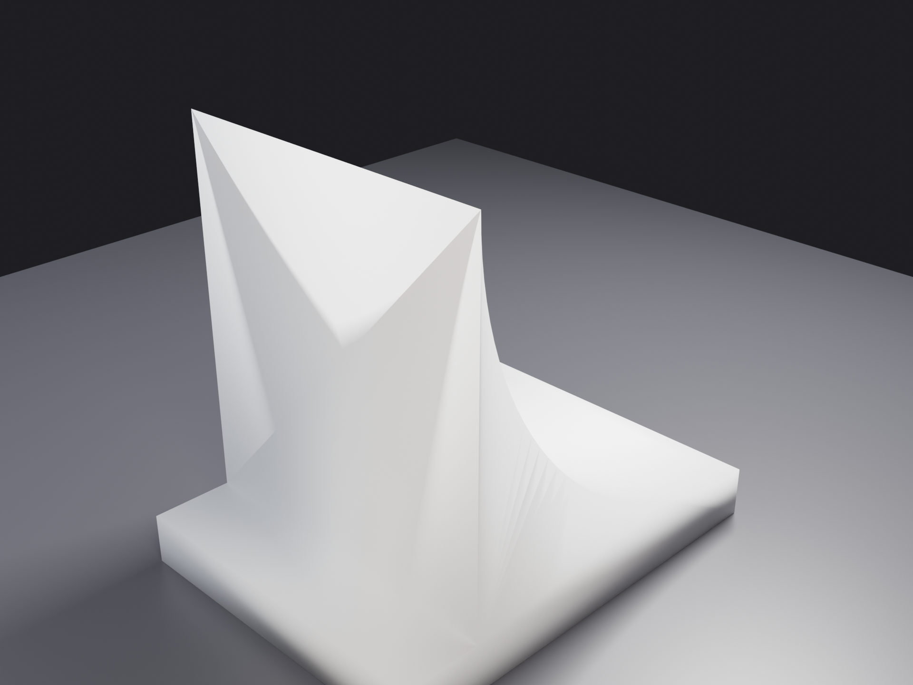

# Workout Dumbbell Holder

Clip-on dumbbell holder for a vertical treadmill rail extrusion. Dual-engagement (plug inside the rail, sleeve around the outside) with a horizontal slot through which the dumbbell shaft hangs vertically along the rail. No fasteners. Gravity retention only. CF-reinforced filament.


## Use Case

The treadmill rail is a hollow rectangular aluminum extrusion (76.5 × 51.0 mm OD, 70.5 × 44.5 mm ID, ~3.7 mm wall, open at the top). One holder per dumbbell. Each holder slides down over the rail from above: the plug enters the rail's interior cavity, the sleeve simultaneously wraps the rail's exterior, and the flange seats on the rail-top face. The fork plate cantilevers out in front of the rail, 20 mm below the rail-top, and the dumbbell shaft slides sideways into the slot from the open +Y plate edge — the upper bell rests on the fork plate, the rest of the dumbbell hangs vertically below, parallel to the rail.

Reference dumbbell: 1–3 lb rubber-coated. Shaft Ø 46 mm, bell Ø 111 mm, length > 200 mm.

## Geometry Overview

```
                    ┌─────────────────┐  z=0  flange top
                    │     FLANGE      │  88.5 × 62.5 × 8 mm
                    │  rail-mating    │  corner r=7
                    └─────────────────┘  z=-8  rail-top face (flange seats here)
              ┌─────┐                 ┌─────┐  z=-8  sleeve top
              │PLUG │   sleeve cavity │     │
              │     │   78.5 × 53     │SLEV │
              │     │   (rail OD +1mm │     │  sleeve OD 88.5 × 62.5
              │     │    clearance)   │     │  sleeve walls 5.0 / 4.75 mm
              │     │                 │     │  −X short wall REMOVED (console clearance)
              │     │   ╔══╗  rail    │     │
              │     │   ║  ║  goes    │     │
              │     │   ║  ║  here    │     │
              │     │   ╚══╝          │     │
              │PLUG │                 │     │
              │     │═══════ FORK    ═══════│ ◄── fork plate top z=-22
              │     │═════ PLATE 12mm═══════│ ◄── fork plate bot z=-34
              │     │                 │     │       (fork extends out in +Y to slot)
              │     │   ┃  ┃          │     │
              │     │   ┃  ┃   r=22   │     │  bottom buttress
              │     │   ┃  ┃   gusset │     │
              └─────┘                 └─────┘  z=-38  plug bottom
                    │                       │
                    │       SLEEVE          │  sleeve extends 18mm past plug
                    │   continues to        │  for symmetric bottom buttress
                    │       z=-56           │
                    └───────────────────────┘  z=-56  sleeve bottom

Plug axis Z = rail axis. Plug at Z=[-38, -8]. Flange at Z=[-8, 0].
Sleeve at Z=[-56, -8] with -X wall removed (C-shape).
Fork plate cantilevers in +Y from the sleeve at Z=[-22, -34], 20mm below rail-top.
```

The cantilever (fork plate plus both buttresses plus ribs) extends in +Y. The slot through the fork plate is in the XY plane — the dumbbell shaft passes vertically through it.

### Cantilever (fork plate + buttresses + ribs), top-down view at saddle level

```
                              fork plate
                              symmetric in X around 0
                    ┌─────────────────────────────────────────┐ Y=+110 (slot opens here)
                    │    ◄────  open slot, 69.1 mm wide  ────►│
                    │                                         │
                    │   tine                       tine       │
                    │  4.7 mm                     4.7 mm      │
                    │   wall                       wall       │
                    │           ╭─ R=23 ─╮                    │
                    │           │  arc   │                    │ Y=+90 saddle centerline
                    │           ╰─tangent╯                    │
                    │            30°-flared arms              │
                    │                                         │ Y=+67 arc bottom
                    │                                         │
                    │     left rib            right rib       │
                    │      X=-37             X=+37            │
                    │  (3 mm × 12 mm × ~52 mm, arc-tapered)   │
                    └─────────────────────────────────────────┘ Y=+31.25 (sleeve face)
                              X=-39.25      0      X=+39.25
```

### Cantilever side view (looking down +X)

```
                  fork plate
                  Z=[-22, -34]
                          ┌──────────────────────────┐ z=-22 (fork top, bell rests here)
   sleeve+flange  ┌───────│                          │
   +Y face        │ TOP   │      FORK PLATE          │
   Y=+31.25       │ BUT-  │                          │
                  │ TRESS │                          │ z=-34 (fork bottom)
                  │ r=22  └──╮                       │ ─ ─ ─ ─ ─ ─
                  │           ╲                      │
                  │            ╲      RIB (curved)   │
                  │             ╲   ←─── arc tapers from full
                  │              ╲     depth at Y=+53.25
                  │               ╲    to zero at Y=+105
                  │ BOTTOM         ╲___________________ z=-46 (rib max depth)
                  │ BUTTRESS r=22
                  │
                  └─ z=-56 (sleeve bottom)
```

## Dimensions

| Feature | Value | Notes |
|---|---|---|
| Bounding box (X × Y × Z) | 88.5 × 141.25 × 56 mm | well inside Bambu X1C 256 mm cube |
| Volume (solid) | 253.6 cm³ | ~317 g PLA solid; ~150–200 g typical with infill |
| Plug (rail-interior engagement) | 68.5 × 42.5 × 30 mm | corner r=2.5, 1 mm/side clearance to rail ID |
| Flange (rail-mating cap) | 88.5 × 62.5 × 8 mm | corner r=7, rests on rail-top face |
| Sleeve (rail-exterior engagement) | OD 88.5 × 62.5, ID 78.5 × 53 | walls 5.0 / 4.75 mm, length 48 mm, **−X short wall removed** |
| Fork plate (cantilever) | 88.5 × 78.75 × 12 mm | symmetric in X around 0 (X=±39.25), 20 mm below rail-top |
| Saddle slot | R=23 arc + 30°-flared arms | shaft Ø 46 mm seats in arc; 69.1 mm tine-tip opening |
| Cradle reach (rail center → saddle centerline) | 90 mm | bell clears flange/sleeve in Y by 3.25 mm |
| Top buttress (gusset) | r=22 quarter-cylinder | rolls from flange-top edge down to fork top |
| Bottom buttress (mirror) | r=22 quarter-cylinder | mirror of top, sleeve-bottom edge to fork bottom |
| Ribs (2×, along fork bottom) | 3 mm × 12 mm × ~52 mm | curved arc bottom, X=±37, full depth at Y=+53.25 → zero at Y=+105 |
| Tine wall thickness | 4.7 mm each side | symmetric (post-recentering) |

## Why dual engagement

The cantilever moment from a 1.36 kg dumbbell at 90 mm reach is ~1.2 N·m — modest in absolute terms but non-trivial for a 30 mm-deep plug-only engagement in a brittle CF print. v3 added the external sleeve so the plug and sleeve grip the rail from opposite sides at every Z level. The reaction couple's effective lever arm doubles (plug + sleeve = ~60 mm vs plug alone = 30 mm), so each engagement sees roughly half the contact force. Lowering the fork to 20 mm below the rail-top puts the load application point in the middle of the engaged region rather than at the top, distributing stress across both engagements rather than concentrating it at the plug root.

## Control-panel clearance

The treadmill console abuts the rail on the −X side. The sleeve's −X short wall and its two −X corners are cut so the holder slides on without the console interfering. The flange (which sits above the rail-top face) is unaffected — confirmed against the reference photo that nothing extends above the rail-top face on that side.

## Print Setup

**Modeling backend:** Fusion 360 (via MCP). First design in this project's pipeline routed to the Fusion backend. Output is a 1540-triangle binary STL — same downstream handling as OpenSCAD-generated geometry.

**Material:** CF-reinforced filament (CF-PLA, CF-PA, or CF-PETG). Minimum wall enforced at 3.0 mm everywhere (vs the project's 1.2 mm PLA standard). The rib walls hit exactly 3.0 mm — at the floor with no margin.

**Recommended orientation:** plug-vertical, flange face-down on bed. Layer lines run perpendicular to the rail axis. Bridges and overhangs flagged by the print-reviewer:

| Bridge / overhang | Span | Mitigation |
|---|---|---|
| Fork plate bottom | 15.9 mm | slicer support |
| Bottom buttress leading edge | 11.2 mm | slicer support |
| Sleeve inner ceiling | 14.0 mm | slicer support |
| Both r=22 buttress arc undersides | curved overhang | slicer support |

The buttress-underside support marks land on a non-mating surface and are cosmetic. Support material inside the sleeve cavity must be cleaned out fully before sliding the holder onto the rail — the cavity is accessible from the open bottom end only.

CF-specific structural margin: ~0.6 MPa peak inter-layer stress vs ~15 MPa CF-PLA tensile floor → **safety factor > 25×**.

## Test Prints

Three minimal-material test prints modeled before committing the full part. Each lives under [`designs/workout-dumbbell-holder/test-prints/`](../designs/workout-dumbbell-holder/test-prints/) with its own `requirements.md` + `spec.json` + STL/F3D in `output/`.

### plug-sleeve-stub (HIGH — must pass before printing the full part)


[`plug-sleeve-stub.stl`](../designs/workout-dumbbell-holder/test-prints/plug-sleeve-stub/output/plug-sleeve-stub.stl) — full plug (hollowed to 3 mm walls) + flange + 25 mm sleeve. **91 cm³** / ~115 g PLA solid. Validates plug-to-rail-ID clearance (1 mm/side), sleeve-to-rail-OD clearance (1 mm/side), and sleeve interior surface quality after support removal. **PASS gates the full part.**

### fork-plate-sample (MEDIUM — bell-rest surface and slot accuracy)


[`fork-plate-sample.stl`](../designs/workout-dumbbell-holder/test-prints/fork-plate-sample/output/fork-plate-sample.stl) — Y-truncated fork plate (Y=+31.25 to +70) with both buttresses, slot cut at the saddle arc, 3 mm base plate. **61 cm³** / ~76 g. Validates bell-rest surface quality (the bell sits on this face — must come out smooth after support removal) and saddle arc dimensional accuracy.

### buttress-arc-sample (LOW — redundant with fork-plate-sample)



[`buttress-arc-sample.stl`](../designs/workout-dumbbell-holder/test-prints/buttress-arc-sample/output/buttress-arc-sample.stl) — 20 mm X-slice of the top buttress with base plate. **3.7 cm³** / ~5 g. Curved-overhang surface-quality check only. **Drop this if `fork-plate-sample` is printed** — it captures both buttress arc undersides at full span.

| # | STL | Volume | Print time est. | Gates |
|---|---|---|---|---|
| 1 (HIGH) | `plug-sleeve-stub.stl` | 91 cm³ | ~70 min | Plug + sleeve fit; **must pass** |
| 2 (MED) | `fork-plate-sample.stl` | 61 cm³ | ~50 min | Bell-rest surface + slot accuracy |
| 3 (LOW) | `buttress-arc-sample.stl` | 3.7 cm³ | ~10 min | Buttress overhang surface quality (redundant if #2 is printed) |

## Iteration History

This design went through 4 user-driven revisions before clearing review.

| Version | Change | Why |
|---|---|---|
| **v1** | Vertical fork U-saddle, shaft drops in horizontally from above | First spec, perpendicular-to-rail orientation |
| **v2** | Saddle profile rotated 90° to horizontal plane; shaft passes vertically through a slot in a flat plate; cradle reach 70 mm | User correction: dumbbell should hang **parallel** to the rail axis, in front of the post, not sticking out perpendicular |
| **v3** | Added external sleeve (dual-engagement) and lowered the fork 20 mm below rail-top; cradle reach increased 70 → 90 mm so the upper bell clears the flange/sleeve in Y | User: "make a sleeve that goes on the outside of the extrusion too — and slide the fork down to live ~20 mm below the top of the plug" |
| **v3.1** | Removed sleeve −X short wall (5 × 62.5 × 30 mm cut at X=[−44.25, −39.25]) | Treadmill console abuts the rail on −X side per reference photo |
| **v3.2** | Added top r=22 buttress filling the air pocket between fork-top and flange-top edge | "Big fillet on top of the fork to give it strength — roll it all the way to the top edge of the block" |
| **v3.3** | Extended sleeve down 18 mm (length 30 → 48 mm); added symmetric bottom r=22 buttress; added 2 ribs along fork bottom (3 mm × 12 mm × 73.75 mm) | Symmetric reinforcement on both sides of the fork-sleeve junction; ribs add section depth to the cantilever |
| **v3.4** | Reshaped ribs to curved-fin profiles (3-point arc tapering full depth at inner end → zero at outer end with horizontal tangent at outer end); recentered the cantilever in X (cut +X overhang to match −X cut so tine walls are symmetric 4.7 mm each) | "Make ribs a nice rounded arc shape, not rectangular" + "recenter the fork now that we cut it from extruding beyond the trimmed wall" |

Each version's STL/F3D for v2 is preserved at [`designs/workout-dumbbell-holder/output/v2-archive/`](../designs/workout-dumbbell-holder/output/v2-archive/). Earlier versions were overwritten in place.

## Process Notes

- **First Fusion-backend design.** The Fusion MCP server (`fusion360-mcp-server v1.27.0`) wedged mid-session — it sends `{"command": ...}` payloads but the current add-in expects `{"type": "<cmd>", "params": {...}}`. Built a small Python helper that opens a TCP connection to `host.docker.internal:9876` and speaks the add-in's native protocol directly. The MCP server's role was just translating between agent tool calls and the add-in protocol; doing it directly worked fine. See modeling report's Process Notes section for the protocol shape.
- **Subagent MCP propagation gap.** The `modeler-fusion` subagent halted on three consecutive dispatches because Claude Code does not propagate MCP servers (`mcp__fusion__*`) into subagent tool registries. Modeling was driven from the main session instead. Outstanding fix: add an explicit `mcpServers:` field to `.claude/agents/modeler-fusion.md` once the schema is identified.

## Files

| Path | What |
|---|---|
| [`designs/workout-dumbbell-holder/spec.json`](../designs/workout-dumbbell-holder/spec.json) | Authoritative spec (v3.4). Includes all params, sleeve/fork/buttress/rib dimensions, the v1/v2 history note, and the v3 amendment params. |
| [`designs/workout-dumbbell-holder/requirements.md`](../designs/workout-dumbbell-holder/requirements.md) | Original spec body (v1 vintage) plus a "v3 Amendment" block with the dual-engagement / lowered-fork / control-panel-clearance / buttress / recentering rationale. |
| [`designs/workout-dumbbell-holder/output/workout-dumbbell-holder.stl`](../designs/workout-dumbbell-holder/output/workout-dumbbell-holder.stl) | Final STL (v3.4). 1540 triangles, 77 KB. |
| [`designs/workout-dumbbell-holder/output/workout-dumbbell-holder.f3d`](../designs/workout-dumbbell-holder/output/workout-dumbbell-holder.f3d) | Fusion 360 native archive. |
| [`designs/workout-dumbbell-holder/output/modeling-report.md`](../designs/workout-dumbbell-holder/output/modeling-report.md) | Build journal — feature timeline, dimensional verification, deviations from spec, full v1 → v3.4 evolution. |
| [`designs/workout-dumbbell-holder/output/geometry-report.json`](../designs/workout-dumbbell-holder/output/geometry-report.json) | trimesh-based mesh analysis (watertightness, walls, clearances, overhang inventory). |
| [`designs/workout-dumbbell-holder/output/review-printability.md`](../designs/workout-dumbbell-holder/output/review-printability.md) | print-reviewer's pass-with-conditions verdict and recommended print orientation. |
| [`designs/workout-dumbbell-holder/output/v2-archive/`](../designs/workout-dumbbell-holder/output/v2-archive/) | v2 STL/F3D + report, preserved for reference. |
| [`designs/workout-dumbbell-holder/test-prints/`](../designs/workout-dumbbell-holder/test-prints/) | 3 planned test prints, each with `requirements.md` + `spec.json`. None modeled yet. |
